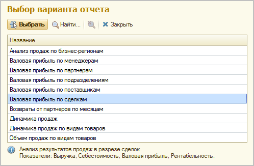

###### #std671

# Варианты отчетов

###### 1.

Создавайте варианты отчета,
когда один и тот же источник данных
нужно анализировать в разных:

- группировках;
- сортировках;
- отборах;
- наборах показателей.

В этом случае создается один отчет
с несколькими вариантами.

!!! example "Пример"

    Источником данных может быть совокупность документов
    и регистров сведений
    для пользователей
    с одинаковым уровнем прав.

    Например,
    отчет `Выручка и себестоимость продаж`:

    { width="498" }

###### 2.

Если вариант отчета является рабочим местом
или используется очень часто,
оформляйте его отдельным отчетом.

Это упрощает использование.

###### 3.

Если вариант отчета требуется включить
в разные подсистемы одного раздела,
вместо одного общего варианта
создавайте отдельные варианты
для каждой подсистемы
с разными параметрами и отборами.

!!! success "Правильно"

    Создать два варианта отчета:
    `Валовая прибыль по поставщикам (опт)`
    и
    `Валовая прибыль по поставщикам (розница)`
    с отборами по оптовым и розничным продажам.

!!! failure "Неправильно"

    Создать один вариант отчета
    и включить его в подсистемы
    `Продажи/Продажи и возвраты`
    и
    `Продажи/Розничные продажи`.

###### 4.

При использовании в конфигурации
`Библиотеки стандартных подсистем`
обязательно заполняйте описание варианта отчета.

В описании указывайте:

- основное назначение;
- состав анализируемых данных.

###### Источник

https://its.1c.ru/db/v8std#content:671
