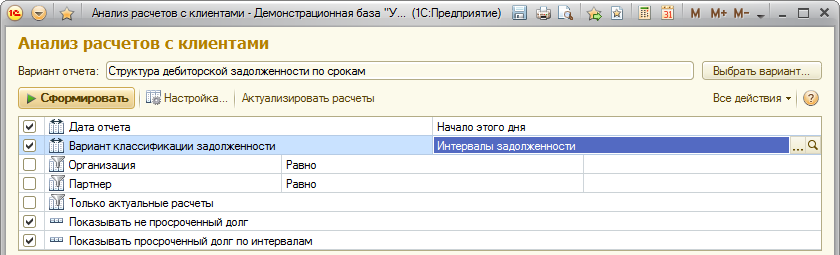
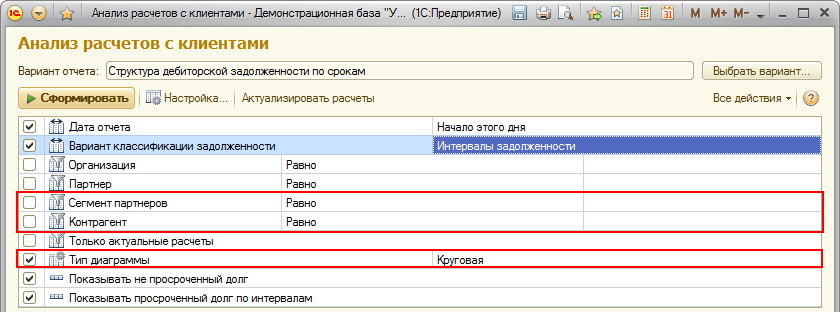
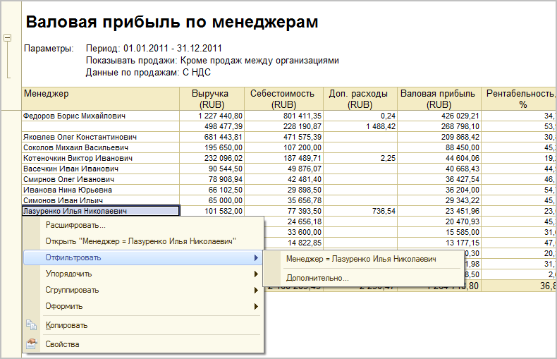
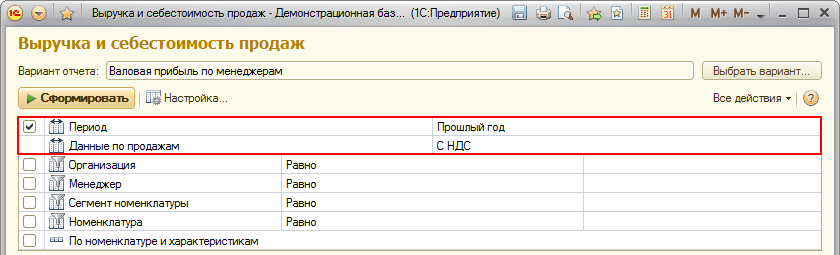
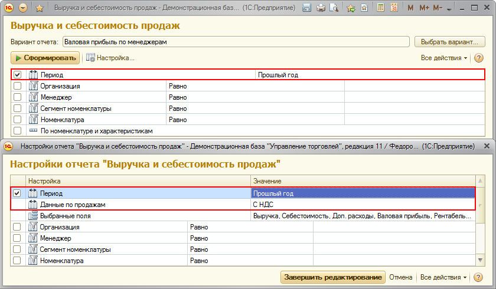
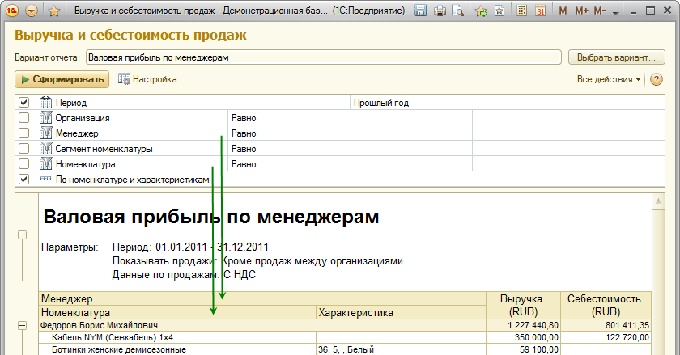
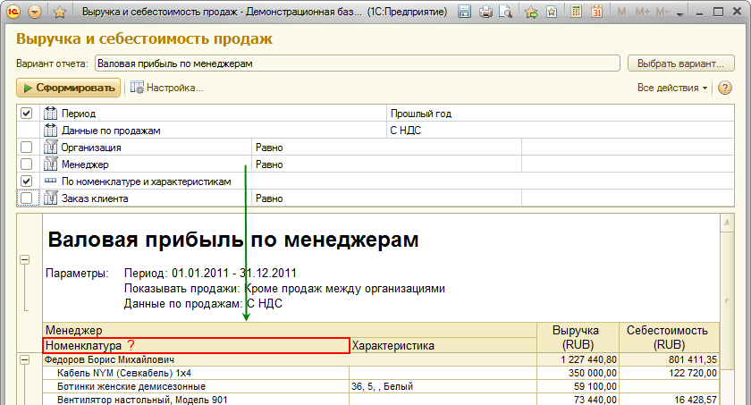
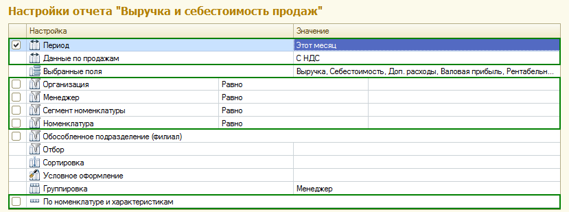

###### #std673

# Пользовательские настройки

Для эффективной работы пользователя с отчетом
нужно определить состав
быстрых и обычных пользовательских настроек.

Состав настроек определяется
основной целью использования отчета.

###### 1.

Общие рекомендации

###### 1.1.

Избегайте наименований настроек,
которые пользователь может трактовать неоднозначно
или не понять.

!!! success "Правильно"

    `Оплатить позже`

!!! failure "Неправильно"

    `Дата оплаты Меньше или равно ...`

###### 1.2.

Для параметров,
без которых запрос СКД не выполнится
или не имеет смысла,
следует:

- установить флажок `Запрещать незаполненные значения`;
- установить режим использования `Всегда`.

###### 1.3.

Обязательные параметры
должны заполняться наиболее вероятными значениями.

!!! example "Пример"

    Период `Этот месяц`
    для отчета `Выручка и себестоимость продаж`.

###### 2.

Быстрые пользовательские настройки

###### 2.1.

Рекомендуется делать не более `5-7` быстрых настроек.

!!! success "Правильно"

    { width="840" }

!!! failure "Неправильно"

    { width="840" }

###### 2.2.

В состав быстрых пользовательских настроек
следует включать только частотные настройки.

Включайте:

- параметры отчета
  (обязательные и необязательные),
  так как контекстное меню отчета
  не позволяет применять параметры "на лету";
- отборы по соответствующим группировкам
  для наиболее важных группировок отчета.

!!! example "Пример"

    Параметры отчета в пользовательских настройках:

    { width="790" }

!!! success "Правильно"

    Все параметры включены в быстрые настройки:

    { width="840" }

!!! failure "Неправильно"

    Параметр `Данные по продажам`
    не включен в быстрые настройки:

    { width="840" }

!!! success "Правильно"

    { width="840" }

!!! failure "Неправильно"

    { width="840" }

###### 2.3.

Если в отчете несколько элементов
(например,
гистограмма и список),
в быстрых настройках
рекомендуется предусмотреть возможность
их отключения.

###### 2.4.

В быстрые настройки контекстных отчетов
не следует включать отборы по полям,
по которым отбор уже устанавливается через параметры
в командах вызова отчета.

###### 3.

Обычные пользовательские настройки

###### 3.1.

Для нечастотных настроек
лучше устанавливать режим редактирования `Обычный`.

###### 3.2.

В состав обычных пользовательских настроек
следует включать:

- отборы по реквизитам объектов анализа,
  которые по умолчанию не выводятся в отчет,
  если такие отборы требуются;
- отборы по числовым показателям отчета,
  если такие отборы требуются;
- настройки выбранных полей (`Выбранные поля`);
- настройки отборов (`Отборы`);
- настройки упорядочивания (`Сортировка`);
- настройки условного оформления (`Условное оформление`);
- настройки группировок (`Группировка`).

!!! example "Примеры"

    `Обособленное подразделение (филиал)`
    как реквизит поля `Организация`.

    `Сумма задолженности Больше ...`.

!!! example "Пример"

    В отчете `Выручка и себестоимость продаж`
    быстрые настройки выделены зеленым,
    остальные настройки - обычные.

    { width="829" }

###### Источник

https://its.1c.ru/db/v8std#content:673
