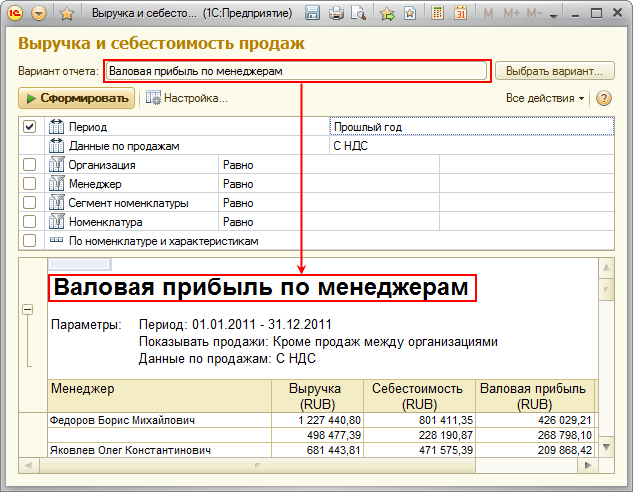
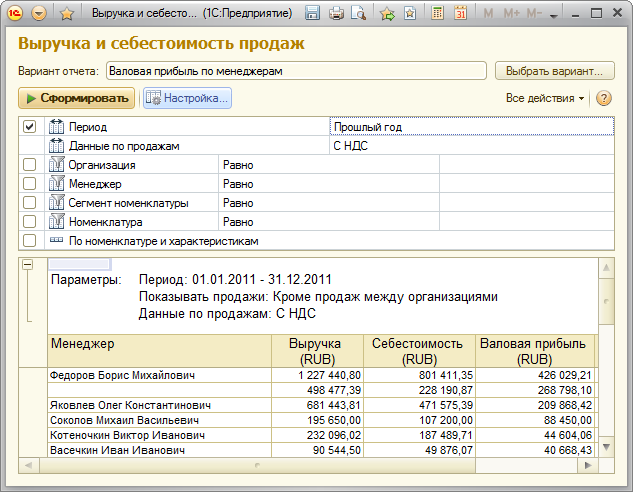

###### #std674

# Заголовок отчета

###### 1.

Заголовок отчета
должен четко отражать
цель анализа
и содержание отчета.

Заголовок должен быть
узнаваемым и понятным.

###### 2.

Если используются варианты отчета,
заголовок каждого варианта должен быть заполнен
и соответствовать наименованию варианта отчета.

Это нужно,
чтобы можно было быстро находить отчет в системе
по заголовку напечатанного отчета.

!!! success "Правильно"

    В таблице отчета есть заголовок,
    соответствующий наименованию варианта:

    { width="633" }

!!! failure "Неправильно"

    В таблице отчета нет заголовка:

    { width="633" }

###### 3.

Если используются однотипные варианты отчета
с разными группировками,
уточнение по группировке
следует писать во множественном числе,
без разделителей
(`-`, скобки и т.п.),
чтобы слова названия были согласованы.

!!! success "Правильно"

    `Анализ расчетов с клиентами по договорам`

!!! failure "Неправильно"

    `Анализ расчетов с клиентами (по договорам)`

В исключительных случаях
можно использовать разделители
или другие специальные знаки,
например,
для стандартизованной отчетности.

###### 4.

Запрещается использовать название `Основной`
для варианта отчета,
потому что для новых пользователей
такое название не раскрывает смысл.

Лучше использовать осмысленные названия.

!!! example "Пример"

    Для отчета `Анализ причин проигрыша сделок`
    варианты могут называться:

    - `Анализ причин проигрыша сделок по партнерам`;
    - `Анализ причин проигрыша сделок по ответственным`;
    - `Анализ причин проигрыша сделок по причинам`.

###### 5.

Следует избегать слова `отчет`
в синониме
и заголовках отчетов.

###### 6.

Если в отчете несколько элементов
(например,
гистограмма и список),
для каждого элемента рекомендуется устанавливать заголовок.

Общий заголовок отчета в этом случае не обязателен.

###### Источник

https://its.1c.ru/db/v8std#content:674
