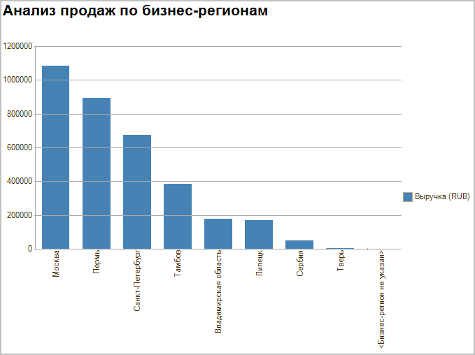
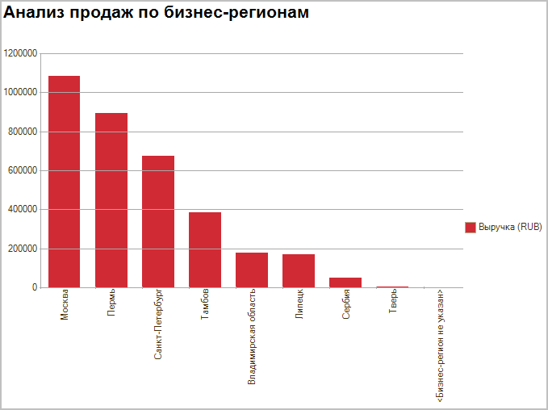

###### #std675

# Отчеты вида "диаграмма"

###### 1. 

Типы диаграмм

Использование диаграмм в отчетах
позволяет визуально и компактно
представлять закономерности в данных,
а значит,
сокращает время поиска нужной информации.

###### 1.1.

Диаграммы в отчетах следует применять,
только если объем данных потенциально невелик
и диаграмма не будет перегружена.

###### 1.2.

Для разных целей поиска информации
следует использовать разные типы диаграмм.

<table>
  <thead>
    <tr>
      <th>Цель поиска</th>
      <th>Тип диаграммы</th>
      <th>Сортировка</th>
      <th>Условие применения</th>
    </tr>
  </thead>
  <tbody>
    <tr>
      <td rowspan="3">Динамика показателей</td>
      <td>График График по шагам</td>
      <td>По возрастанию периода</td>
      <td>Много периодов От 1-й до нескольких серий</td>
    </tr>
    <tr>
      <td>График с областями График с накоплением и областями Нормированные графики</td>
      <td>По возрастанию периода</td>
      <td>Много периодов От 2-х серий до нескольких серий</td>
    </tr>
    <tr>
      <td>Вертикальные гистограммы</td>
      <td>По возрастанию периода</td>
      <td>Несколько периодов До 3-х серий</td>
    </tr>
    <tr>
      <td rowspan="2">Распределение величины по значимым диапазонам</td>
      <td>Вертикальная гистограмма</td>
      <td>Логический порядок диапазонов</td>
      <td>Менее 10 диапазонов</td>
    </tr>
    <tr>
      <td>График</td>
      <td>Логический порядок диапазонов</td>
      <td>Более 10 диапазонов, непрерывная шкала диапазонов</td>
    </tr>
    <tr>
      <td rowspan="3">Анализ структуры показателей</td>
      <td>Круговая диаграмма</td>
      <td>По важности значений показателя, по периоду</td>
      <td>Анализ соотношения компонент как частей целого. Количество компонент до 7-10</td>
    </tr>
    <tr>
      <td>Вертикальная гистограмма</td>
      <td>По убыванию величины показателя</td>
      <td>Рейтинг. Количество компонент - менее 10</td>
    </tr>
    <tr>
      <td>Горизонтальная диаграмма</td>
      <td>По возрастанию величины показателя</td>
      <td>Рейтинг. Количество компонент - более 10</td>
    </tr>
  </tbody>
</table>

###### 1.3.

Следует избегать объемных диаграмм,
так как они искажают информацию
и отвлекают от закономерностей,
которые должны быть видны при визуальном анализе.

###### 2. 

Условное оформление

###### 2.1.

Основной цвет для гистограмм
и линий графиков динамики -
элемент стиля вида цвет `Диаграмма`,
`RGB: 70,130,180` .

###### 2.2.

Основной цвет для прогнозных значений
гистограмм
и линий графиков динамики -
элемент стиля вида цвет `Прогноз`,
`RGB: 199,21,133` .

###### 2.3.

Следует избегать использования
оттенков красного
и зеленого
для отдельных значений (серий) в диаграммах,
если эти значения (серии)
не отражают негативные
или позитивные факты.

!!! success "Правильно"

    { width="679" }

!!! failure "Неправильно"

    { width="679" }

###### Источник

https://its.1c.ru/db/v8std#content:675
