###### #std676

# Отчеты вида "таблица", "список"

###### 1. 

Структура отчета

Отчет должен максимально соответствовать
целям и задачам анализа.

Хороший отчет сразу дает понять:

- для кого он предназначен
  (роль,
  должность пользователя);
- на какие вопросы
  и каким образом
  он помогает получать ответы.

###### 1.1.

Проектируйте отчет так,
чтобы количество уровней вложенности
не превышало `3`.

###### 1.2.

Вложенность группировок
должна отражать связь объектов анализа:
от общего к частному.

!!! example "Пример"

    В отчете `Валовая прибыль по партнерам`
    видно,
    какая номенклатура (частное)
    продана определенному партнеру (общее):

    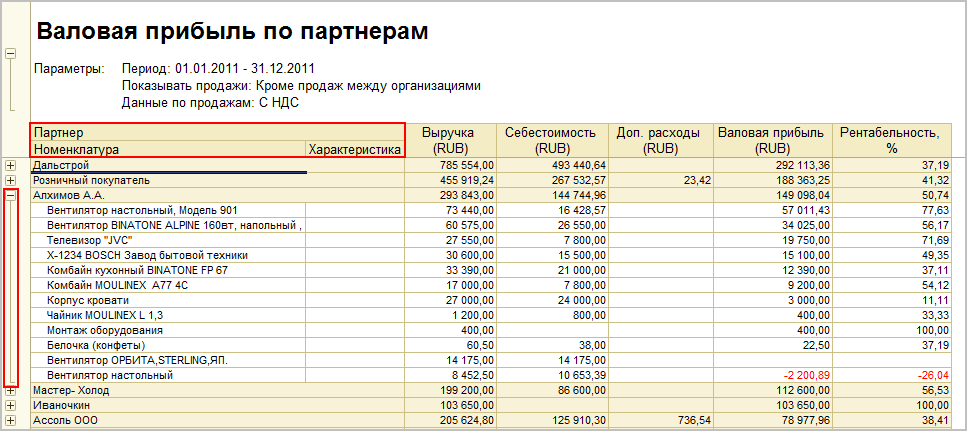{ width="967" }

###### 1.3.

Группировку по периоду
рекомендуется располагать в колонках таблицы
с упорядочиванием по возрастанию.

!!! example "Пример"

    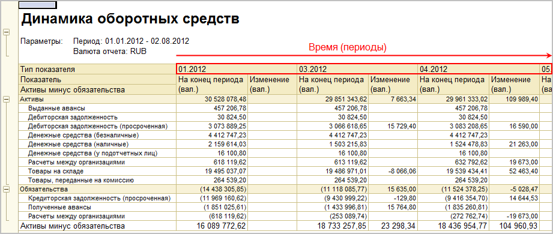{ width="921" }

###### 1.4.

Дополнительную информацию по группировке
следует выводить:

- вместе с объектом анализа,
  если информация уточняет свойства объекта;
- в отдельной колонке,
  если информация тоже является объектом анализа,
  но группировка по ней невозможна
  или усложняет восприятие.

!!! example "Примеры"

    `Характеристика` для объекта `Номенклатура`:

    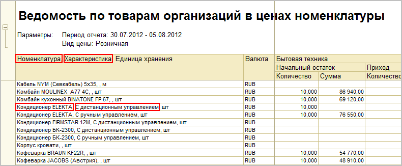{ width="790" }

    `Валюта` в отчетах по анализу расчетов с клиентами:

    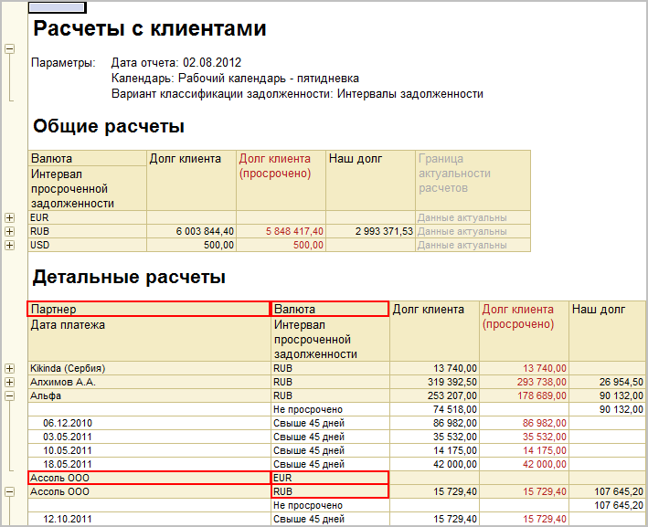{ width="709" }

###### 1.5.

Показатели отчета следует располагать:

- в колонках:
  по важности слева направо,
  либо в порядке,
  отражающем логику вычислений;
- в строках,
  если нужно сравнивать несколько показателей в динамике.

!!! example "Примеры"

    Порядок показателей по формуле
    в отчете `Валовая прибыль по сделкам`:

    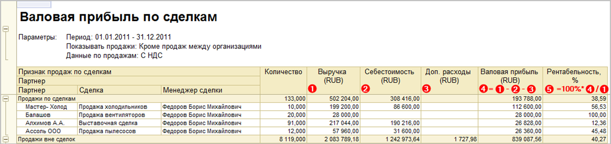{ width="1241" }

    Показатели в строках
    в отчете `Динамика оборотных средств`:

    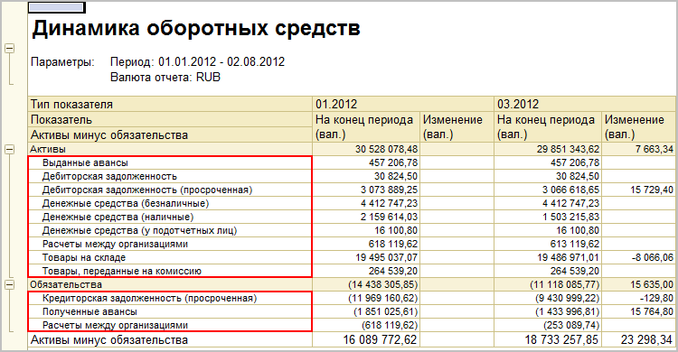{ width="750" }

###### 1.6.

В отчетах,
где данные выводятся списком,
рекомендуется делать колонку
с порядковым номером первой.

###### 1.7.

Если предполагается печать отчета,
оптимизируйте макет под формат `A4`.

###### 2. 

Сортировка данных

###### 2.1.

Сортировку по умолчанию
следует задавать исходя из назначения отчета,
чтобы наверху были самые важные для пользователя данные.

!!! success "Правильно"

    Сортировка по долгу клиента,
    сравнивать проще:

    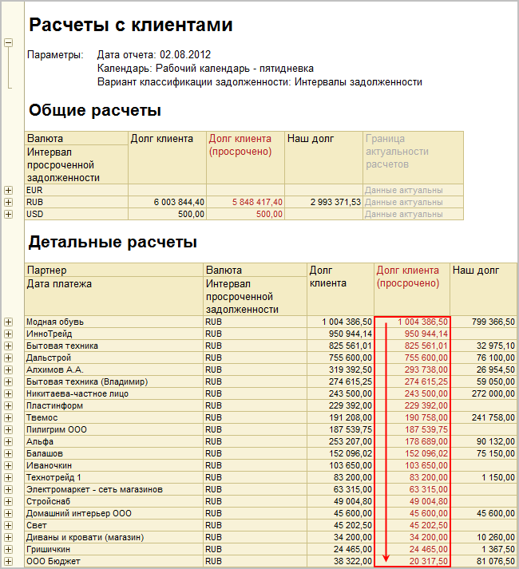{ width="650" }

!!! failure "Неправильно"

    Сортировка по алфавиту,
    сравнивать сложнее:

    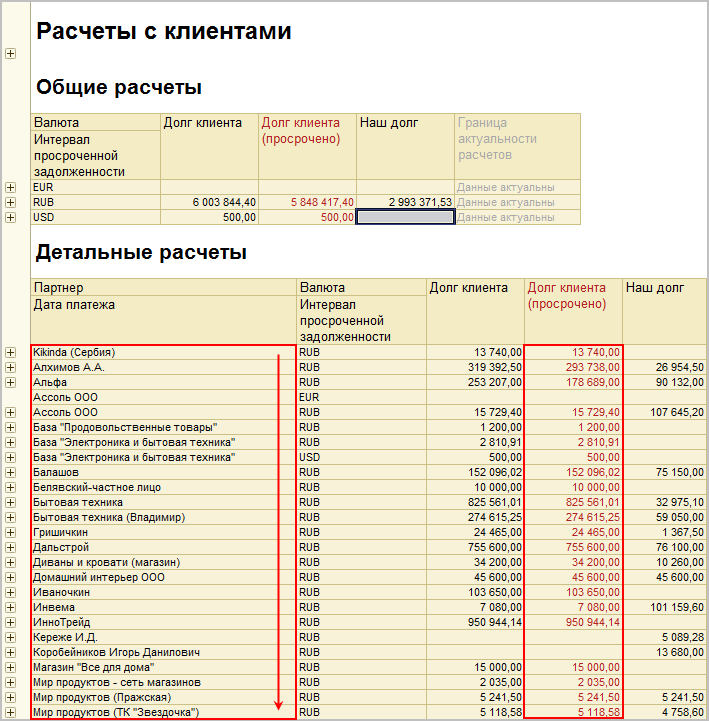{ width="709" }

###### 2.2.

Сортировку по алфавиту (по возрастанию)
следует применять,
если числовые показатели дополнительны,
а цель анализа - поиск объекта учета по наименованию.

!!! example "Пример"

    В отчете `Движения товаров по складам`
    применяется сортировка
    по наименованию номенклатуры:

    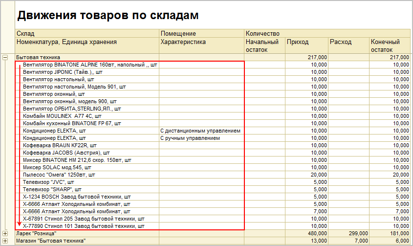{ width="845" }

###### 2.3.

Сортировку по периоду (по возрастанию)
следует применять,
когда отчет анализирует хозяйственные операции
в разрезе времени.

###### 2.4.

Сортировка должна применяться
только к видимым объектам анализа
(группировкам или показателям).

Пользователю должен быть понятен принцип сортировки
без дополнительных объяснений.

###### 3. 

Условное оформление

Оформление элементов отчета
работает как индикатор важных фактов.

При цветовом оформлении таблиц,
списков
и диаграмм
следует придерживаться правил ниже.

###### 3.1.

Негативные факты оформляются красным цветом
(элемент стиля `НегативноеСобытие`,
`RGB: 178,34,34` ).

Позитивные факты оформляются зеленым цветом
(элемент стиля `ПозитивноеСобытие`,
`RGB: 0,128,0` ).

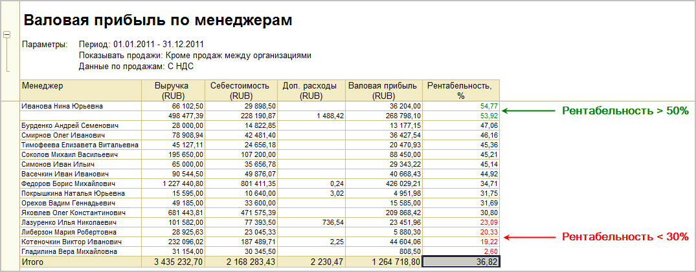{ width="1075" }

###### 3.2.

Для фона ячеек
с неактуальной информацией
используется розовый цвет
(элемент стиля `НеактуальнаяИнформация`,
`RGB: 255,200,200` ).

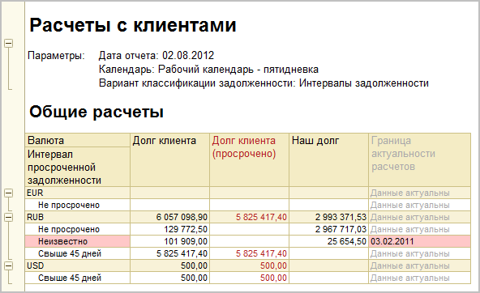{ width="592" }

###### 3.3.

Итоговая информация
оформляется жирным шрифтом
(элемент стиля вида шрифт `ИтоговаяИнформация`,
начертание `жирный`).

###### 3.4.

Для числовых полей
включайте выделение отрицательных значений,
если отрицательное значение
однозначно указывает на ошибку
или является негативным фактом.

###### 3.5.

Данные,
помеченные на удаление,
оформляются зачеркнутым шрифтом
(элемент стиля вида шрифт `ПомеченныеНаУдалениеДанные`,
начертание `зачеркнутый`).

###### 4. 

Общие итоги

Если отображение общих итогов
не имеет смысла,
его следует отключать.

!!! example "Пример"

    В отчете `Прайс-лист`
    для колонки `Цена`
    общие итоги нужно отключить.

###### Источник

https://its.1c.ru/db/v8std#content:676
