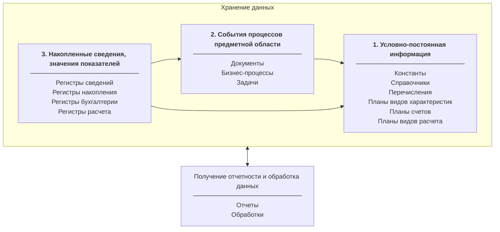

###### #std683

# Общие сведения об организации хранения данных

###### 1.

При проектировании системы
одна из ключевых задач -
выбрать типы объектов метаданных
для хранения сущностей предметной области.

Неправильный выбор типов объектов
приводит к неэффективности решения,
усложняет развитие
и мешает адаптации
к изменению состава задач.

###### 2.

При выборе типа объектов метаданных
в общем случае
используйте следующую схему прикладного решения:

*Стрелки на схеме обозначают взаимосвязи между данными (взаимные ссылки).* 

На схеме выделяются три блока:

1. **Условно-постоянная информация**.
   Информация вводится один раз,
   сравнительно редко меняется
   и многократно используется.
   Примеры: классификаторы,
   настройки,
   перечни,
   реестры,
   нормативно-справочная информация.
2. **События процессов предметной области**.
   События привязаны ко времени
   и при регистрации
   могут порождать сведения
   или изменять значения показателей.
   Примеры: документооборот,
   учетные события,
   регистрация заявок и звонков.
3. **Накопленные сведения, значения показателей**.
   Данные характеризуют процессы
   и текущее состояние прикладной области.
   В отличие от первых двух блоков,
   это данные необъектной природы:
   они не являются самостоятельными сущностями.
   Примеры: история продаж,
   остатки на складах,
   текущий баланс,
   история курсов валют.

Отдельно выделяются средства анализа и обработки данных:
отчеты и механизмы,
которые опираются на данные всех блоков,
но сами данные не хранят.

Подробнее о задачах и принципах хранения информации:
книга
[«Профессиональная разработка в системе 1С Предприятие 8»](https://buh.ru/books/detail.php?ID=42696),
глава 6.

###### 2.1.

Упрощенно,
для каждой сущности предметной области
сначала выберите блок:

- если нужно хранить сравнительно редко изменяющуюся информацию,
  не привязанную ко времени,
  выбирайте блок условно-постоянной информации (`1`);
- если нужно регистрировать события,
  требующие документального подтверждения,
  и отслеживать последовательность на временной оси,
  выбирайте блок событий процессов (`2`);
- в остальных случаях
  относите сущность
  к блоку сведений и значений показателей (`3`).

Развернутые критерии выбора блока:

=== "Условно-постоянная информация"

    | Критерий | Значение |
    | --- | --- |
    | Основное предназначение | Хранение нормативно-справочной информации и реестров. |
    | Отслеживание изменения состояния | Не требуется. |
    | Иерархия и группировка данных | Требуется, в том числе между разными сущностями. |
    | Ключевые свойства | Нужны `Наименование` и `Код`. |
    | Хранение значений дополнительных реквизитов сущности | Нужно хранить редко изменяемые реквизиты произвольных данных. |
    | Нумерация | Нужны серии кодов по всем элементам типа или в пределах иерархии. |

=== "События процессов предметной области"

    | Критерий | Значение |
    | --- | --- |
    | Основное предназначение | Регистрация событий процессов и документальное подтверждение сведений. |
    | Отслеживание изменения состояния | Требуется. Например: регистрация/отмена регистрации документа, учет запусков и окончаний процесса, смена состояния задач, формирование движений. |
    | Иерархия и группировка данных | Не требуется. |
    | Ключевые свойства | Нужно учитывать дату события и его номер. |
    | Хранение значений дополнительных реквизитов сущности | Нужно хранить ссылки на другие объекты и параметры, характеризующие событие. |
    | Нумерация | Нужны серии номеров по всем элементам данного типа или в пределах периода по дате, включая сквозную нумерацию объектов разных типов. |

=== "Накопленные сведения, значения показателей"

    | Критерий | Значение |
    | --- | --- |
    | Основное предназначение | Хранение данных, характеризующих процессы и текущее состояние прикладной области. |
    | Отслеживание изменения состояния | Не требуется. |
    | Иерархия и группировка данных | Не требуется. |
    | Ключевые свойства | Не требуется. |
    | Хранение значений дополнительных реквизитов сущности | Нужно хранить только значения реквизитов для других объектов базы. |
    | Нумерация | Не требуется. |

###### 2.2.

После выбора блока
примите решение
о конкретном типе объекта метаданных
внутри этого блока.

!!! tip "Уточнение"

    Для пп. `2.2.1`-`2.2.3`
    область применения:
    `управляемое приложение`, `обычное приложение`.

###### 2.2.1.

Для хранения условно-постоянной информации:

1. Для хранения плана счетов
   по [принципам двойной записи](https://its.1c.ru/db/garant/content/10036812/hdoc/1)
   используйте объект метаданных
   [«План счетов»](https://its.1c.ru/db/v8devgloss/content/28/hdoc/01).
2. Для хранения перечня видов расчета
   для [учета начислений и удержаний](https://its.1c.ru/db/garant/content/12025268/hdoc/1020)
   используйте объект метаданных
   [«План видов расчета»](https://its.1c.ru/db/v8devgloss/content/28/hdoc/03).
3. Для хранения списка характеристик,
   когда состав списка,
   тип характеристик
   и их состав определяет пользователь,
   используйте
   [«План видов характеристик»](https://its.1c.ru/db/v8devgloss/content/28/hdoc/02).
4. Для хранения одиночного значения,
   редактируемого пользователем
   (обычно администратором)
   и не требующего ссылок из других данных,
   используйте
   [«Константа»](https://its.1c.ru/db/v8devgloss/content/26/hdoc).
5. Для фиксированного списка значений,
   который не редактируется пользователем
   и не имеет дополнительных реквизитов,
   используйте
   [«Перечисление»](https://its.1c.ru/db/v8devgloss/content/62/hdoc).
6. В остальных случаях,
   как правило,
   используйте
   [«Справочник»](https://its.1c.ru/db/v8devgloss/content/22/hdoc).

Развернутые критерии выбора типа объекта:

=== "Константа"

    | Критерий | Значение |
    | --- | --- |
    | Основное предназначение | Хранение одиночных значений, предопределенных данных. |
    | Добавление и редактирование пользователем | Требуется только изменение значения. |
    | Иерархия и группировка данных | Не требуется. |
    | Хранение значений дополнительных реквизитов сущности | Не требуется. |
    | Хранение списков значений дополнительных реквизитов | Не требуется. |
    | Возможность ввода на основании других объектов | Не требуется. |
    | Нумерация | Не требуется. |

=== "Перечисление"

    | Критерий | Значение |
    | --- | --- |
    | Основное предназначение | Хранение списка неизменных представлений без дополнительных атрибутов. |
    | Добавление и редактирование пользователем | Не требуется. |
    | Иерархия и группировка данных | Не требуется. |
    | Хранение значений дополнительных реквизитов сущности | Не требуется. |
    | Хранение списков значений дополнительных реквизитов | Не требуется. |
    | Возможность ввода на основании других объектов | Не требуется. |
    | Нумерация | Не требуется. |

=== "План видов характеристик"

    | Критерий | Значение |
    | --- | --- |
    | Основное предназначение | Хранение списка сущностей и значений характеристик экземпляров сущности. |
    | Добавление и редактирование пользователем | Требуется добавление, удаление, изменение элементов, редактирование состава и значений характеристик сущности. |
    | Иерархия и группировка данных | Требуется в пределах одной сущности. |
    | Хранение значений дополнительных реквизитов сущности | Нужно хранить произвольные данные для атрибутов сущности. |
    | Хранение списков значений дополнительных реквизитов | Требуется хранение списков наборов значений реквизитов для сущности. |
    | Возможность ввода на основании других объектов | Нужен ввод новых элементов с использованием информации других объектов. |
    | Нумерация | Нужны серии кодов по всем элементам одного типа или в пределах группировки. |

=== "Справочник"

    | Критерий | Значение |
    | --- | --- |
    | Основное предназначение | Хранение списка объектов и значений их атрибутов. |
    | Добавление и редактирование пользователем | Требуется добавление, удаление и изменение элементов. |
    | Иерархия и группировка данных | Требуется в пределах одной сущности или между разными сущностями. |
    | Хранение значений дополнительных реквизитов сущности | Нужно хранить произвольные данные для атрибутов сущности. |
    | Хранение списков значений дополнительных реквизитов | Требуется хранение списков наборов значений реквизитов для сущности. |
    | Возможность ввода на основании других объектов | Нужен ввод новых элементов с использованием информации других объектов. |
    | Нумерация | Нужны серии кодов по всем элементам одного типа, в пределах группировки или подчинения. |

###### 2.2.2.

Для хранения событий процессов предметной области:

1. Если нужен учет одиночных событий,
   адресованных исполнителю
   (пользователю,
   сотруднику,
   группе,
   роли)
   и не требующих формирования движений,
   используйте
   [«Задача»](https://its.1c.ru/db/v8devgloss/content/94/hdoc).
2. Если нужно регистрировать возникновение
   и ход регулярного процесса
   как последовательность действий,
   используйте
   [«Бизнес-процесс»](https://its.1c.ru/db/v8devgloss/content/42/hdoc).
   Для учета событий в рамках процесса
   используйте
   [«Задача»](https://its.1c.ru/db/v8devgloss/content/94/hdoc).
3. В остальных случаях,
   как правило,
   используйте
   [«Документ»](https://its.1c.ru/db/v8devgloss/content/23/hdoc).

Развернутые критерии выбора типа объекта:

=== "Задача"

    | Критерий | Значение |
    | --- | --- |
    | Основное предназначение | Учет одиночных событий, адресованных исполнителям. |
    | Вложенность | Не требуется. |
    | Объединение в журналы | Не требуется. |
    | Состояние объекта | Нужны состояния `новый`, `выполнено`. |
    | Нумерация | Нужны серии номеров по всем задачам данного вида или в пределах периода по дате. |

=== "Бизнес-процесс (с задачами)"

    | Критерий | Значение |
    | --- | --- |
    | Основное предназначение | Учет последовательности событий, адресованных исполнителям. |
    | Вложенность | Нужен учет процессов, вложенных в другие процессы (иерархия задач). |
    | Объединение в журналы | Не требуется. |
    | Состояние объекта | Нужны состояния `новый`, `в работе`, `завершен`. |
    | Нумерация | Нужны серии номеров по всем процессам данного вида или в пределах периода по дате, плюс нумерация событий внутри процесса. |

=== "Документ"

    | Критерий | Значение |
    | --- | --- |
    | Основное предназначение | Регистрация событий во времени и генерация вторичных данных, соответствующих этим событиям. |
    | Вложенность | Не требуется. |
    | Объединение в журналы | Нужно объединение документов разных видов в одном журнале. |
    | Состояние объекта | Нужны состояния `проведен`, `не проведен`. |
    | Нумерация | Нужны серии номеров для документов разных видов: сквозные или в пределах периода по дате. |

###### 2.2.3.

Для хранения накопленных сведений
и значений показателей:

1. Для хранения данных учета
   с использованием
   [принципа двойной записи](https://its.1c.ru/db/garant/content/10036812/hdoc/1)
   используйте
   [«Регистр бухгалтерии»](https://its.1c.ru/db/v8devgloss/content/20/hdoc/04).
2. Для хранения результатов расчета
   [учета начислений и удержаний](https://its.1c.ru/db/garant/content/12025268/hdoc/1020)
   используйте
   [«Регистр расчета»](https://its.1c.ru/db/v8devgloss/content/20/hdoc/05).
3. Если требуется хранить изменения показателей
   (приход/расход)
   и получать остатки и обороты за период,
   используйте
   [«Регистр накопления»](https://its.1c.ru/db/v8devgloss/content/151/hdoc).
4. Во всех остальных случаях
   используйте
   [«Регистр сведений»](https://its.1c.ru/db/v8devgloss/content/152/hdoc).

Развернутые критерии выбора типа объекта:

=== "Регистр накопления"

    | Критерий | Значение |
    | --- | --- |
    | Основное предназначение | Хранение изменений данных (приход и расход значений показателей). |
    | Получение данных | Нужно получать остатки и обороты. |
    | Подтверждение происхождения данных | Требуется обязательная связь с регистрирующим документом. |

=== "Регистр сведений"

    | Критерий | Значение |
    | --- | --- |
    | Основное предназначение | Хранение информации в виде наборов записей, регистрация сведений и значений. |
    | Получение данных | Нужно получать срез на момент времени или текущее значение показателей. |
    | Подтверждение происхождения данных | Связь с регистрирующим документом не обязательна. |

###### 3.

Пример выбора типов объектов метаданных.

Пусть организация
периодически проводит анкетирование.
При заполнении анкеты
указывается дата анкетирования,
набор вопросов
и набор ответов.
Сущность `Анкета`
привязана к дате
и порождает статистику
(ответы на вопросы).

Следовательно:

- это периодическое событие,
  привязанное ко времени,
  которое порождает значения параметров,
  то есть второй блок
  «события предметной области»;
- внутри второго блока
  это должен быть `Документ`,
  потому что анкета
  формирует вторичные данные
  (результаты ответов на вопросы).

###### Источник

https://its.1c.ru/db/v8std#content:683
