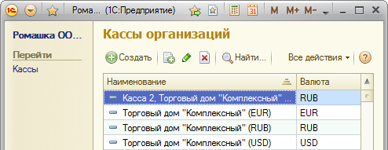
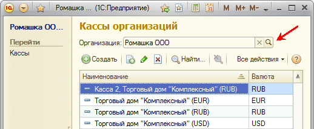
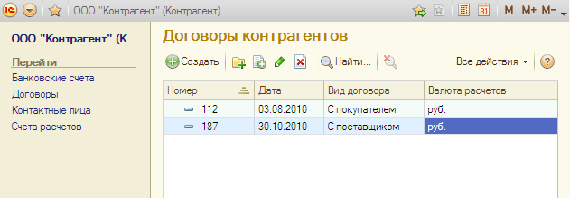

###### #std684

# Список, открываемый из панели навигации формы объекта

###### 1.

Список,
который открывается из панели навигации формы объекта,
следует показывать с отбором по этому объекту.

!!! example "Пример"

    В списке `Договоры`
    справочника `Контрагент`
    отображаются договоры
    только конкретного контрагента
    (например, `ООО "Контрагент"`).

###### 2.

В списке не следует выводить название объекта
(как надпись или поле ввода в режиме `Просмотр`),
потому что оно уже отображается
в области системных команд
и в панели навигации.

!!! success "Правильно"

    { width="494" }

!!! failure "Неправильно"

    { width="518" }

###### 3.

В списке не следует выводить колонку
с названием объекта,
потому что это значение
в каждой строке одинаковое.

!!! example "Пример"

    В списке `Договоры`
    справочника `Контрагент`
    колонка `Контрагент` не выводится.

    { width="631" }

###### 4.

В названии команды,
которая отображается в панели навигации,
не следует указывать название объекта,
потому что его можно определить из контекста.

!!! success "Правильно"

    - `Банковские счета`
    - `Договоры`
    - `Ответственные лица`

!!! failure "Неправильно"

    - `Банковские счета контрагента`
    - `Договоры контрагента`
    - `Ответственные лица организаций`

###### Источник

https://its.1c.ru/db/v8std#content:684
