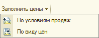
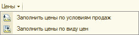
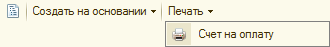

###### #std694

# Подменю

###### 1.

При формировании командных панелей
однотипные команды
рекомендуется объединять в подменю.

###### 2.

Если в подменю есть команды,
в заголовках которых
присутствует общий текст,
его следует выносить
в заголовок подменю.

!!! success "Правильно"

    { width="197" }

!!! failure "Неправильно"

    { width="281" }

###### 3.

Подменю не должно содержать
только одну команду.

В этом случае
команду следует выносить
в командную панель.

!!! success "Правильно"

    { width="270" }

!!! failure "Неправильно"

    { width="330" }

###### Источник

https://its.1c.ru/db/v8std#content:694
