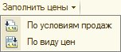
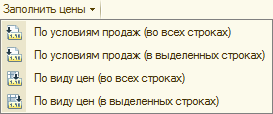
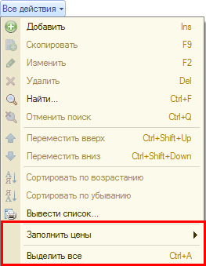
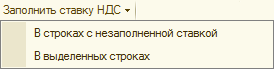

###### #std695

# Командные панели табличных частей

Этот стандарт распространяется
на табличные части форм объектов
и не распространяется на формы списков.

Командная панель табличной части
может содержать команды,
применяемые:

- к табличной части в целом;
- к отдельным строкам табличной части
  (одной или нескольким);
- к одной строке табличной части.

###### 1.

Команды, применяемые к табличной части в целом и к отдельным строкам табличной части

###### 1.1.

Команды,
влияющие на заполнение отдельных строк,
должны применяться только к выделенным строкам.

!!! example "Пример"

    Лучше использовать одну команду `Заполнить по виду цен`
    вместо двух:
    `Заполнить по виду цен во всех строках`
    и
    `Заполнить по виду цен в выделенных строках`.

!!! success "Правильно"

    { width="152" }

!!! failure "Неправильно"

    { width="273" }

###### 1.2.

Если добавляется команда,
влияющая на выделенные строки,
в подменю `Все действия`
следует добавлять команду `Выделить все`.

Это нужно,
потому что многие пользователи
не используют горячие клавиши `++ctrl+a++`.

!!! example "Пример"

    Команда `Выделить все`
    добавлена в подменю `Все действия`,
    чтобы можно было быстро заполнить цены
    не только по выделенным строкам,
    но и по всем.

    { width="263" }

###### 1.3.

Допускается добавлять команды,
которые действуют не на выделенные строки,
а на строки,
отобранные по специальному алгоритму.

Это допустимо только для частотных операций,
где пользователю сложно
самостоятельно выделить нужные строки.

!!! example "Пример"

    Команда автоматического заполнения вида цен
    только по строкам,
    где вид цен не заполнен.

###### 1.4.

Если в одной командной панели
есть схожие команды,
из которых одна действует на выделенные строки,
а другая на все строки,
из названий команд
должно быть ясно,
на какие строки они влияют.

!!! example "Пример"

    { width="274" }

###### См. также

- [#std653: Групповые обработки в списках](653.md)
- [#std694: Подменю](694.md)

###### Источник

https://its.1c.ru/db/v8std#content:695
