###### #std696

# Формы пошаговых помощников (мастеров)

Пошаговые помощники (мастера)
используются для последовательного,
контекстно-зависимого ввода данных.

Весь процесс ввода
разбивается на отдельные этапы.

!!! example "Примеры"

    Помощник ввода нового партнера,
    помощник приема сотрудника на работу,
    помощник создания опроса,
    помощник обновления системы.

###### 1. 

Расположение и оформление кнопок

###### 1.1.

Кнопки формы пошагового помощника
оформляются как командная панель
в нижней части формы.

Такое размещение характерно
именно для форм помощников.

!!! example "Пример"

    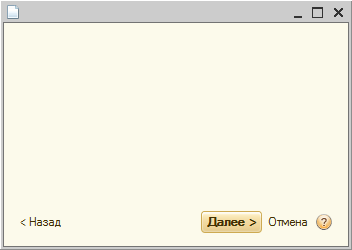{ width="352" }

###### 1.2.

На каждом этапе помощника
одна из кнопок должна быть кнопкой по умолчанию
и визуально отличаться
(желтый фон и полужирный шрифт).

Для разных экранов помощника
кнопка по умолчанию
может называться по-разному.

Обычно это команда,
которая чаще всего используется
на конкретном экране.

!!! example "Пример"

    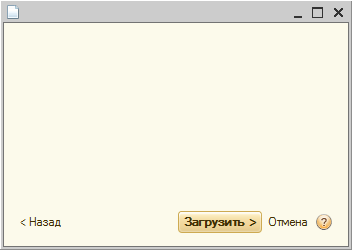{ width="352" }
    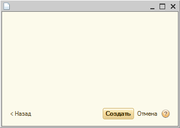{ width="352" }

###### 2. 

Состав кнопок

###### 2.1.

Состав кнопок определяется
для каждого помощника отдельно
и зависит от решаемых задач.

Командная панель может включать:

- кнопку по умолчанию
  (`Далее`,
  кнопку подтверждения ввода,
  `Закрыть`);
- `Назад`;
- `Отмена`;
- `Справка`.

###### 2.2. 

Кнопка "Далее"

Используется для перехода
к следующему этапу помощника.

В название кнопки
добавляется угловая скобка `>`.

!!! example "Пример"

    { width="63" }

###### 2.3. 

Кнопка "Назад" (при наличии)

Используется для перехода
к предыдущему этапу помощника.

В название кнопки
добавляется угловая скобка `<`.

В командной панели
кнопка `Назад` всегда располагается
в крайнем левом углу.

На первый экран помощника
кнопка `Назад` не добавляется.

!!! example "Пример"

    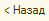{ width="49" }

###### 2.4. 

Кнопка, подтверждающая ввод данных

Используется для безусловного применения
всех действий,
выполненных в помощнике.

В качестве названия
следует использовать глагол,
характеризующий выполняемое действие.

!!! example "Примеры"

    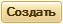{ width="63" }
    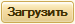{ width="75" }
    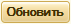{ width="71" }

Если подходящее название подобрать сложно,
можно использовать `Готово`.

!!! example "Пример"

    { width="55" }

Название `ОК` лучше не использовать:
кнопка получается слишком маленькой,
и пользователю сложнее понять
ее смысл.

Если кнопка подтверждения ввода
расположена на промежуточном экране помощника,
в название добавляется `>`.

Если кнопка находится на последнем экране,
`>` не добавляется.

!!! example "Пример"

    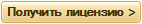{ width="142" }
    { width="86" }

###### 2.5. 

Кнопка "Закрыть"

После нажатия кнопки подтверждения ввода
может показываться справочная информация
о результатах операции
(положительных и отрицательных).

Если информация выводится только справочно
и от пользователя
не требуется дополнительных действий,
кнопкой по умолчанию
используется `Закрыть`.

По нажатию этой кнопки
форма помощника закрывается.

!!! example "Пример"

    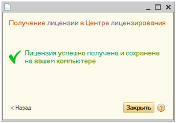{ width="360" }

###### 2.6. 

Кнопка "Отмена" (при наличии)

Позволяет пользователю
отказаться от ввода данных
и закрыть форму помощника.

Если пользователь уже ввел данные,
по нажатию `Отмена`
нужно задавать вопрос
об их сохранении.

В командной панели
кнопка `Отмена` располагается
между кнопкой подтверждения ввода
и кнопкой `Справка`.

!!! example "Пример"

    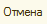{ width="47" }
    { width="136" }

###### 2.7. 

Кнопка "Справка" (при наличии)

Используется для отображения
справочной информации
по вводу данных в помощнике.

Если такая информация не предусмотрена,
кнопку `Справка` показывать не нужно.

В командной панели
кнопка `Справка`
всегда располагается
крайней справа.

!!! example "Пример"

    { width="17" }
    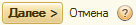{ width="136" }

###### Источник

https://its.1c.ru/db/v8std#content:696
