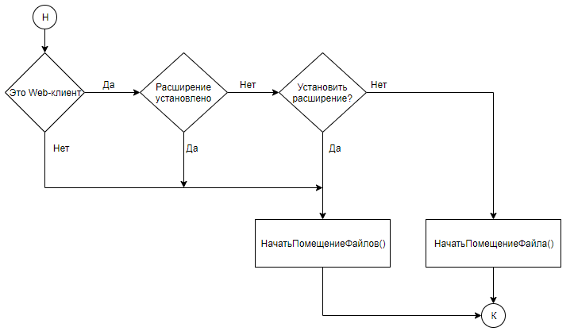
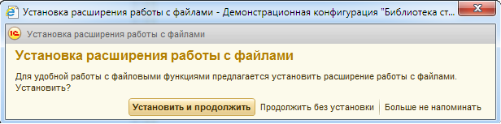

###### #std700

# Установка внешних компонент и расширений платформы

###### 1.1.

Установка внешних компонент и расширений должна быть интерактивной.
Решение об установке принимает пользователь.

В диалоге установки объясняйте:

- зачем нужна компонента;
- что именно не будет работать без нее.

!!! failure "Неправильно"

    ```bsl
    Если Не ПодключитьВнешнююКомпоненту(...) Тогда
        УстановитьВнешнююКомпоненту(...);
    КонецЕсли;
    ```

!!! success "Правильно"

    Сначала показать пользователю понятный диалог с кнопками `Установить` и `Продолжить`.

###### 1.2.

Предлагайте установку в момент, когда пользователь запускает конкретное прикладное действие, зависящее от компоненты.

Типовой сценарий:

- пользователь запускает действие (например, отправка отчета);
- система проверяет наличие компоненты;
- при отсутствии показывает предложение установить;
- после установки пользователь продолжает исходное действие.

Такой подход снижает проблемы совместимости на разных браузерах.

!!! example "Пример"

    Предложение об установке расширения для работы с файлами при загрузке файла:

    { width="723" }

###### 1.3.

Если используется БСП, для сценариев работы с файлами применяйте API `#!bsl ФайловаяСистемаКлиент`.

Рекомендуемые замены:

- `#!bsl ВыбратьКаталог()` вместо `#!bsl ДиалогВыбораФайла.Показать()` в режиме выбора каталога;
- `#!bsl ЗагрузитьФайл()` вместо `#!bsl ПоместитьФайл()` и аналогов;
- `#!bsl ЗагрузитьФайлы()` вместо `#!bsl ПоместитьФайлы()` и аналогов;
- `#!bsl ОткрытьФайл()` вместо `#!bsl ЗапуститьПриложение()` для открытия файла в ассоциированной программе;
- `#!bsl СохранитьФайл()`/`#!bsl СохранитьФайлы()` вместо прямых вызовов методов получения файлов;
- в остальных случаях `#!bsl ПодключитьРасширениеДляРаботыСФайлами()`.

!!! example "Пример"

    { width="616" }

###### 2.

В конфигурации должна быть отдельная функция, позволяющая установить компоненты и расширения в любой момент работы (например, из персональных или административных настроек).

###### См. также

- [#std467: Общие требования к конфигурации](467.md)
- [#std774: Безопасность запуска приложений](774.md)

###### Проверки

~[#acc:150](../diagnostics/acc/150.md)~
~[#acc:1348](../diagnostics/acc/1348.md)~
###### Источник

https://its.1c.ru/db/v8std#content:700
