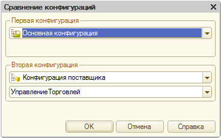
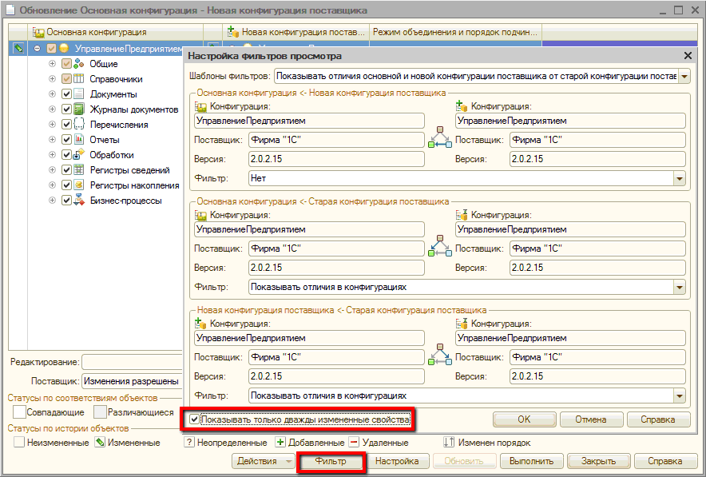
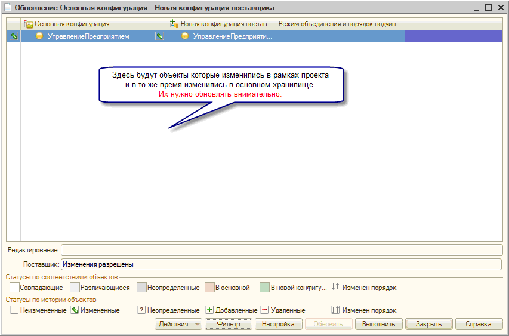
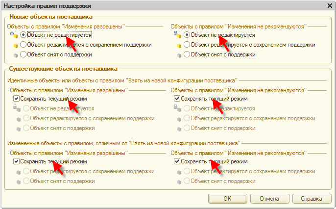
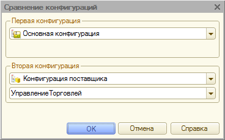

###### #std709

# Технология разветвленной разработки конфигураций

Цели внедрения технологии:

- повышение качества разрабатываемой конфигурации;
- повышение культуры разработки и тестирования;
- обеспечение непрерывного развития конфигураций в условиях жестких сроков разработки.

###### 1.

Определения

**Плановая версия конфигурации** - версия,
содержащая существенное развитие функционала,
с заранее назначенным сроком выпуска.

**Исправительная версия** - версия,
которая выпускается при необходимости
срочной публикации исправлений критичных ошибок.
В исключительных случаях
исправительная версия может содержать
новый функционал
(например, изменения для поддержки законодательства).
Срок выпуска определяется
по количеству и критичности ошибок,
обнаруженных в плановой версии.

**Технический проект** - задание
на доработку конфигурации.
Каждый технический проект
должен иметь четко сформулированную цель
и конечный список изменений,
которые нужно выполнить для ее достижения.

Для организации разработки и сопровождения конфигураций
(в том числе для ведения технических проектов и списка ошибок)
рекомендуется использовать
**Систему проектирования прикладных решений (СППР)**.

###### 2.

Разработка исправительных версий

###### 2.1.

Для выпуска каждой исправительной версии
создавайте новое хранилище
на основе конфигурации
последней выпущенной версии.

!!! tip "Важно"

    Создавайте новое хранилище,
    а не копируйте основное.

###### 2.2.

В исправительной версии
не должно быть объемных доработок конфигурации.
Иначе нужно пересматривать
сроки выпуска плановой версии.

###### 2.3.

Все закладки в хранилище исправительной версии
должны содержать комментарий.

Требования к комментариям
аналогичны требованиям
к закладкам в хранилище плановой версии
(см. п. 3.4).

###### 2.4.

Все изменения,
которые выполняются в исправительном релизе,
должны синхронно повторяться
в основном хранилище.

Если в исправительном релизе
добавляются новые объекты
(или реквизиты объектов),
переносите изменения
только через сравнение и объединение конфигураций.
Это нужно,
чтобы не расходились внутренние идентификаторы объектов.

###### 2.5.

При сборке исправительной версии
рекомендуется устанавливать метку
с номером сборки
на закладке той версии хранилища,
которая идет в сборку.
Обычно это последняя закладка
на момент сборки.

###### 3.

Разработка плановой версии

###### 3.1.

Плановые версии
разрабатываются в основном хранилище конфигурации.

###### 3.2.

Закладки в основное хранилище
нужно выполнять так,
чтобы каждая закладка
переводила конфигурацию
из одного рабочего
(готового к выпуску)
состояния в другое.

**Не закладывайте не полностью отлаженный функционал.**
Основное хранилище
должно всегда оставаться
в «неразваленном» состоянии,
чтобы в любой момент
можно было начать сборку плановой версии.

###### 3.3.

В основном хранилище
разрешается выполнять:

- исправление ошибок,
  не требующих перепроектирования,
  объемного кодирования и тестирования.
  Если ошибка требует крупных переработок
  и/или пересмотра проектных решений,
  исправляйте ее в рамках технического проекта.
  Порядок работы с основным хранилищем
  в этом случае должен быть таким же,
  как для других технических проектов;
- встраивание новых версий библиотек;
- встраивание полностью отлаженных проектов,
  прошедших отладочное тестирование;
- в исключительных случаях
  разработку некоторых проектов
  (например, проектов массового рефакторинга).

Рекомендуется использовать возможности **СППР**
для автоматической генерации
комментариев к закладкам,
связанным с исправлением ошибок
и встраиванием технических проектов.

###### 3.4.

Все закладки в основное хранилище
должны содержать комментарий.

Содержание комментария
зависит от характера выполненных работ:

- при исправлении ошибки
  обязательно указывайте
  номер и краткое наименование ошибки
  в системе баг-трекинга;
- при встраивании новой версии библиотеки
  указывайте название библиотеки
  и точный номер ее версии;
- при встраивании технических проектов
  указывайте номер проекта
  в системе ведения проектной документации
  и краткое наименование;
- при выполнении работ
  по техническому проекту
  в основном хранилище
  комментарий,
  помимо номера и краткого наименования проекта,
  должен содержать
  краткое описание изменений,
  сделанных в этой закладке.

###### 3.5.

Все изменения по техническому проекту
переносите в основное хранилище
за одну закладку.

Если нужно переносить изменения несколько раз,
открывайте несколько проектов.

###### 3.6.

После переноса изменений
в основном хранилище
можно исправлять ошибки,
наведенные техническим проектом.

Для пересмотра проектных решений
нужно открывать новый проект.

###### 3.7.

При сборке плановой версии
рекомендуется устанавливать метку
с номером сборки
на закладке той версии хранилища,
конфигурация которой идет в сборку.
Обычно это последняя закладка
на момент сборки.

###### 4.

Разработка технических проектов

###### 4.1.

Каждый технический проект
разрабатывайте в отдельном хранилище.

При использовании **СППР**
хранилище технического проекта
может создаваться автоматически.
Если **СППР** не используется,
хранилище технического проекта
нужно создавать вручную
по порядку,
описанному в приложении 1.

###### 4.2.

При постановке хранилища технического проекта
на поддержку от основного хранилища
платформа устанавливает
для всех объектов правило:
«Объект поставщика, не редактируется».

Для работы над техническим проектом
измените это правило
на «Объект поставщика редактируется
с сохранением поддержки».

Устанавливайте это правило
только для тех объектов,
которые изменяются в проекте.
Делайте это максимально точечно.

Например,
если в проекте меняется только форма,
измените правило только для формы,
а для объекта,
к которому она относится,
оставьте правило
«Объект поставщика, не редактируется».

Чтобы изменить правила поддержки,
захватывайте только корень конфигурации.
Сами объекты захватывать не нужно.

Это упрощает перенос изменений
между основным хранилищем
и хранилищем технического проекта.

###### 4.3.

Ответственный за технический проект
может периодически обновлять
конфигурацию хранилища проекта.
Периодичность он определяет самостоятельно.

На частоту обновления влияют,
например, такие факторы:

- затрагивает ли проект
  объекты других ответственных;
- проводится ли в это время
  рефакторинг общих механизмов;
- ведется ли сейчас
  массовое исправление ошибок
  в основном хранилище.

Порядок обновления хранилища
описан в приложении 2.

###### 4.4.

После окончания разработки
ответственный согласует:

- сроки завершения отладочного тестирования;
- сроки внесения технического проекта
  в основное хранилище.

Проекты,
затрагивающие большое количество объектов,
рекомендуется вносить в основное хранилище
ближе к завершению разработки,
чтобы снизить влияние на другие проекты.

Ответственные за другие проекты
могут попросить перенести сроки внесения.

В **СППР** сроки встраивания
можно согласовывать
через функциональность
контрольных точек
по техническому проекту.

###### 4.5.

Вносите проект
в основное хранилище
только после завершения
отладочного тестирования.

Рекомендуется после исправления ошибок,
выявленных отладочным тестированием,
сформировать файл сравнения
конфигурации проекта
и конфигурации основного хранилища.

###### 4.6.

Внесение наработок технического проекта
в основное хранилище
не должно приводить
к длительному захвату объектов
основного хранилища.

Для этого сначала
обновляйте хранилище технического проекта
до состояния основного хранилища
(по методике из приложения 2).

Если изменений много,
обновление может занимать
достаточно долгое время
(до нескольких дней).
За это время
конфигурация основного хранилища
может измениться.

Поэтому обновление может быть итеративным:
на каждой итерации
отличия конфигураций
становятся ближе
к фактическому объему изменений проекта.

После каждой итерации
целесообразно выполнять
быструю проверку работоспособности
функционала,
который разрабатывается в проекте.

Начинайте перенос изменений
в основное хранилище
(с захватом объектов в основном хранилище)
только когда конфигурация
технического проекта
отличается от конфигурации
основного хранилища
почти исключительно
на изменения проекта.

###### 4.7.

Ответственный за технический проект
должен внимательно относиться
к внесению изменений
в основное хранилище.

Помните:
основное хранилище
в любой момент времени
должно быть готово
к выпуску плановой версии.

После внесения изменений
разработчики технического проекта
совместно с тестировщиками
должны быстро проверить,
что изменения перенесены корректно
и не повлияли
на работоспособность смежного функционала.

Объем и порядок проверок
определяет ответственный за проект.

###### 4.8.

После проверки переноса изменений
и до закладки в основное хранилище
ответственный обязан
запустить проверку конфигурации
с максимальными настройками.

Закладка в основное хранилище
допускается только после исправления
всех ошибок,
выявленных проверкой конфигурации,
которые были привнесены проектом.

###### 4.9.

После переноса изменений
в основное хранилище
ответственный за технический проект
удаляет хранилище проекта.

###### 5.

Нумерация сборок

Изменение номеров версий
регламентируется стандартом
[#std483: Нумерация редакций и версий](483.md).

Ниже приведены правила
изменения номера сборки
(четвертое число в номере версии).

###### 5.1.

Номер сборки
следует увеличивать
как в основном хранилище,
так и в хранилище исправительного релиза,
в двух случаях:

- непосредственно перед сборкой релиза.
  Это нужно,
  чтобы полный номер собранного релиза
  гарантированно отличался
  от полного номера предыдущего релиза;
- при закладке в хранилище
  обработчика обновления информационной базы.
  Это нужно,
  чтобы после обновления из хранилища
  у всех участников разработки
  добавленный обработчик
  запускался автоматически
  (только для конфигураций,
  основанных на **Библиотеке стандартных подсистем**).

###### 5.2.1.

При добавлении в хранилище
обработчиков обновления информационной базы
рекомендуется повышать номер сборки
в рамках этой же закладки.

Возможны два сценария:

- обработчик добавляется
  при разработке технического проекта
  в хранилище технического проекта.
  В этом случае
  при переносе изменений
  в основное хранилище
  увеличивайте номер сборки
  основного хранилища;
- обработчик добавляется
  в рамках исправления ошибки.
  Если ошибка исправляется
  только в одном хранилище
  (основном или исправительном),
  номер сборки повышается только в нем.
  Если в двух,
  номер нужно увеличить
  в обоих хранилищах.

###### 5.2.2.

Обработчик и изменение номера сборки
должны помещаться в хранилище
в рамках одной закладки.

Обработчик обновления
должен быть «привязан»
к тому номеру сборки,
который вместе с ним
помещается в хранилище.

###### 5.2.3.

Если в одной конфигурации
обработчики обновления
разбиты по технологическим подсистемам
(например, в конфигурации **1С:ERP**
обработчики разбиты
на подсистемы `УправлениеПредприятием`
и `УправлениеТорговлей`),
повышайте номер сборки
как подсистемы,
к которой относится обработчик,
так и конфигурации.

###### 5.3.

Номер сборки
нужно изменять:

1. в свойствах конфигурации;
2. в процедуре `ОбновлениеИнформационнойБазы<ИмяБиблиотеки>.ПриДобавленииПодсистемы`
   (только для конфигураций,
   основанных на **Библиотеке стандартных подсистем**).

###### Приложение 1.

Порядок создания хранилища технического проекта

1. Обновите из хранилища
   конфигурацию информационной базы,
   подключенную к основному хранилищу.
2. Создайте файл поставки
   конфигурации основного хранилища (`*.cf`).
3. В информационную базу,
   которая будет использоваться
   для работы над техническим проектом,
   **загрузите** конфигурацию
   из файла поставки.
   После загрузки
   конфигурация будет находиться на поддержке
   без возможности изменения.
4. Создайте хранилище конфигурации
   в соответствующей общей папке.
   При создании хранилища
   платформа включит в конфигурации
   возможность изменения.
5. Добавьте пользователя `ТолькоПросмотр`
   (без пароля,
   без права захвата объектов).
   Этого пользователя
   не нужно использовать
   для подключения базы к хранилищу.
   Он нужен только для обновления из хранилища
   (получения конфигурации хранилища).
6. Добавьте в хранилище пользователей,
   перечисленных в проекте
   (логин - фамилия сотрудника,
   без пароля,
   с правом захвата объектов).
   Не используйте для работы
   логин пользователя `ТолькоПросмотр`.

###### Приложение 2.

Порядок обновления хранилища технического проекта до состояния основного хранилища

Перед переносом изменений
из *хранилища технического проекта*
(далее - ХТП)
в *основное хранилище*
(далее - ОХ)
обновите ХТП до состояния ОХ.

Для этого выполните следующие действия:

1. Обновите информационную базу,
   подключенную к ОХ.
2. Создайте файл поставки конфигурации ОХ.
3. Захватите все объекты в ХТП.
4. Запустите сравнение
   основной конфигурации
   и конфигурации поставщика
   (`Конфигурация - Сравнить конфигурации`).
   Сохраните результаты сравнения в файл:
   это изменения,
   внесенные в конфигурацию
   при работе над техническим проектом.
   В меню `Действия`
   выберите пункт
   `Отчет о сравнении конфигураций`.
   Для дальнейшего использования
   лучше сохранить отчет
   и в текстовом формате,
   и в формате табличного документа.

   { width="368" }

5. Обновите конфигурацию
   (`Конфигурация - Поддержка - Обновить конфигурацию - Выбор файла обновления`)
   и укажите файл поставки,
   созданный на шаге 2.

   В окне сравнения и объединения конфигураций
   нажмите кнопку `Фильтр`
   и установите флажок
   `Показывать только дважды измененные свойства`.

   { width="884" }

   На эти объекты
   нужно обратить внимание при объединении.
   Остальные изменения
   можно объединять без проверки.

   { width="853" }

6. В диалоге,
   который появляется при нажатии
   на кнопку `Выполнить`
   окна сравнения и объединения конфигураций,
   для новых объектов поставщика
   установите правило
   `Объект не редактируется`
   как для объектов с правилом
   `Изменения разрешены`,
   так и для объектов с правилом
   `Изменения не рекомендуются`.

   Для всех остальных
   установите флаг
   `Сохранять текущий режим`
   (по умолчанию он установлен).

   { width="686" }

7. После завершения объединения
   исправьте объекты,
   затрагиваемые техническим проектом,
   изменения в которых
   затерлись при обновлении.
   По сути это означает,
   что нужно повторно внести доработки,
   реализованные в рамках проекта,
   в объекты конфигурации.
8. Запустите сравнение
   обновленной основной конфигурации
   технического проекта
   и обновленной конфигурации поставщика
   (`Конфигурация - Сравнить конфигурации`).

   { width="368" }

9. Сохраните результаты сравнения в файл.
   Имя файла должно отличаться
   от имени файла,
   созданного на шаге 6.
   В меню `Действия`
   выберите пункт
   `Отчет о сравнении конфигураций`.
   Для дальнейшего использования
   лучше сохранить отчет
   в текстовом формате.
10. Сравните файлы,
    созданные на шагах 4 и 9.
    При корректном обновлении
    сравнение не должно показать отличий.

###### Источник

https://its.1c.ru/db/v8std#content:709
