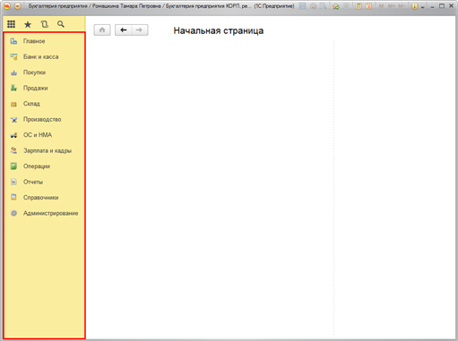
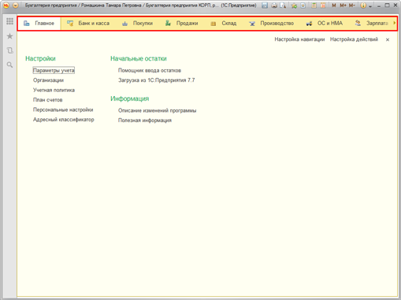

###### #std712

# Панель разделов

Панель разделов может выводиться:

- отдельной панелью;
- в составе меню функций.

{ width="511" }
{ width="509" }

###### 1. 

Состав панели

Панель разделов это "лицо" программы.
Состав и порядок разделов проектируйте особенно тщательно.
Количество и состав разделов должны соответствовать реальным участкам работ и областям деятельности в представлении пользователей.

###### 1.1.

Раздел `Главное` по умолчанию есть во всех конфигурациях и располагается первым.
В него рекомендуется включать команды перехода к объектам всей конфигурации и не включать объекты конкретных разделов учета.

###### 1.2.

Списки с условно-постоянной информацией (справочники, регистры сведений, перечисления и др.) в командном интерфейсе можно размещать:

- внутри раздела, к которому относится список (обычно в конце меню или в группе `См. также`);
  например, список должностей в разделе `Кадры`;
- в специально выделенном разделе (`Справочники`, `Настройки`, `НСИ`), при этом в остальных разделах такие команды обычно не размещают;
- в панели навигации формы списка, которой эти данные подчинены;
  например, `Счета учета номенклатуры` в панели навигации справочника `Номенклатура`.

Исключение: списки условно-постоянной информации, с которых начинаются бизнес-процессы.
Такие списки рекомендуется размещать в группах меню соответствующего раздела.

Например, справочник `Сотрудники` размещается в разделе `Кадры`, так как сначала вводятся сотрудники, а затем по ним формируются кадровые документы.

###### 1.3.

Разделы для настройки, администрирования и сервисных действий располагайте в конце панели.

###### 2. 

Названия разделов

###### 2.1.

Общая длина названия раздела не должна превышать `35` символов с учетом пробелов.
Так название помещается максимум в две строки; при большей длине появится многоточие.
Рекомендуется выбирать названия примерно одинаковой визуальной ширины.

###### 2.2.

Названия разделов должны быть конкретными и запоминающимися.
Из названия должно быть понятно назначение раздела.

###### 2.3.

По возможности не используйте длинные слова.
Рекомендуемые комбинации слов:

| Комбинация слов | Пример |
| --- | --- |
| Одно-два средних слова | `Продажи`, `Зарплата и персонал` |
| Одно длинное и одно короткое | `Отчетность и справки` |
| Два коротких и одно длинное | `Учет, налоги, отчетность` |

###### 2.4.

Используйте в названиях только общеупотребительные и подходящие целевой аудитории сокращения и аббревиатуры.

Например, `НДС`, `МСФО`.

Сокращение обязательно расшифровывайте во всплывающей подсказке.

Например, для `ОС и НМА` подсказка: `Основные средства и нематериальные активы`.

###### 2.5.

Не рекомендуется делать раздел с названием `Сервис`.
Он будет пересекаться с пунктом `Сервис` главного меню и группой `Сервис` в панели или меню функций.

###### 3. 

Картинки разделов

###### 3.1.

Названия разделов рекомендуется выводить в режиме `Картинка и текст`.

###### 3.2.

Картинки делайте разными по начертанию и ведущим цветам для лучшей запоминаемости.
При этом они должны быть выполнены в одном стиле, с одинаковым направлением света и во фронтальной проекции.

###### См. также

- [#std567: Панель разделов (8.2)](567.md)
- [#std568: Названия разделов (8.2)](568.md)
- [#std569: Картинки разделов (8.2)](569.md)
- [#std571: Подсказки для интерфейсных подсистем (8.2)](571.md)

###### Проверки
~[#v8cs:subsystem-synonym-too-long](../diagnostics/v8-code-style/subsystem-synonym-too-long.md)~

~[#acc:311](../diagnostics/acc/311.md)~
###### Источник

https://its.1c.ru/db/v8std#content:712
