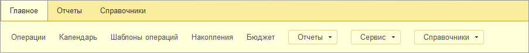
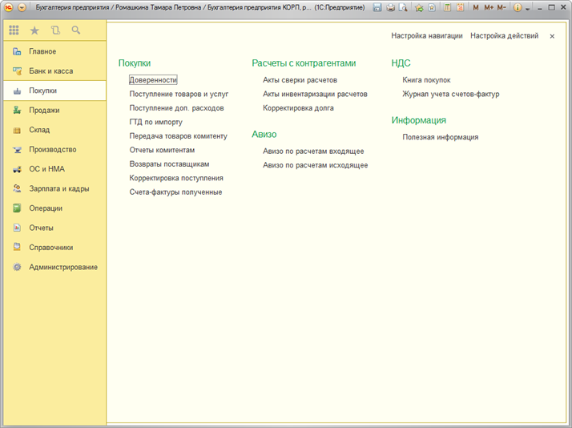
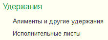
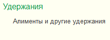
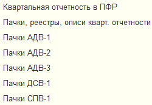
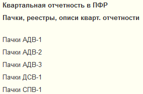
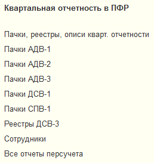
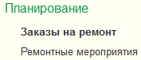
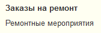

###### #std714

# Навигация внутри раздела

Навигация внутри раздела выполняется через:

- `Панель функций текущего раздела`;
- область навигации и действий в составе `Меню функций`.

Панель функций текущего раздела:

{ width="903" }

Эту панель рекомендуется использовать в конфигурациях с небольшим количеством команд в каждом разделе.
В конфигурациях со сложной структурой и большим количеством команд панель рекомендуется скрывать.

Область команд навигации и действий в составе `Меню функций`:

{ width="714" }

В этой области показываются все функциональные возможности раздела.
В отличие от панели функций текущего раздела, команды здесь можно группировать.

###### 1. Состав команд

###### 1.1.

В раздел рекомендуется помещать команды перехода к:

- спискам и журналам документов;
- спискам первичных документов (данных), с которых начинаются бизнес-процессы;
- рабочим местам;
- специальным обработкам, похожим на обычные списки;
- отчетам.

Все эти команды должны решать задачу конкретного участка работ или области деятельности.

###### 1.2.

Второстепенные и подчиненные объекты можно не выносить в командный интерфейс.
Обычно это справочники и регистры сведений, доступные из документов и других объектов.

!!! example "Пример"

    Справочники `Контрагенты`, `Договоры` выносятся в командный интерфейс:

    - открываются из разных документов и используются отдельно от них;
    - могут содержать много элементов и требуют отдельной работы со списком.

    Справочник `Причины списания основного средства` не выносится в командный интерфейс:

    - открывается из одного специализированного документа;
    - содержит мало редкозаменяемых элементов.

###### 2. Названия команд

###### 2.1.

Чтобы при стандартном разрешении не появлялась прокрутка, следите, чтобы название команды не превышало `38` символов, а лучше укладывалось в `30`.

###### 3. Группировка команд

###### 3.1.

Область команд включает блок навигации и блок действий, но для пользователя выглядит как единый список.
Поэтому группируйте команды не по техническим признакам, а так, как их структурирует пользователь в реальной работе.

###### 3.2.

В одну группу рекомендуется включать не более `7` команд.

###### 3.3.

Не рекомендуется делать группы, содержащие только одну команду.

!!! success "Правильно"

    { width="221" }

!!! failure "Неправильно"

    { width="221" }

Запрещается делать группы, в которых выводится только одна "важная" команда.

!!! success "Правильно"

    { width="250" }

    или

    { width="284" }

!!! failure "Неправильно"

    { width="258" }

###### 3.4.

Группам рекомендуется добавлять название.
Оно не должно пересекаться с названиями системных групп (`Создать`, `Отчеты`, `Сервис`, `Важное`, `См. также`).

Если группа содержит несколько команд и только одну важную, заголовок обязателен.

!!! success "Правильно"

    { width="177" }

!!! failure "Неправильно"

    { width="168" }

###### См. также

- [#std572: Панель навигации основного окна (8.2)](572.md)
- [#std573: Порядок и названия команд в ПН (8.2)](573.md)
- [#std623: Группа команд «Важное» в ПН (8.2)](623.md)
- [#std574: Группировка команд в ПН (8.2)](574.md)
- [#std601: Группа «См. также» в ПН (8.2)](601.md)
- [#std575: Команды, размещаемые в ПН (8.2)](575.md)
- [#std576: Панель действий (8.2)](576.md)

###### Проверки

~[#acc:313](../diagnostics/acc/313.md)~
###### Источник

https://its.1c.ru/db/v8std#content:714
