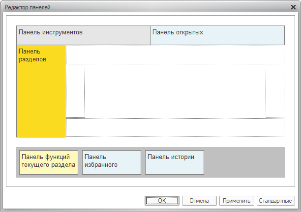
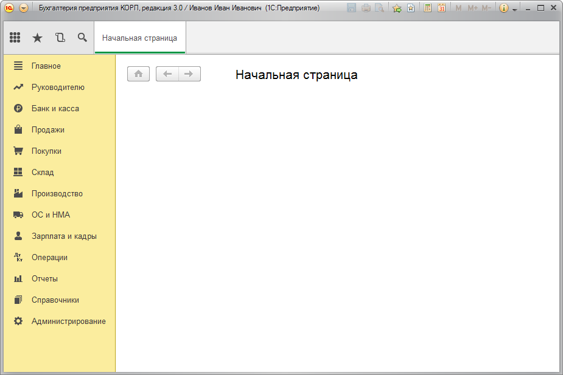

###### #std715

# Как вместить большое количество команд

В конфигурациях со сложной структурой меню и большим количеством команд рекомендуется:

###### 1.

Панель разделов размещайте вертикально, в левой части окна.

###### 2.

Заголовки разделов выводите в режиме `Картинка и текст`.
Используйте картинки размером `16x16`.

###### 3.

Панель инструментов и панель открытых размещайте сверху.

###### 4.

Не отображайте панель функций текущего раздела.
Навигацию внутри раздела выполняйте через `Меню функций`.

!!! example "Пример"

    { width="612" }
    { width="925" }

###### Источник

https://its.1c.ru/db/v8std#content:715
