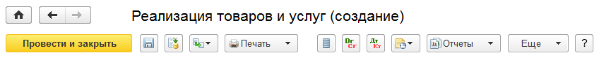
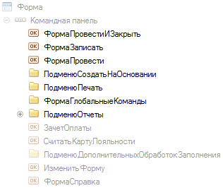

---
llms:
  ignore: true
---

###### #std716

# Командная панель документа

###### 1.

Кнопка по умолчанию должна быть самой левой в командной панели.
В большинстве случаев это `Провести и закрыть` или `Записать и закрыть`.

###### 2.

Порядок команд должен быть одинаковым во всех документах.

###### 3.

Не рекомендуется менять состав системных кнопок командной панели,
которые платформа показывает по умолчанию,
и их порядок относительно друг друга.

###### 4.

Командная панель должна позволять пользователю при стандартных настройках экрана
(ширина `1280`, панель разделов выведена слева вертикально)
выполнять самые важные и частотные действия без открытия подменю `Еще`.

###### 5.

При стандартных настройках экрана пользователю должны быть сразу видны важные команды:

- `Провести и закрыть` / `Записать и закрыть`;
- `Записать`;
- `Провести`;
- `Создать на основании`;
- `Печать`;
- `Глобальные команды` (`Дополнительные сведения`, `Движения документа` и т.д.);
- `Отчеты` (контекстные, из панели навигации).

###### 6.

Если в командной панели много команд,
важные команды рекомендуется показывать кнопками с картинками без текста.

!!! example "Пример командной панели документа"

    { width="848" }

!!! example "Структура командной панели в конфигураторе"

    { width="316" }

Для этого настройте отображение команд:

- `Записать` - `Отображение = Картинка`;
- `Провести` - `Отображение = Картинка`;
- `Создать на основании` - `Отображение = Картинка`;
- `Печать` - `Отображение = Авто`;
- `Отчеты` - `Отображение = Авто`.

###### См. также

- [#std620: Командная панель формы (8.2)](620.md)

###### Источники

- [Русская версия — ИТС](https://its.1c.ru/db/v8std#content:716)
- [English version — 1Ci Knowledge Base](https://kb.1ci.com/1C_Enterprise_Platform/Guides/Developer_Guides/1C_Enterprise_Development_Standards/Designing_interface_for_8.3/Document_forms/Document_command_bar/?language=en)
