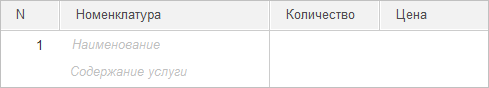
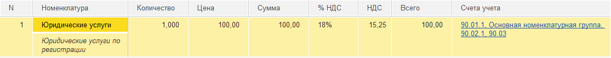
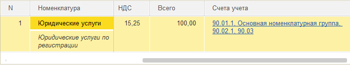

###### #std717

# Табличные части. Оформление списка

###### 1.

Шапка табличной части должна быть в одну строку:
и для одноэтажных, и для многоэтажных списков.

В многоэтажных колонках предусмотрите общий заголовок,
соответствующий смыслу данных,
и вывод подсказки в незаполненных ячейках.

Для подсказки одновременно используйте:

- элемент стиля `ПодсказкаНезаполненнойЯчейки` (размер `8`, начертание `наклонный`);
- свойство `ПодсказкаВвода`.

!!! example "Пример общего заголовка и подсказок в ячейках"

    { width="489" }

В конфигураторе отключайте показ заголовков во вложенных колонках
через свойство `ОтображатьВШапке`.

###### 2.

Заголовок колонки должен полностью помещаться в шапке.

###### 3.

Если в табличной части много колонок
и они не помещаются при стандартном разрешении без горизонтальной прокрутки,
часть колонок размещайте первыми и фиксируйте.

Фиксируйте самые важные колонки,
по которым пользователь идентифицирует объект.
Колонка с номером по порядку также фиксируется.

Например:

- для списка сотрудников - `ФИО`;
- для списка товаров и услуг - `Номенклатура`;
- для списка основных средств - наименование основного средства.

Остальные реквизиты должны оставаться в горизонтально прокручиваемой области.

!!! example "Пример фиксации важных колонок"

    { width="800" }
    { width="520" }

В конфигураторе фиксация выполняется свойством `ФиксацияВТаблице = Лево`.

###### 4.

Для колонок с числовыми значениями явно задавайте ширину,
достаточную для наиболее частотных значений.
Если нужна большая ширина,
пользователь сможет расширить колонку самостоятельно.

Например, для большинства бухгалтерских документов обычно достаточно ширины `10`.

###### Источник

https://its.1c.ru/db/v8std#content:717
