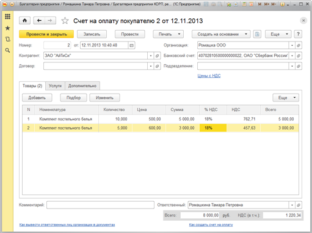
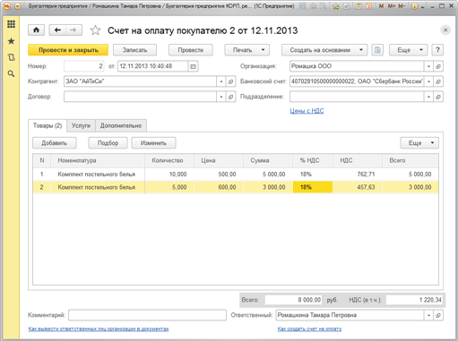
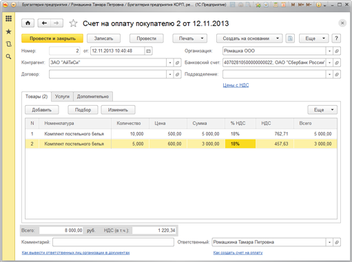

###### #std718

# Итоги в документах

Итоги в документах можно выводить:

- отдельными полями ввода;
- в подвалах таблиц.

###### 1. 

Итоги в виде отдельных полей ввода

Расположение.

###### 1.1.

Итоги размещайте сразу под таблицей (или несколькими таблицами),
по которым эти итоги выводятся.
Не вставляйте элементы, разделяющие табличную часть и группу итогов.

!!! success "Правильно"

    { width="511" }

!!! failure "Неправильно"

    { width="511" }

###### 1.2.

В области итогов размещайте только элементы,
которые относятся к итоговым данным.
Элементы с иной ролью размещайте вне этой области.

Например, в форме акта сверки реквизит `Остаток на начало`
не является итоговым значением,
поэтому его не следует включать в группу итогов и выделять серым фоном.

!!! success "Правильно"

    { width="680" }

!!! failure "Неправильно"

    { width="680" }

###### 1.3.

Область с итогами выравнивайте по правому краю формы.

!!! success "Правильно"

    { width="511" }

!!! failure "Неправильно"

    { width="511" }

Оформление.

###### 1.4.

Итоги выделяйте серым фоном.
Для этого используйте элемент стиля `ИтогиФонГруппы` (`RGB 220,220,220`).

###### 1.5.

Итоги оформляйте отдельными полями ввода
с установленным признаком `ТолькоПросмотр`.

###### 1.6.

В заголовках итоговых полей не используйте слово `итог`.

###### 1.7.

Если требуется вывод валюты,
показывайте ее после поля ввода.
Если итоги состоят из нескольких взаимосвязанных полей,
валюту выводите только после первого поля.

Например, в группе `Всего` и `НДС (в т.ч.)`
валюта выводится только после поля `Всего`.

!!! success "Правильно"

    { width="463" }

!!! failure "Неправильно"

    { width="496" }

###### 2. 

Итоги в подвалах таблиц

###### 2.1.

Итоги в подвалах таблиц используйте,
если итоговые значения нужно выводить по большому числу колонок
(более `4`) в одной табличной части,
и при оформлении отдельными полями они не помещаются на форме в одну строку.

###### См. также

- [#std613: Итоги в документах (8.2)](613.md)

###### Источник

https://its.1c.ru/db/v8std#content:718
