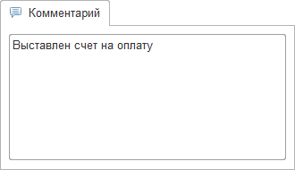
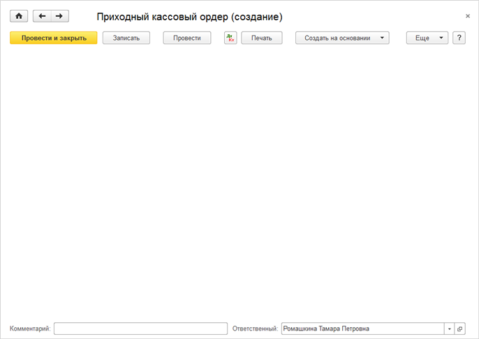

###### #std719

# Поля «Ответственный» и «Комментарий»

###### 1.

Поле `Комментарий` в форме документа можно выводить в двух вариантах:

- как однострочное поле в нижней части формы;
- как многострочное поле на отдельной вкладке.

Если в типовых сценариях комментарии обычно длинные, используйте многострочный вариант на отдельной вкладке.
В остальных случаях используйте однострочное поле.

###### 1.1.

Однострочное поле `Комментарий` оформляйте так:

- располагайте внизу формы документа, последним полем;
- заголовок выводите слева от поля;
- не выводите кнопки выбора, списка выбора и другие аналогичные кнопки.

!!! example "Однострочное поле «Комментарий»"

    { width="456" }

###### 1.2.

Многострочное поле `Комментарий` оформляйте так:

- размещайте на отдельной вкладке;
- заголовок `Комментарий` выводите в названии вкладки, а у самого поля заголовок не отображайте;
- на вкладке размещайте только поле комментария, растянутое по вертикали и горизонтали;
- если комментарий заполнен, отображайте в заголовке вкладки картинку `Комментарий`.

!!! example "Многострочное поле «Комментарий» на отдельной вкладке"

    { width="330" }
    { width="330" }

###### 2.

Поле `Ответственный` выводите в нижней части формы документа.

###### 3.

Если в форме документа одновременно есть поле `Ответственный` и однострочное поле `Комментарий`, объединяйте их в группу:

- группу располагайте внизу формы документа;
- внутри группы поля размещайте в одну строку, рядом друг с другом.

!!! example "Группа полей «Ответственный» и «Комментарий»"

    { width="885" }
    { width="686" }

###### См. также

- [#std531: Реквизит «Комментарий» у документов](531.md)

###### Источник

https://its.1c.ru/db/v8std#content:719
