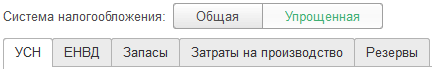
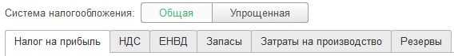

###### #std720

# Тумблер

###### 1.

Тумблер используйте, когда выбор значения меняет состав
или расположение элементов формы.
Тумблер визуально похож на кнопку
и показывает пользователю, что по нажатию произойдет действие.

Например, при выборе системы налогообложения меняется состав вкладок.

!!! example "Пример"

    { width="432" }
    { width="568" }

###### 2.

Количество кнопок в тумблере должно быть небольшим,
а названия - краткими.
Если вариантов много и названия длинные,
используйте выпадающий список.

###### 3.

Добавляйте заголовок тумблера, если:

- по названиям кнопок непонятно его назначение;
- тумблер используется как переключатель режимов.

###### Источник

https://its.1c.ru/db/v8std#content:720
