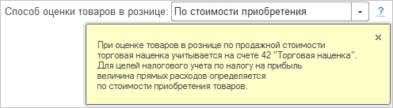
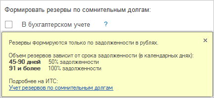
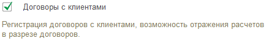
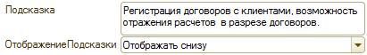
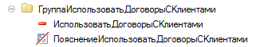

###### #std721

# Подсказки на форме

Добавляйте подсказки только для элементов интерфейса, которым действительно нужно пояснение.
Для реквизитов ежедневной работы подсказки обычно не нужны.

Не используйте подсказки как инструкцию.
Если поле требует длинного объяснения, лучше улучшить сам сценарий работы.

###### 1.

Текстовые подсказки к полям.

###### 1.1.

Текстовые подсказки к полям рекомендуется прятать в ссылке `?`.
Для этого в конфигураторе установите режим отображения подсказки `Кнопка`.

!!! example "Режим отображения подсказки `Кнопка`"

    { width="496" }

!!! example "Подсказка после нажатия на `?`"

    { width="496" }

###### 1.2.

Если в подсказке нужны ссылки, иконки или форматированный текст, используйте расширенную подсказку.

!!! example "Пример расширенной подсказки"

    { width="432" }

###### 1.3.

Не выводите в подсказке много текста.
Если текст длиннее `255` символов (включая пробелы), добавьте краткое пояснение и ссылку на подробное описание.

###### 2.

Текстовые подсказки к настройкам.

###### 2.1.

Подсказки к настройкам выводите снизу, под самой настройкой.

!!! example "Пример подсказки к настройке"

    { width="434" }

###### 2.2.

В конфигураторе оформляйте такие подсказки через свойство `Подсказка` в режиме `Отображать снизу`.

!!! example "Настройка свойства в конфигураторе"

    { width="411" }

Также можно использовать расширенные подсказки.
Не используйте декорацию `Надпись` как основной способ вывода текстовых подсказок.

!!! failure "Неправильно"

    { width="341" }

!!! success "Правильно"

    { width="341" }

Использование декорации `Надпись` допустимо, когда нужное поведение нельзя реализовать иначе.
Например, для подсказки к полю ввода, которую нужно выровнять вместе со всем элементом, включая заголовок.

###### См. также

- [#std478: Подсказка и проверка заполнения](478.md)

###### Источник

https://its.1c.ru/db/v8std#content:721
