###### #std722

# Компоновка форм

###### 1. 

Общие принципы

###### 1.1.

Внутри одной формы все заголовки для однострочных полей ввода, переключателей и тумблеров располагайте одинаково: либо слева, либо сверху.

!!! success "Правильно"

    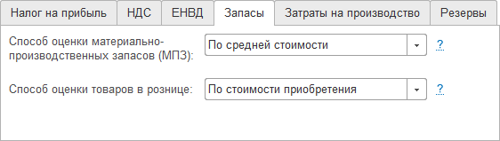{ width="562" }
    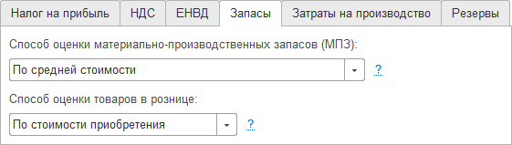{ width="561" }

!!! failure "Неправильно"

    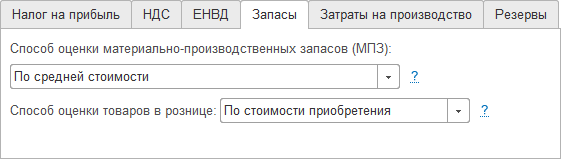{ width="561" }

Заголовки многостраничных полей располагайте с учетом общей композиции формы.

###### 1.1.1.

Если в группе однострочных полей заголовок одного поля заметно длиннее остальных, сокращайте его или переносите часть заголовка на следующую строку.

!!! success "Правильно"

    { width="412" }

!!! failure "Неправильно"

    { width="503" }

###### 1.1.2.

Поля взаимосвязанных реквизитов в одной группе выравнивайте по опорной линии.

!!! success "Правильно"

    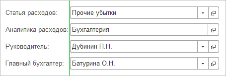{ width="455" }

!!! failure "Неправильно"

    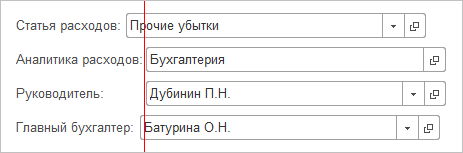{ width="463" }

###### 1.2.

Элементы, которые в разных формах выполняют одну и ту же функцию, называйте одинаково и размещайте примерно в одном и том же месте.

Например, реквизит `Контрагент` во всех документах рекомендуется располагать в левой колонке шапки.

###### 1.3.

Если элемент интерфейса влияет на другие элементы, располагайте его раньше зависимых элементов (выше или левее).
Пользователь должен сначала работать с основным элементом, а затем с зависимыми.

!!! example "Пример"

    Выбор системы налогообложения влияет на состав вкладок, поэтому тумблер для его выбора расположен выше вкладок.

    { width="569" }
    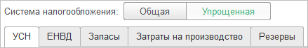{ width="439" }

!!! example "Пример"

    Поле `Договор` заполняется после выбора `Контрагент`, поэтому располагается справа.

    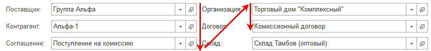{ width="858" }

!!! example "Пример"

    Если внутри формы есть взаимосвязанные табличные части, размещайте их рядом.

    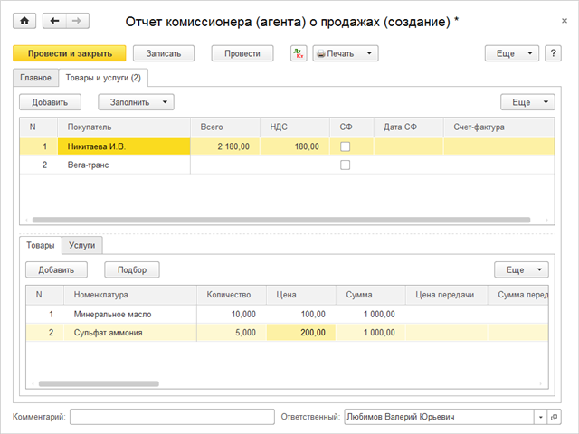{ width="640" }

###### 1.3.1.

Использование вертикальной зеленой черты для выделенных отдельных элементов и групп взаимосвязанных реквизитов не допускается.

В качестве выделения используйте состояния:

- слабое выделение;
- обычное выделение;
- нет.

!!! success "Правильно"

    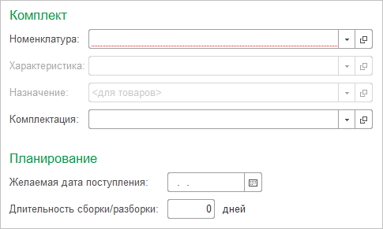{ width="485" }

!!! failure "Неправильно"

    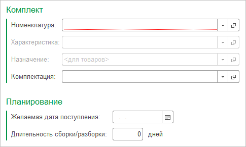{ width="485" }

!!! success "Правильно"

    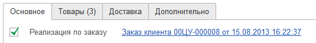{ width="535" }

!!! failure "Неправильно"

    { width="535" }

Использование сильного выделения с вертикальной зеленой полосой допустимо, когда взаимосвязанные группы реквизитов расположены в несколько колонок по горизонтали.

!!! example "Пример"

    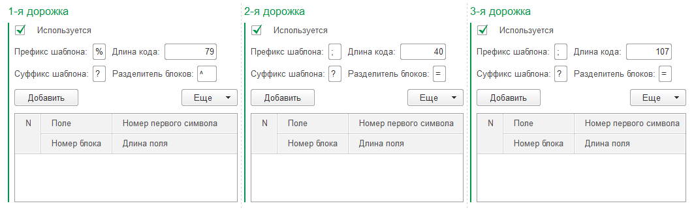{ width="1063" }

###### 1.4.

Внутри формы документа группируйте элементы по смыслу.

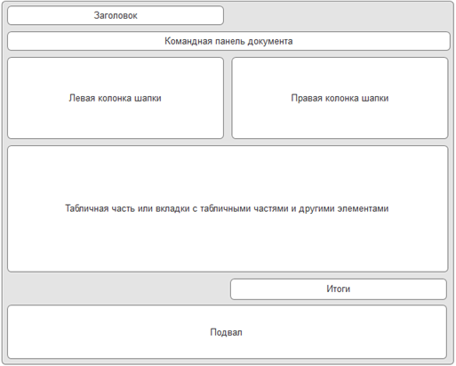{ width="513" }
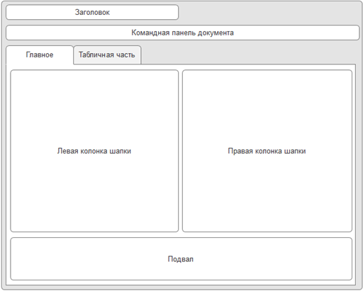{ width="512" }

В левой и правой колонках шапки распределяйте реквизиты так:

| Левая колонка | Правая колонка |
| --- | --- |
| важные | вспомогательные и менее значимые |
| заполняются вручную | чаще заполняются автоматически |
| обязательны для заполнения | не обязательны для заполнения |
| заполняются на основе входящих данных, полученных извне | значения задаются пользователем по внутренним данным |
| примеры: `Номер`, `Дата`, `Контрагент`, `Договор` | примеры: `Организация`, `Подразделение` |

В нижней части формы размещайте область итогов и подвал.
В подвале могут располагаться поля `Ответственный`, `Комментарий`, ссылка на счет-фактуру и другие элементы.

Подробнее по этим элементам:
[#std718: Итоги в документах](718.md),
[#std719: Поля «Ответственный» и «Комментарий»](719.md).

###### 1.4.1.

При компоновке документов с табличной частью ориентируйтесь на видимое количество строк:

- минимум `7` строк;
- оптимально не менее `10` строк.

Если строк меньше `7`, табличную часть рекомендуется размещать на отдельной вкладке.

!!! example "Пример"

    В документе `Отчет комитенту` реквизиты шапки вынесены на вкладку основных реквизитов.

    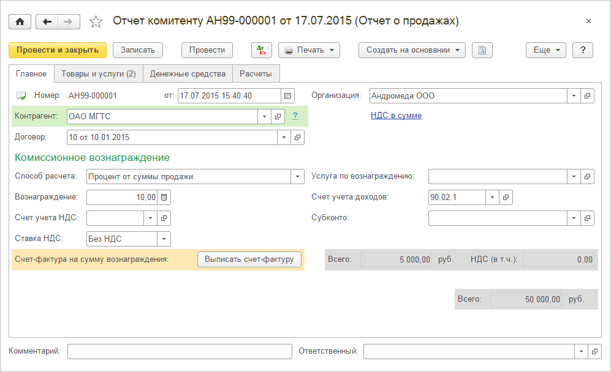{ width="997" }

    Количество строк таблицы вкладки `Товары` реквизитами не ограничивается.

    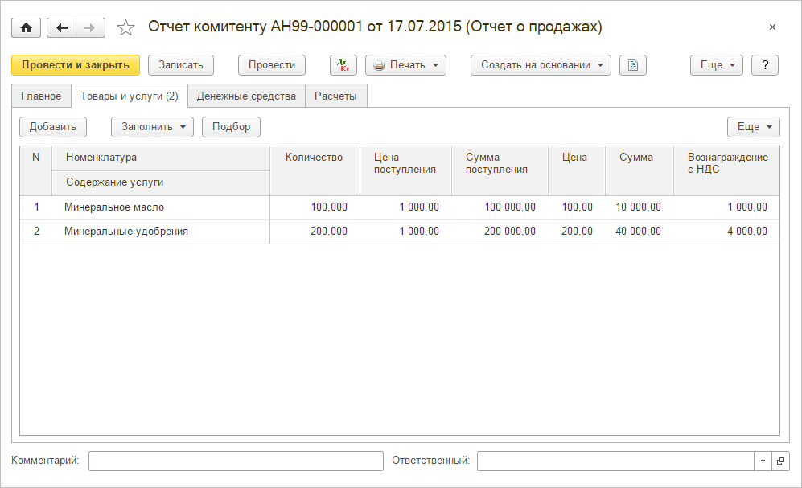{ width="997" }

###### 1.4.2.

Если на форме есть несколько невзаимосвязанных табличных частей, размещайте их на отдельных вкладках.

###### 1.5.

Формы проектируйте так, чтобы они не были перегружены функциями, реквизитами и элементами.

Для этого используйте:

- скрытие элементов в зависимости от настроек программы или функциональных опций;
- размещение части элементов на отдельных вкладках, в свертываемых группах или во вспомогательных формах.

Конкретный способ выбирайте по ситуации и задаче.

###### 2. 

Вкладки

###### 2.1.

Название вкладки должно отражать ее содержание.

!!! example "Пример"

    По названию вкладки `Товары` понятно, что на ней расположен список товаров.

    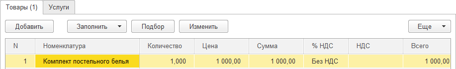{ width="917" }

###### 2.2.

Поля, обязательные для заполнения, располагайте на вкладке, активной в момент открытия формы.

###### 2.3.

Не рекомендуется делать вкладки с небольшим числом элементов (`1-2`), если эти элементы не занимают все пространство вкладки.

###### 3. 

Вспомогательные формы

###### 3.1.

При размещении элементов во вспомогательных формах действуйте так:

1. Выберите второстепенные реквизиты и элементы:
   - чаще заполняемые автоматически;
   - используемые меньшей частью пользователей;
   - обычно необязательные для заполнения.
2. Разделите эти элементы на несколько смысловых групп.
3. Разместите группы в одной или нескольких вспомогательных формах.

###### 3.2.

Для открытия вспомогательной формы используйте гиперссылку в основной форме.
При открытии вспомогательная форма должна блокировать окно владельца.

###### 3.3.

Текст гиперссылки может формироваться двумя способами.

Вариант 1: в тексте ссылки указывается название вспомогательной формы.
Название должно помогать понять, какие реквизиты расположены внутри.

!!! example "Пример"

    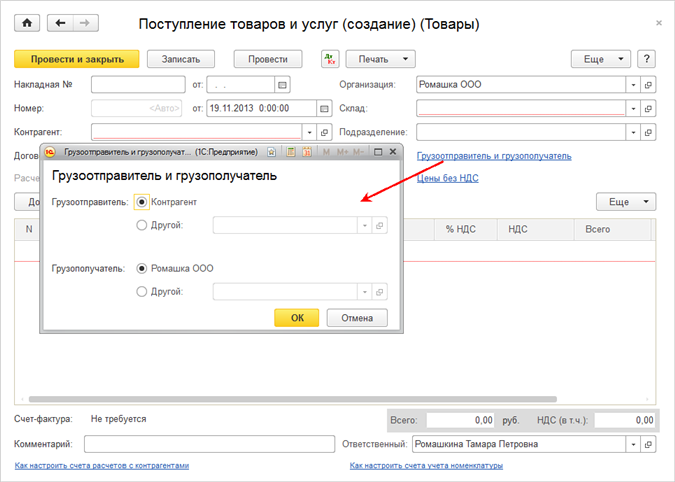{ width="675" }

Вариант 2: в тексте ссылки указывается перечень значений реквизитов, заполняемых во вспомогательной форме.
Если перечень слишком велик, в первую очередь выносите реквизиты:

- значения которых важно видеть из основной формы сразу;
- которые обязательны для заполнения.

!!! example "Пример"

    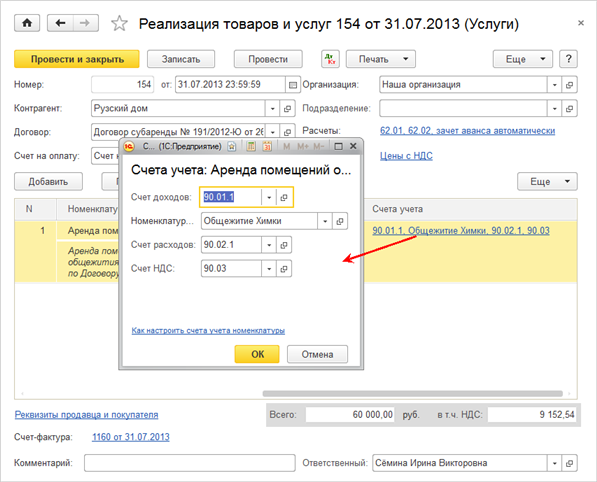{ width="597" }

Если ссылка выводится как перечень значений, добавляйте для нее заголовок.
В табличной части заголовком является название колонки.

!!! success "Правильно"

    { width="375" }

!!! failure "Неправильно"

    { width="293" }

###### 3.4.

Если во вспомогательной форме есть обязательные, но незаполненные реквизиты, для гиперссылки используйте красный цвет (`НезаполненныйРеквизит`, `RGB 178,34,34`).

!!! example "Пример"

    { width="455" }

###### 3.5.

Командная панель во вспомогательной форме должна содержать две кнопки: `ОК` и `Отмена`.
Расположение панели — в нижней части формы.

!!! example "Пример"

    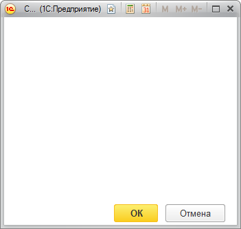{ width="351" }

###### 4. 

Свертываемые группы

###### 4.1.

Свертываемые группы это разделы реквизитов или настроек, логически связанных и объединенных общим заголовком.
Свертывание упрощает поиск нужного раздела и информации внутри него.

###### 4.2.

Для форм, где вся информация размещена в свертываемых группах, используйте режимы открытия, обеспечивающие быстрый доступ к содержимому:

- если все группы в развернутом виде помещаются без вертикальной прокрутки, раскрывайте их по умолчанию;
- если при развернутой первой и свернутых остальных группах прокрутка не нужна, раскрывайте по умолчанию первую группу.

!!! success "Правильно"

    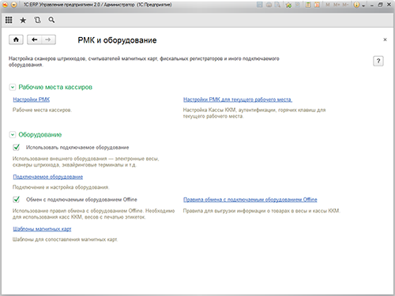{ width="500" }

!!! failure "Неправильно"

    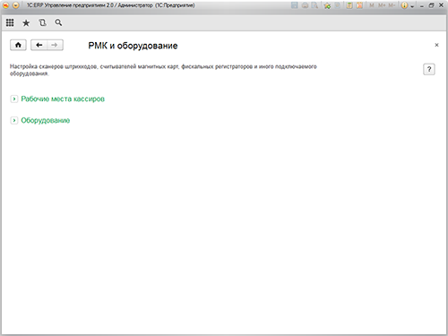{ width="500" }

!!! success "Правильно"

    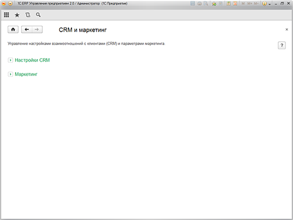{ width="500" }

!!! failure "Неправильно"

    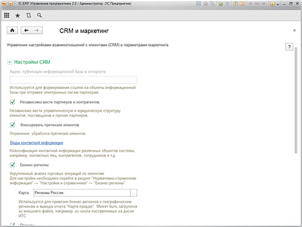{ width="500" }

###### См. также

- [#std597: Компоновка форм (8.2)](597.md)
- [#std624: Оформление элементов (8.2)](624.md)
- [#std602: Переход к форме с дополнительными реквизитами (8.2)](602.md)

###### Источник

https://its.1c.ru/db/v8std#content:722
