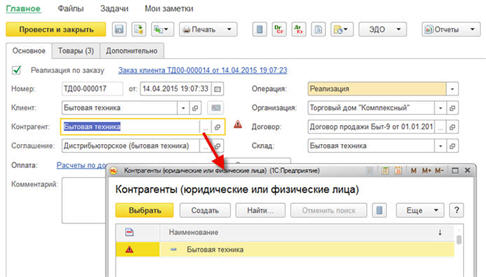
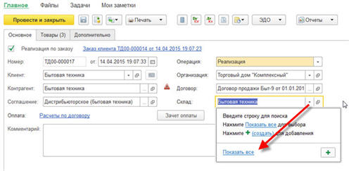

###### #std744

# История выбора при вводе

###### 1.

Для свойства `История выбора` у большинства объектов метаданных
должно быть установлено значение `Авто`.

###### 2.1.

Историю выбора в свойствах объекта метаданных рекомендуется отключать,
если ее использование не соответствует прикладной логике конфигурации:

- для объектов, сценарий использования которых не предполагает
  повторный выбор из 5 ранее выбранных вариантов;
- для объектов, у которых в модуле менеджера переопределен обработчик
  `ОбработкаПолученияДанныхВыбора`.

Во втором случае условия обработчика
не учитываются механизмом формирования истории выбора,
и пользователь может получить возможность выбрать значение,
которое иначе выбрать нельзя.

!!! example "Пример"

    Для большинства документов повторный выбор маловероятен.
    Например, выбор объекта расчетов в `Поступлении безналичных денежных средств`.

###### 2.2.

После отключения истории выбора в свойствах объекта метаданных
во всех ссылающихся на него полях ввода
установите значения:

- `КнопкаВыпадающегоСписка` - `Нет`;
- `КнопкаВыбора` - `Да`;
- `ОтображениеКнопкиВыбора` - `В поле ввода`.

Это нужно, чтобы перед началом выбора
пользователь не попадал в меню,
где каждый раз приходится нажимать `Показать все`.

!!! success "Правильно"

    { width="486" }

!!! failure "Неправильно"

    { width="496" }

Исключения:
значения этих свойств можно не менять, если:

- у поля ввода установлен режим выбора из списка
  и список выбора заполнен (в метаданных или программно);
- поле ввода ссылается на объект метаданных
  с установленным свойством `Быстрый выбор`.

Для автоматического изменения свойств полей выбора
можно использовать приложенную
[обработку с ИТС](https://its.1c.ru/db/files/1CITS/EXE/V8Std/АвтоматическоеИзмененияСвойствПолей/АвтоматическоеИзмененияСвойствПолей.zip).

###### Проверки

~[#acc:412](../diagnostics/acc/412.md)~
~[#acc:413](../diagnostics/acc/413.md)~
~[#acc:414](../diagnostics/acc/414.md)~
###### Источник

https://its.1c.ru/db/v8std#content:744
