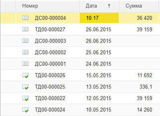
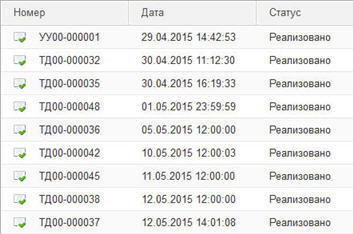

###### #std745

# Поле "Дата" в списках

Для списков, в которых реквизит `Дата` имеет состав даты `Дата и время`,
рекомендуется использовать сокращенное представление даты.

Чтобы экономить место на форме:

1. Устанавливайте ширину поля `Дата` без времени: `9 пунктов`.
2. Отображайте дату документов без времени: `01.01.2015`.
3. В системах оперативного учета дату документов за текущий день
   рекомендуется выводить в виде времени: `09:46`.

<div class="std-good-bad-pair" markdown="1">

!!! success "Рекомендуется"

    { width="322" }

!!! failure "Не рекомендуется"

    { width="353" }

</div>

###### Пример кода

```bsl
&НаСервере
Процедура ПриСозданииНаСервере(Отказ, СтандартнаяОбработка)
    СтандартныеПодсистемыСервер.УстановитьУсловноеОформлениеПоляДата(
        ЭтотОбъект,
        "Список.Дата",
        Элементы.Дата.Имя);
КонецПроцедуры
```

Для автоматического изменения свойств полей выбора
можно воспользоваться приложенной
[обработкой с ИТС](https://its.1c.ru/db/files/1CITS/EXE/V8Std/ИзменитьПредставлениеПоляДатаВСписках/ИзменитьПредставлениеПоляДатаВСписках.zip).

###### См. также

- [#std763: Даты: требования по локализации](763.md)

###### Источник

https://its.1c.ru/db/v8std#content:745
