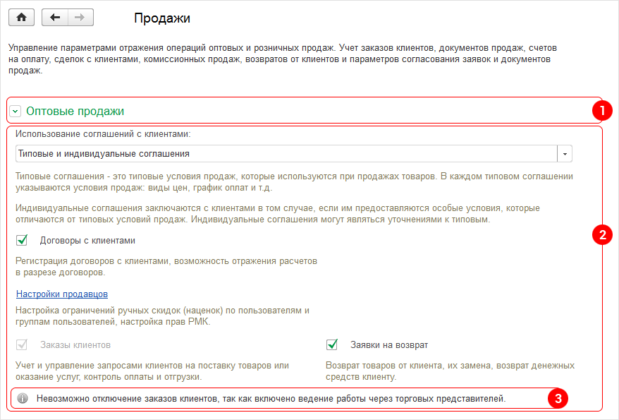
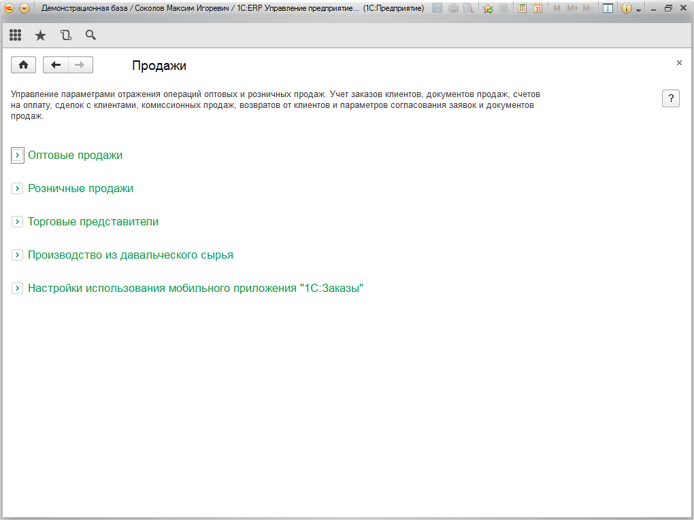
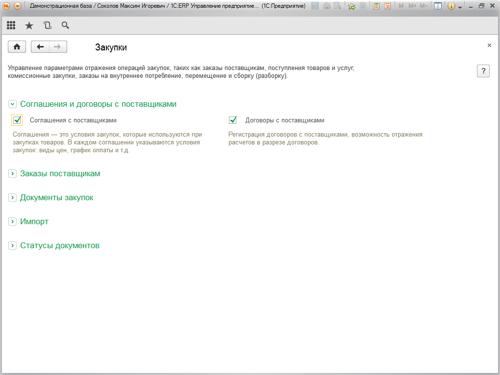
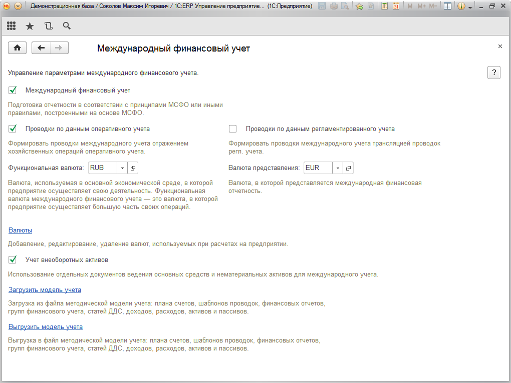

###### #std753

# Оформление групп разделов с настройками и справочниками

###### 1.

Группа раздела может включать:

- заголовок (1);
- реквизиты и настройки (2);
- информационные сообщения (3).

###### 1.1.

Типовое разрешение экрана `1280x768` px.
Размеры в стандарте даны для этого разрешения.

!!! example "Пример"

    { width="878" }

###### 2.

Разделы, состоящие из нескольких групп, реализуйте как свертываемые группы.

Для корректного отображения заголовка свертываемой группы в конфигураторе используйте параметры:

- `Поведение`: `Свертываемая`;
- `ОтображениеУправления`: `Картинка`;
- `Отображение`: `Обычное выделение`;
- `ЦветТекстаЗаголовка`: `Авто`;
- `ШрифтЗаголовка`: `Авто`.

!!! example "Пример"

    { width="196" }

###### 2.1.

Группы раздела формируйте так, чтобы при разрешении `1280x768` все группы умещались на экране.
По возможности сворачивайте группы и избегайте вертикальной прокрутки.

!!! example "Пример"

    В разделе `Продажи` все группы свернуты по умолчанию.

    { width="1020" }

###### 2.2.

Допустимо оставлять первую группу развернутой, если форма не выходит за пределы экрана `1280x768`.

!!! example "Пример"

    В разделе `Закупки` первая группа развернута, остальные свернуты и форма остается в пределах экрана.

    { width="1020" }

###### 3.

Если раздел состоит из одной группы, она должна быть развернута и иметь параметр `Поведение: Обычное`.
Заголовок в такой группе не используется.

!!! example "Пример"

    { width="1020" }

###### Источник

https://its.1c.ru/db/v8std#content:753
