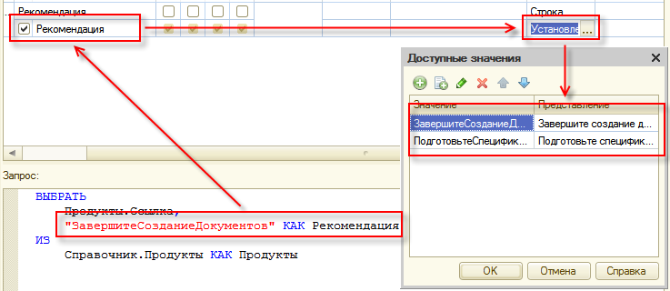
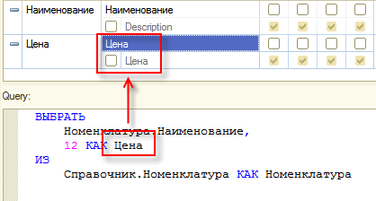
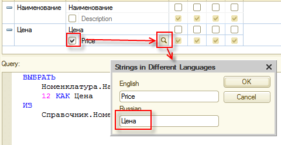
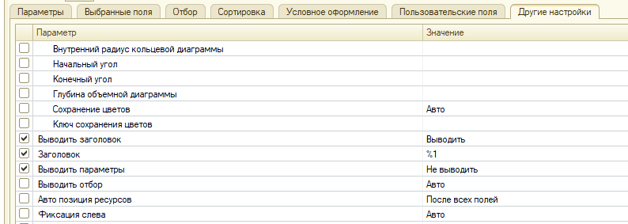
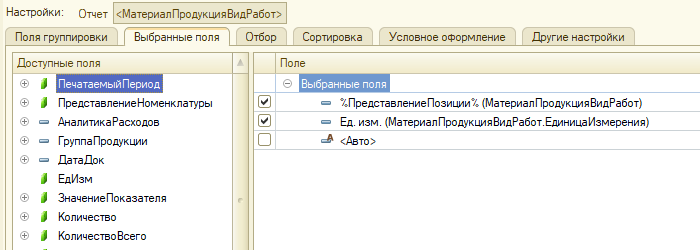
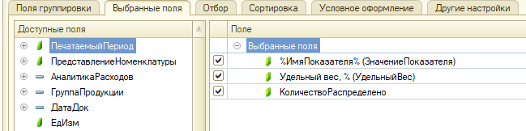
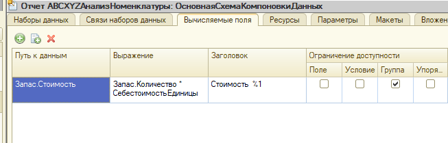
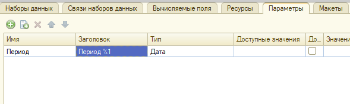

###### #std762

# Запросы, динамические списки и отчеты на СКД: требования по локализации

###### 1.

Если строковые литералы из текста запроса выводятся пользователю, не оставляйте их в тексте `#!sdbl`.

Передавайте такие значения через параметры запроса и задавайте через `#!bsl НСтр`.

!!! failure "Неправильно"

    ```sdbl
    ВЫБРАТЬ
        Версии.Ссылка,
        ВЫБОР
            КОГДА Версии.Выпущена = ИСТИНА ТОГДА "выпущена"
            ИНАЧЕ "в разработке"
        КОНЕЦ КАК ТекстПояснения
    ИЗ
        Справочник.Версии КАК Версии
    ```

!!! failure "Также неправильно"

    ```bsl
    ТекстЗапроса =
        "ВЫБРАТЬ
        |   ВЫБОР
        |       КОГДА Версии.Выпущена = ИСТИНА ТОГДА &ТекстВыпущеннойВерсии
        |       ИНАЧЕ &ТекстНеВыпущеннойВерсии
        |   КОНЕЦ";
    ТекстЗапроса = СтрЗаменить(ТекстЗапроса, "&ТекстВыпущеннойВерсии", НСтр("ru='выпущена'"));
    ТекстЗапроса = СтрЗаменить(ТекстЗапроса, "&ТекстНеВыпущеннойВерсии", НСтр("ru='в разработке'"));
    ```

!!! success "Правильно"

    ```bsl
    ЗапросПоВерсиям = Новый Запрос(
        "ВЫБРАТЬ
        |   Версии.Ссылка,
        |   ВЫБОР
        |       КОГДА Версии.Выпущена = ИСТИНА ТОГДА &ТекстВыпущеннойВерсии
        |       ИНАЧЕ &ТекстНеВыпущеннойВерсии
        |   КОНЕЦ КАК ТекстПояснения
        |ИЗ
        |   Справочник.Версии КАК Версии");

    ЗапросПоВерсиям.УстановитьПараметр("ТекстВыпущеннойВерсии", НСтр("ru='выпущена'"));
    ЗапросПоВерсиям.УстановитьПараметр("ТекстНеВыпущеннойВерсии", НСтр("ru='в разработке'"));
    ```

###### 2.

Те же требования применяйте к выражениям СКД и запросам наборов данных СКД, если они формируют интерфейсный текст.

- Для параметров СКД с текстовыми значениями используйте технические ключи по правилам [#std454: Правила образования имен переменных](454.md), а человекочитаемый текст задавайте локализуемо.

  { width="737" }

- Если значение параметра зависит от прикладной логики, задавайте его в модуле отчета в `#!bsl ПриКомпоновкеРезультата`, а не в колонке `Выражение`.

- В выражениях настройки СКД (`Выражение представления`, `Выражение упорядочивания` и др.) используйте `#!bsl НСтр`, аналогично модульному коду.

!!! failure "Неправильно"

    ```sdbl
    ВЫБОР
        КОГДА ВидОперации = "Отгрузка клиентам" ТОГДА 1
        КОГДА ВидОперации = "Возвраты товаров от клиентов" ТОГДА 2
        КОГДА ВидОперации = "Приемка от поставщиков" ТОГДА 3
    КОНЕЦ
    ```

!!! success "Правильно"

    ```sdbl
    ВЫБОР
        КОГДА ВидОперации = &ВидОперацииОтгрузкаКлиентам ТОГДА 1
        КОГДА ВидОперации = &ВидОперацииВозвратыТоваровОтКлиентов ТОГДА 2
        КОГДА ВидОперации = &ВидОперацииПриемкаОтПоставщиков ТОГДА 3
    КОНЕЦ
    ```

!!! success "Правильно"

    ```sdbl
    Выбор Когда Объект = Раздел
        Тогда Выбор
            Когда Раздел = Значение(ПланВидовХарактеристик.РазделыДатЗапретаИзменения.ПустаяСсылка)
                Тогда НСтр("ru='<Для всех разделов и объектов, кроме указанных>'")
            Иначе НСтр("ru='<Для всех объектов, кроме указанных>'")
        Конец
        Иначе Объект
    Конец
    ```

###### 3.

Для поля выборки отчета СКД, полученного вычислением с псевдонимом, задавайте синоним явно.

Не используйте автоматически сгенерированный заголовок по имени или псевдониму.

<div class="std-good-bad-pair" markdown="1"> 

!!! failure "Неправильно"

    { width="418" }

!!! success "Правильно"

    { width="480" }

</div>

Если не установить синоним, такие поля хуже обнаруживаются при поиске интерфейсных текстов.

###### 4.

В заголовках отчетов СКД, полей, вычисляемых полей и параметров допускаются параметры подстановки `#!bsl СтрШаблон`:

- `%1`, `%2` и т.д.;
- `[Параметр]`;
- `%Параметр%`.

Имя параметра должно соответствовать правилам [#std454: Правила образования имен переменных](454.md).

| Заменяйте параметры в `#!bsl ПриКомпоновкеРезультата`, когда заголовки зависят от прикладной логики. |
| --- |
| { width="600" } |
| { width="600" } |
| { width="600" } |
| { width="600" } |
| { width="600 " } |

###### См. также

- [#std437: Оформление текстов запросов](437.md)
- [#std598: Тексты](598.md)

###### Источник

https://its.1c.ru/db/v8std#content:762
