###### #std765

# Элементы форм: требования по локализации

###### 1.

Не присваивайте реквизитам, которые используются в элементах формы, строковые значения без локализации.

Для таких значений используйте:

- списки значений, где у каждого значения есть локализуемое представление;
- перечисления, если значения используются в таблицах базы данных.

!!! failure "Неправильно"

    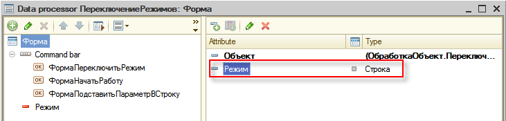{ width="731" }

    ```bsl
    Если Режим = "Рабочий" Тогда
        Режим = "Демо";
    Иначе
        Режим = "Рабочий";
    КонецЕсли;
    ```

!!! success "Правильно"

    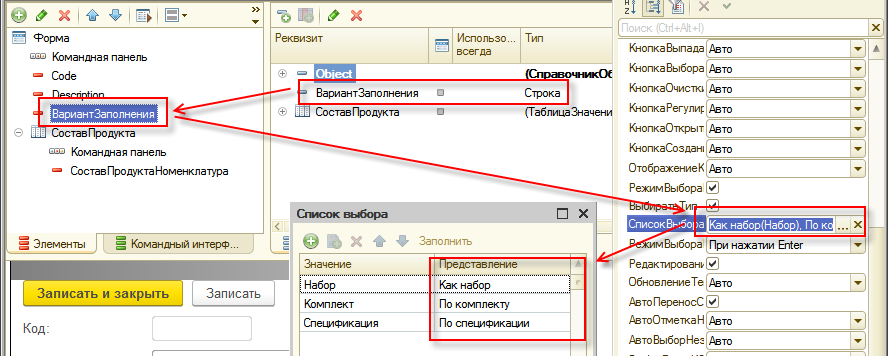{ width="888" }

!!! success "Правильно"

    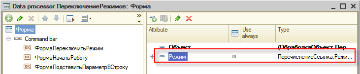{ width="731" }

    ```bsl
    Если Режим = Перечисления.РежимыРаботы.Рабочий Тогда
        Режим = Перечисления.РежимыРаботы.Демо;
    Иначе
        Режим = Перечисления.РежимыРаботы.Рабочий;
    КонецЕсли;
    ```

###### 2.

Для всех таблиц и групп на форме задавайте заголовки.
Если заголовок не должен отображаться пользователю, явно отключайте показ заголовка в свойствах элемента формы.

Иначе в команде `Изменить форму` пользователь увидит автоматически сгенерированные заголовки из имен элементов.
Такие заголовки не переводятся: в выгрузку на перевод они попадают как пустые.

!!! failure "Неправильно"

    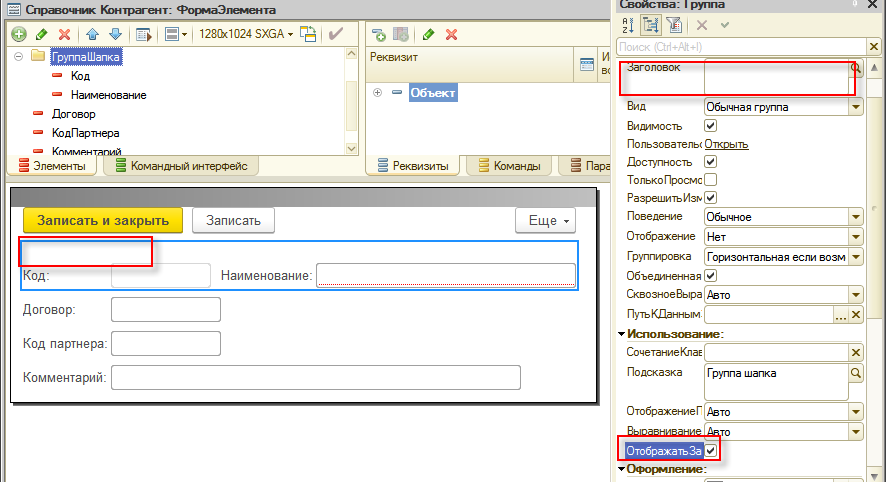{ width="886" }
    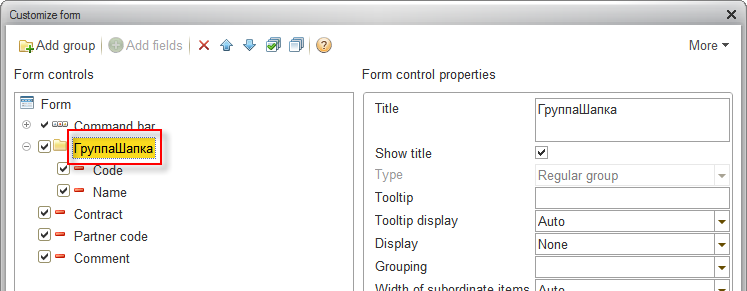{ width="747" }

!!! success "Правильно"

    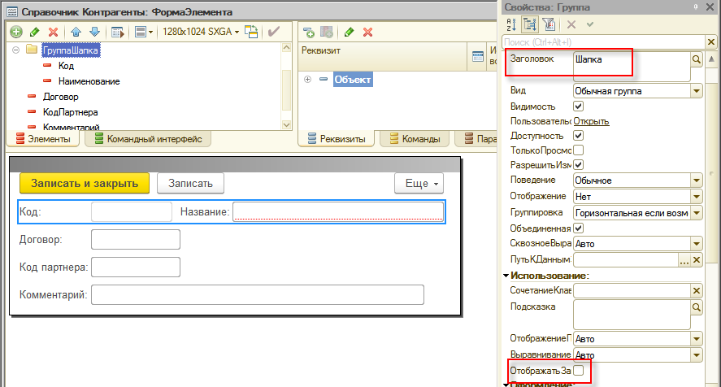{ width="887" }
    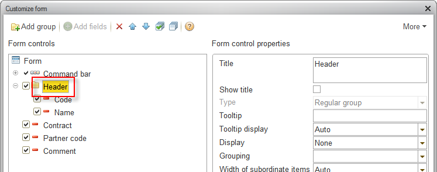{ width="747" }

Для автоматической расстановки заголовков можно использовать обработку с ИТС:
[Автоформатирование кода и локализации](https://its.1c.ru/db/files/1CITS/EXE/V8Std/АвтоформатированиеКодаИЛокализация/АвтоформатированиеКодаИЛокализация.zip).

###### 3.

Сокращайте количество незначащей информации, которая попадает в локализацию.

###### 3.1.

Удаляйте бессмысленные подсказки у групп форм.
См. стандарт [#std478: Подсказка и проверка заполнения](478.md).

Это снижает затраты на перевод и исключает лишний шум для пользователя, в том числе в режиме `Изменить форму`.

!!! failure "Неправильно"

    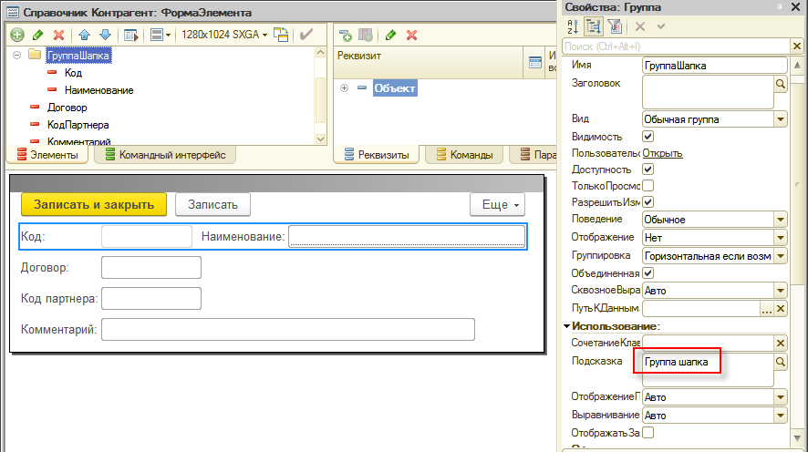{ width="886" }
    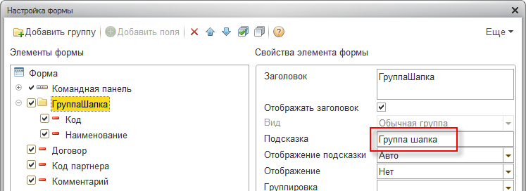{ width="747" }

!!! success "Правильно"

    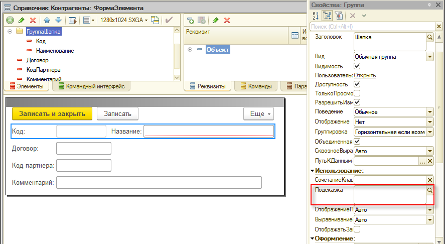{ width="887" }
    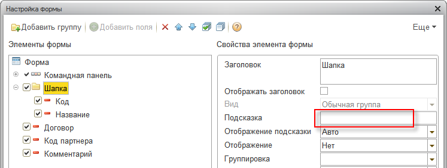{ width="747" }

###### 3.2.

У реквизитов формы, которые не размещены на форме как элементы управления, очищайте заголовки.
Обычно это служебные реквизиты для технологических задач.

Для удаления бессмысленных подсказок можно использовать обработку из статьи [#std456: Тексты модулей](456.md).

###### 4.

###### Проверки
~[#v8cs:form-dynamic-list-item-title](../diagnostics/v8-code-style/form-dynamic-list-item-title.md)~

Задавайте заголовок для колонок динамического списка, которые:

- получаются в запросе комбинацией других колонок;
- имеют собственный псевдоним.

Не полагайтесь на автоматически сгенерированный заголовок по имени или псевдониму.

!!! failure "Неправильно"

    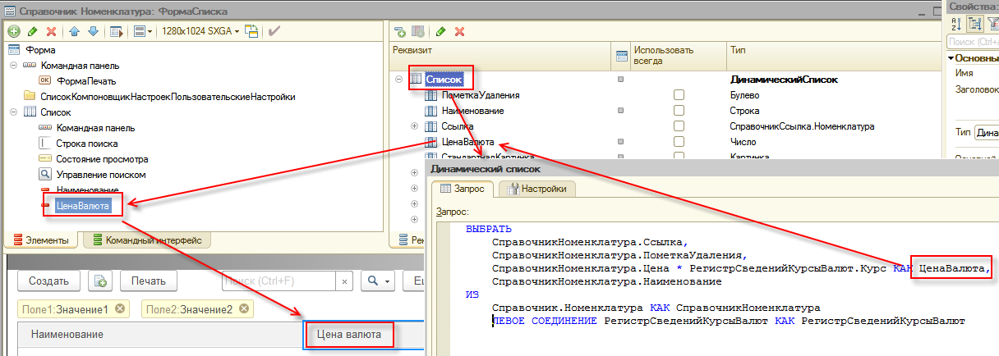{ width="1216" }

!!! success "Правильно"

    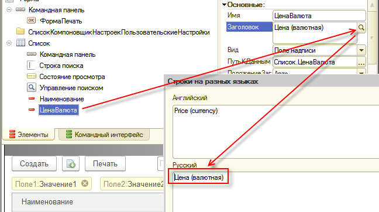{ width="648" }

Примеры, когда заголовок колонки нужно задавать явно:

```sdbl
ВЫБРАТЬ
    Таблица.Поле1 КАК Поле2,
    ВЫРАЗИТЬ(Таблица.Поле1 КАК СТРОКА(100)) КАК Поле3
```

Если поле создается в запросе и получает псевдоним, синоним из метаданных не подставляется автоматически.
Инструмент редактирования интерфейсных текстов не находит заголовки таких колонок.

Имя колонки задавайте даже если заголовок не выводится в форме.
Пользователь все равно видит эти имена в настройке формы (`Еще` -> `Изменить форму...`).

###### 5.

Для полей формы со списками выбора всегда устанавливайте свойство `РежимВыбораИзСписка` в значение `Истина`.

Тогда поле выводит корректное локализуемое представление, а не внутреннее значение списка выбора.

###### См. также

- [#std621: Группы элементов формы](621.md)

###### Проверки
~[#v8cs:input-field-list-choice-mode](../diagnostics/v8-code-style/input-field-list-choice-mode.md)~

###### Источник

https://its.1c.ru/db/v8std#content:765
