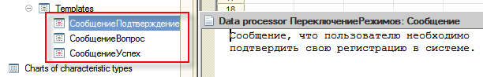
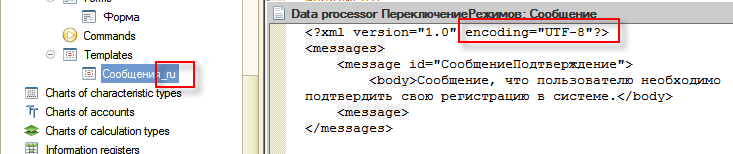

###### #std766

# Макеты: требования по локализации и поддержке разных языков интерфейса

###### 1.

Обычно перевод табличных, текстовых и HTML-макетов не требует специальных подготовительных действий.
Исключение: двоичные макеты, которые нужно переводить, и HTML-макеты с изображениями, где текст внутри изображений должен отличаться по языкам.

Такие макеты помечайте постфиксом в имени: `_кодЯзыка`, где код совпадает со свойством `Код языка` в метаданных.
Для русского языка это `_ru`.

<div class="std-good-bad-pair" markdown="1"> 

!!! failure "Неправильно"

    Макет `ПФ_ODT_СчетНаОплату`

!!! success "Правильно"

    Макет `ПФ_ODT_СчетНаОплату_ru`

</div>

При добавлении языков интерфейса добавляйте макеты с соответствующими постфиксами и выбирайте их в коде по языку.

!!! failure "Неправильно"

    ```bsl
    ... = ПолучитьОбщийМакет("ПФ_ODT_СчетНаОплату");
    ```

!!! success "Правильно"

    ```bsl
    ... = ПолучитьОбщийМакет("ПФ_ODT_СчетНаОплату" + "_" + ТекущийЯзык());
    ```

Чтобы снизить риск ошибок при частичном переводе, получайте макет в три этапа:

- сначала по `ИмяМакета + "_" + ТекущийЯзык()`;
- если не найден, по `ИмяМакета + "_" + Метаданные.ОсновнойЯзык.КодЯзыка`;
- если не найден, по исходному имени `ИмяМакета`;
- затем устанавливайте `КодЯзыка` (для табличного документа) или `КодЯзыкаМакета` (для текстового документа и HTML-макета), как в п. 2.

###### 2.

В многоязычной конфигурации может потребоваться в одном сеансе формировать печатные формы на языке, отличном от текущего языка интерфейса.
Например, в англоязычном сеансе формировать счет на русском языке.

Для получения данных из табличного, текстового или HTML-макета на заданном языке используйте:

- `КодЯзыка` у табличного документа;
- `КодЯзыкаМакета` у текстового документа и HTML-макета.

!!! success "Правильно"

    ```bsl
    Макет = ПолучитьОбщийМакет("ПечатнаяФорма");
    Макет.КодЯзыкаМакета = "ru";
    HTMLДокумент = Макет.ПолучитьДокументHTML();
    ```

###### 3.

В многоязычной конфигурации может понадобиться формировать печатные формы строго на одном языке независимо от текущего языка интерфейса.
Пример: регламентированная отчетность для госучреждений.

Для табличных и HTML-макетов такого типа:

- указывайте постфикс кода языка в имени (как в п. 1);
- при программном получении устанавливайте код языка макета (как в п. 2).

Такие макеты не переводите на другие языки интерфейса.
При программном формировании текстов для заполнения макета явно задавайте второй параметр в `#!bsl НСтр()`, чтобы строки были на том же языке, что и макет.

!!! failure "Неправильно"

    ```bsl
    Макет = ПолучитьМакет("ПФ_MXL_СчетФактура");
    ...
    Область.Текст = НСтр("ru='Заголовок печати';");
    ```

!!! success "Правильно"

    ```bsl
    Макет = ПолучитьМакет("ПФ_MXL_СчетФактура_ru");
    Макет.КодЯзыка = Метаданные.Языки.Русский.КодЯзыка;
    ...
    Область.Текст = НСтр("ru='Заголовок печати';", Метаданные.Языки.Русский.КодЯзыка);
    ```

При использовании БСП и подсистемы `Печать` получение макета через
`УправлениеПечатью.МакетПечатнойФормы("ПФ_MXL_СчетФактура")` возвращает форму `ПФ_MXL_СчетФактура_ru` и устанавливает у макета свойство `КодЯзыка`.

###### 4.

Если в текстах макетов используются именованные параметры подстановки, соблюдайте требования [#std761: Интерфейсные тексты в коде: требования по локализации](761.md).

###### 5.

Используйте в макетах кодировку UTF-8.

###### 6.

По возможности группируйте однотипные макеты: используйте один макет вместо нескольких.

Например, если несколько однотипных сообщений записываются в один справочник, их лучше хранить в одном макете.

!!! failure "Неправильно"

    { width="612" }

    ```bsl
    Макет = Обработки.ПереключениеРежимов.ПолучитьМакет("Сообщение");
    ```

!!! success "Правильно"

    { width="733" }

    ```bsl
    Макет = Обработки.ПереключениеРежимов.ПолучитьМакет(
        СтроковыеФункцииКлиентСервер.ПодставитьПараметрыВСтроку(
            "Сообщения_%1",
            ОбщегоНазначения.КодОсновногоЯзыка()));
    ```

###### 7.

Внешние компоненты размещайте в макетах с типом `внешняя компонента`.

При разработке внешней компоненты обрабатывайте метод `SetLocale` для локализации по полученному коду локали.
Подробнее: [#metod3221: Технология создания внешних компонент](../metod8dev/3221.md).

Если полученный код локали не поддерживается, компонент должен настроить свое окружение на использование английского языка.

###### Источник

https://its.1c.ru/db/v8std#content:766
