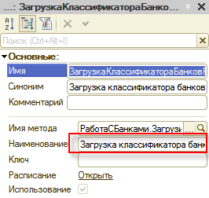
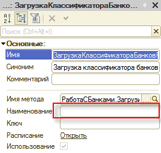

###### #std767

# Регламентные задания: требования по локализации

###### 1.

Для предопределенных регламентных заданий не задавайте наименование в конфигураторе.
Достаточно указать синоним предопределенного регламентного задания.

<div class="std-good-bad-pair" markdown="1"> 

!!! failure "Неправильно"

    { width="266" }

!!! success "Правильно"

    { width="266" }

</div>

Для непредопределенных (параметризованных) регламентных заданий наименование задавайте программно.
Оформляйте его через `#!bsl НСтр`, при необходимости учитывайте контекст выполнения.

!!! success "Правильно"

    ```bsl
    Задание = РегламентныеЗадания.СоздатьРегламентноеЗадание(Метаданные.РегламентныеЗадания.РассылкаОтчетов);
    Задание.Наименование = СтроковыеФункцииКлиентСервер.ПодставитьПараметрыВСтроку(НСтр("ru = 'Рассылка отчетов: %1'"), РассылкаОтчетов);
    Задание.Записать();
    ```

Если наименование не задано, платформа берет его из локализуемого синонима.
Если наименование задано вручную, будет использоваться именно оно, а оно не поддерживает локализацию.

<!-- diagnostic-backlinks:start clause=1 -->
<div class="diagnostic-links" aria-label="Проверки">
<a class="diagnostic-chip" href="../diagnostics/acc/449.md">acc:449</a>
<a class="diagnostic-chip" href="../diagnostics/v8-code-style/mdo-scheduled-job-description.md">v8cs:mdo-scheduled-job-description</a>
</div>
<!-- diagnostic-backlinks:end clause=1 -->

###### См. также

- [#std540: Общие требования к регламентным заданиям](540.md)

###### Источники

- [Русская версия — ИТС](https://its.1c.ru/db/v8std#content:767)
- [English version — 1Ci Knowledge Base](https://kb.1ci.com/1C_Enterprise_Platform/Guides/Developer_Guides/1C_Enterprise_Development_Standards/Localization_requirements/Localization_guidelines_____Scheduled_jobs/?language=en)
