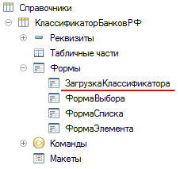
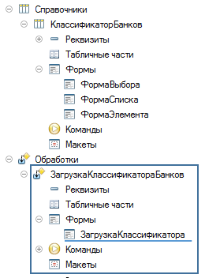
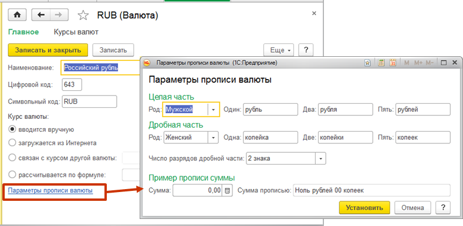

###### #std769

# Поставка международной версии конфигурации

Стандарт применим к локализуемым конфигурациям (и входящим в них библиотекам), на базе которых выпускаются национальные решения для разных стран или регионов.

Для упрощения работы локализаторов при первичной локализации и последующих обновлениях выпускайте международную версию конфигурации, подготовленную для создания национальных версий.

Локализованные версии рекомендуется разрабатывать на базе международной версии.

Требования группы стандартов по локализации одинаково применяются и к международной, и к национальным версиям.

Например, национальная версия также может поставляться с несколькими языками интерфейса.

Для снижения трудозатрат на выделение национальной специфики в первую очередь анализируйте зарубежные версии, опубликованные на портале 1С: https://releases.1c.ru.

###### 1.

Национальную (российскую) специфику в программном коде и формах выделяйте в отдельные объекты метаданных, которые отсутствуют в международной версии.

<div class="std-good-bad-pair" markdown="1"> 

!!! failure "Неправильно"

    { width="227" }

!!! success "Правильно"

    { width="260" }

</div>

###### 1.1.

Реквизиты объектов, относящиеся к национальной специфике, можно оставлять в объектах, но конфигурация должна сохранять работоспособность при их удалении.

###### 1.2.

Если в форме к национальной специфике относится только часть элементов, выносите эти элементы в отдельную форму.

!!! example "Пример"

    { width="789" }

###### 1.3.

К национальной специфике могут относиться и алгоритмы (например, загрузка курсов валют).
Такие алгоритмы также выделяйте в отдельные объекты метаданных.

###### 1.4.

Если подсистема или объект в основном международные, но нужно добавить национальную специфику, создавайте общие модули с постфиксом `Локализация`.

В алгоритмах, где нужно дополнить или переопределить поведение, делайте вызов в эти модули.
Процедуры размещайте в области `ПрограммныйИнтерфейс`.

В международной поставке модули с постфиксом `Локализация` не должны содержать прикладной код.

В национальной конфигурации код внутри процедур обрамляйте комментариями `Локализация` и `Конец Локализация`.
Если международная поставка изготавливается из национальной, такие фрагменты удаляются вместе с обрамляющими комментариями.

!!! example "Пример: национальная конфигурация"

    ```bsl
    Процедура ПриОпределенииСимволовНациональногоАлфавита(СимволыНациональногоАлфавита, ДополнительныеДопустимыеСимволы) Экспорт

        // Локализация
        СимволыНациональногоАлфавита = "абвгдеёжзийклмнопрстуфхцчшщъыьэюя";
        // Конец Локализация

    КонецПроцедуры
    ```

!!! example "Пример: международная поставка"

    ```bsl
    Процедура ПриОпределенииСимволовНациональногоАлфавита(СимволыНациональногоАлфавита, ДополнительныеДопустимыеСимволы) Экспорт

    КонецПроцедуры
    ```

Не обрамляйте комментариями `Локализация` и `Конец Локализация` фрагменты кода в любых других объектах и модулях.
Иначе разработчик не сможет при необходимости доопределить национальную специфику.

!!! failure "Неправильно"

    ```bsl
    Функция АдресВОблачномСервисе(Сервис, Href) Экспорт

        АдресОбъекта = "";

        Если Сервис = "Box" Тогда
            АдресОбъекта = "https://app.box.com/files/0/";
        // Локализация
        ИначеЕсли Сервис = "Yandex" Тогда
            АдресОбъекта = "https://disk.yandex.ru/client/disk/";
        // Конец Локализация
        ИначеЕсли Сервис = "Dropbox" Тогда
            АдресОбъекта = "https://www.dropbox.com/home/";
        КонецЕсли;

        Возврат АдресОбъекта + Href;

    КонецФункции
    ```

!!! success "Правильно"

    ```bsl
    Функция АдресВОблачномСервисе(Сервис, Href) Экспорт

        АдресОбъекта = "";

        Если Сервис = "Box" Тогда
            АдресОбъекта = "https://app.box.com/files/0/";
        ИначеЕсли Сервис = "Dropbox" Тогда
            АдресОбъекта = "https://www.dropbox.com/home/";
        Иначе
            РаботаСФайламиЛокализация.ПриОпределенииАдресаОблачногоСервиса(Сервис, АдресОбъекта);
        КонецЕсли;

        Возврат АдресОбъекта + Href;

    КонецФункции
    ```

В модуле `РаботаСФайламиЛокализация`:

```bsl
Процедура ПриОпределенииАдресаОблачногоСервиса(Сервис, АдресОбъекта)

    // Локализация
    Если Сервис = "Yandex" Тогда
        АдресОбъекта = "https://disk.yandex.ru/client/disk/";
    КонецЕсли;
    // Конец Локализация

КонецПроцедуры
```

Пример применения: функциональность закрытия месяца международная, но список этапов нужно дополнять национальными этапами.

Для этого добавляют общий модуль `ЗакрытиеМесяцаЛокализация`, а из процедуры `ЗакрытиеМесяца.ДобавитьЭтапыЗакрытияМесяца` вызывают его метод.

В международной поставке модуль `ЗакрытиеМесяцаЛокализация` содержит только определение метода `ДобавитьЭтапыЗакрытияМесяца`.

###### 1.5.

Если национальная специфика занимает большую часть подсистемы, относите к национальной специфике всю подсистему.

Пример: подсистема «Склонение представлений объектов».

###### 1.6.

Перечисляйте объекты метаданных с национальной спецификой в файле `ЛокализуемыеОбъекты<...>.txt` и включайте файл в дистрибутив типовой конфигурации.

Файл содержит имена объектов в том виде, в котором их возвращает функция `ОбъектМетаданных.ПолноеИмя()`.
Каждый объект указывается с новой строки.
Допускаются комментарии, как в коде конфигурации.

!!! example "Пример"

    ```bsl
    // Банки
    Обработка.ЗагрузкаКлассификатораБанков
    РегламентноеЗадание.ЗагрузкаКлассификатораБанков
    Справочник.КлассификаторБанков.Реквизит.ИНН

    // Валюты
    Обработка.ЗагрузкаКурсовВалют
    РегламентноеЗадание.ЗагрузкаКурсовВалют
    ```

###### 2.

Соблюдение требования п. 1 не должно ухудшать удобство интерфейса.

Если из-за переноса части формы в отдельные формы юзабилити существенно ухудшается, относите к национальной специфике всю форму.

###### 3.

В процедурах переопределяемых модулей размещайте только вызовы процедур конфигурации, содержащих прикладной код.

Это упрощает доработку переопределяемых модулей при локализации.

!!! failure "Неправильно"

    ```bsl
    // В модуле ВариантыОтчетовПереопределяемый
    Процедура ОпределитьРазделыСВариантамиОтчетов(Разделы) Экспорт
        Разделы.Добавить(ВариантыОтчетовКлиентСервер.ИдентификаторНачальнойСтраницы(),
            НСтр("ru = 'Главное'"));

        Разделы.Добавить(Метаданные.Подсистемы.CRMИМаркетинг,
            НСтр("ru= 'Отчеты по CRM и маркетингу'"));

        Разделы.Добавить(Метаданные.Подсистемы.Закупки,
            НСтр("ru= 'Отчеты по закупкам'"));

        Разделы.Добавить(Метаданные.Подсистемы.Казначейство,
            НСтр("ru= 'Отчеты по казначейству'"));

        Разделы.Добавить(Метаданные.Подсистемы.Продажи,
            НСтр("ru= 'Отчеты по продажам'"));

        Разделы.Добавить(Метаданные.Подсистемы.Склад,
            НСтр("ru= 'Отчеты по складу'"));

        Разделы.Добавить(Метаданные.Подсистемы.ФинансовыйРезультатИКонтроллинг,
            НСтр("ru= 'Отчеты по финансовому результату'"));
    КонецПроцедуры
    ```

!!! success "Правильно"

    ```bsl
    // В модуле ВариантыОтчетовПереопределяемый
    Процедура ОпределитьРазделыСВариантамиОтчетов(Разделы) Экспорт
        ВариантыОтчетовУТ.ОпределитьРазделыСВариантамиОтчетов(Разделы);
    КонецПроцедуры

    // В модуле ВариантыОтчетовУТ
    Процедура ОпределитьРазделыСВариантамиОтчетов(Разделы) Экспорт
        Разделы.Добавить(ВариантыОтчетовКлиентСервер.ИдентификаторНачальнойСтраницы(),
            НСтр("ru = 'Главное'"));

        Разделы.Добавить(Метаданные.Подсистемы.CRMИМаркетинг,
            НСтр("ru= 'Отчеты по CRM и маркетингу'"));

        Разделы.Добавить(Метаданные.Подсистемы.Закупки,
            НСтр("ru= 'Отчеты по закупкам'"));

        Разделы.Добавить(Метаданные.Подсистемы.Казначейство,
            НСтр("ru= 'Отчеты по казначейству'"));

        Разделы.Добавить(Метаданные.Подсистемы.Продажи,
            НСтр("ru= 'Отчеты по продажам'"));

        Разделы.Добавить(Метаданные.Подсистемы.Склад,
            НСтр("ru= 'Отчеты по складу'"));

        Разделы.Добавить(Метаданные.Подсистемы.ФинансовыйРезультатИКонтроллинг,
            НСтр("ru= 'Отчеты по финансовому результату'"));
    КонецПроцедуры
    ```

###### 4.

Обеспечивайте работоспособность международной конфигурации.

###### 5.

Международную и российскую версии выпускайте синхронно.

Для этого используйте одну из схем разработки:

- `a.` разработка российской версии в одном хранилище и автоматическая сборка международной версии удалением объектов национальной специфики и кода внутри процедур модулей с постфиксом `Локализация`;
- `b.` разработка российской и международной версий в двух хранилищах, где российская версия стоит на поддержке международной и содержит добавленные объекты национальной специфики.

Если локализатор берет за основу международную версию, рекомендуется:

- поставить национальную конфигурацию на поддержку международной;
- по мере необходимости добавить объекты из файла `ЛокализуемыеОбъекты<...>.txt`, ориентируясь на аналогичные объекты российской версии;
- при необходимости добавить реализацию в процедуры общих модулей с постфиксом `Локализация`.

Если локализатор берет за основу российскую версию, рекомендуется:

- поставить национальную конфигурацию на поддержку российской;
- снять с поддержки и локализовать объекты из файла `ЛокализуемыеОбъекты<...>.txt`;
- снять с поддержки и локализовать алгоритмы модулей с постфиксом `Локализация`.

Подготовку файла поставки международной версии можно упростить файлом настроек объединения.

!!! tip "Подсказка"

    Для автоматизации используйте обработку подготовки файла настроек объединения:
    https://its.1c.ru/db/files/1CITS/EXE/V8Std/ПодготовкаФайлаНастроекОбъединения/ПодготовкаФайлаНастроекОбъединения.zip

###### См. также

- [#std761: Интерфейсные тексты в коде: требования по локализации](761.md)
- [#std762: Запросы, динамические списки и отчеты на СКД: требования по локализации](762.md)
- [#std763: Форматирование даты, числа, Булево: требования по локализации](763.md)
- [#std764: Строковые константные выражения в коде: требования по локализации](764.md)
- [#std765: Элементы форм: требования по локализации](765.md)
- [#std767: Регламентные задания: требования по локализации](767.md)
- [#std766: Макеты: требования по локализации](766.md)

###### Источник

https://its.1c.ru/db/v8std#content:769
