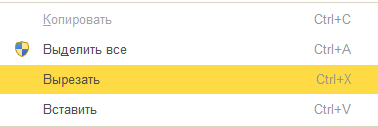

###### #std774

# Безопасность запуска приложений

###### 1.

При запуске внешней программы из кода собирайте командную строку только из проверенных частей.

Если любая часть команды получена из:

- базы данных;
- пользовательского ввода в форме;
- хранилища настроек,

перед запуском проверяйте безопасность значения.

Небезопасными считайте строки, содержащие символы:

`$` `` ` `` `|` `||` `;` `&` `&&`

Требование распространяется на все способы запуска, включая:

- `#!bsl КомандаСистемы()`;
- `#!bsl ЗапуститьПриложение()`;
- `#!bsl НачатьЗапускПриложения()`;
- `#!bsl ПерейтиПоНавигационнойСсылке()`;
- COM-объекты `#!bsl Wscript.Shell` и `#!bsl Shell.Application`.

###### 2.

При использовании БСП для запуска внешних программ применяйте профильный API.

###### 2.1.

Чтобы открыть проводник с фокусом на каталоге/файле, используйте `#!bsl ФайловаяСистемаКлиент.ОткрытьПроводник`.

!!! example "Пример"

    ```bsl
    // Windows
    ФайловаяСистемаКлиент.ОткрытьПроводник("C:\Users");
    ФайловаяСистемаКлиент.ОткрытьПроводник("C:\Program Files\1cv8\common\1cestart.exe");

    // Linux
    ФайловаяСистемаКлиент.ОткрытьПроводник("/home/");
    ФайловаяСистемаКлиент.ОткрытьПроводник("/opt/1C/v8.3/x86_64/1cv8c");
    ```

###### 2.2.

Чтобы открыть файл в ассоциированной программе, используйте `#!bsl ФайловаяСистемаКлиент.ОткрытьФайл()`.

Метод блокирует запуск исполняемых файлов (`*.exe`, `*.bin`, `*.apk` и т.п.).

!!! example "Пример"

    ```bsl
    ФайловаяСистемаКлиент.ОткрытьФайл(КаталогДокументов() + "test.pdf");
    ФайловаяСистемаКлиент.ОткрытьФайл("D:\test.xlsx");
    ```

###### 2.3.

Чтобы открыть веб-страницу, вызвать программу по протоколу (`mailto:`, `skype:`, `tel:` и т.д.) или открыть навигационную ссылку ИБ, используйте `#!bsl ФайловаяСистемаКлиент.ОткрытьНавигационнуюСсылку()`.

Для открытия файловой системы не формируйте `file://`-ссылки.
Для этого применяйте только `#!bsl ОткрытьПроводник()` и `#!bsl ОткрытьФайл()`.

!!! example "Пример"

    ```bsl
    ФайловаяСистемаКлиент.ОткрытьНавигационнуюСсылку("https://1c.ru");
    ФайловаяСистемаКлиент.ОткрытьНавигационнуюСсылку("e1cib/navigationpoint/startpage");
    ФайловаяСистемаКлиент.ОткрытьНавигационнуюСсылку("mailto:help@1c.ru");
    ФайловаяСистемаКлиент.ОткрытьНавигационнуюСсылку("skype:echo123?call");
    ```

###### 2.4.

Для запуска исполняемых файлов, системных команд и серверных команд, а также для получения `stdout`/`stderr` используйте:

- `#!bsl ФайловаяСистемаКлиент.ЗапуститьПрограмму()` в клиентском коде;
- `#!bsl ФайловаяСистема.ЗапуститьПрограмму()` в серверном коде.

!!! example "Пример"

    ```bsl
    ФайловаяСистемаКлиент.ЗапуститьПрограмму("calc");

    ПараметрыЗапуска = ФайловаяСистема.ПараметрыЗапускаПрограммы();
    ПараметрыЗапуска.ДождатьсяЗавершения = Истина;
    ПараметрыЗапуска.ПолучитьПотокВывода = Истина;
    ПараметрыЗапуска.ПолучитьПотокОшибок = Истина;

    Результат = ФайловаяСистема.ЗапуститьПрограмму("ping 127.0.0.1 -n 5", ПараметрыЗапуска);
    КодВозврата = Результат.КодВозврата;
    ПотокВывода = Результат.ПотокВывода;
    ПотокОшибок = Результат.ПотокОшибок;
    ```

###### 2.5.

Не формируйте динамически исполняемые файлы во временном каталоге (например, `bat`-файлы с последующим запуском).

Это усложняет политику белых списков и создает дополнительный вектор атаки.

Вместо этого:

- передавайте команду напрямую в `#!bsl ФайловаяСистема.ЗапуститьПрограмму()`;
- или используйте статический доверенный исполняемый файл и передавайте параметры через аргументы командной строки или неисполняемый файл параметров.

###### 3.

Если операция требует запуска внешней программы с повышением прав (например, UAC в Windows),
реализуйте ее как отдельную команду формы и отображайте на кнопке значок щита.

{ width="261" }

{ width="378" }

###### См. также

- [#std770: Ограничения на использование Выполнить и Вычислить на сервере](770.md)
- [#std775: Безопасность программного обеспечения, вызываемого через открытые интерфейсы](775.md)

###### Проверки
~[#bslls:FileSystemAccess](../diagnostics/bslls/FileSystemAccess.md)~

###### Источник

https://its.1c.ru/db/v8std#content:774
