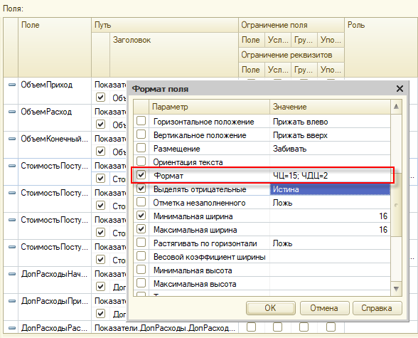
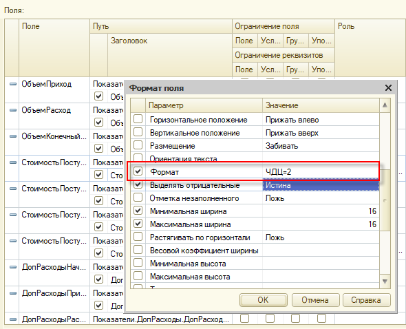

###### #std778

# Денежные поля: требования по локализации

###### 1.

Чтобы конфигурация корректно работала в странах с низким курсом национальной валюты, увеличивайте разрядность целой части числовых полей с денежным эквивалентом.
Примеры денежных полей: `Сумма`, `Цена`, `Себестоимость`.

В метаданных:

- для денежных полей, где возможны только положительные значения, вместо фиксированного типа `Число(15,2)` используйте определяемый тип `ДенежнаяСуммаНеотрицательная`;
- для денежных полей, где возможны отрицательные значения, используйте тип `ДенежнаяСуммаЛюбогоЗнака` со снятым флагом `Неотрицательное`.

Если определяемый тип указать нельзя (например, для параметра формы или в составном типе), задавайте `Число(31,2)`.
В отдельных случаях эту длину нужно уменьшать из-за ограничений СУБД, например в ресурсах регистров.

###### 2.

Если используется БСП, не применяйте конструктор типа `Число` для описания типа денежного поля.
Используйте функцию, которая возвращает описание на основе определяемого типа.

<div class="std-good-bad-pair" markdown="1"> 

!!! failure "Неправильно"

    ```bsl
    ОписаниеТиповСумма = Новый ОписаниеТипов("Число", Новый КвалификаторыЧисла(15,2));
    ```

!!! success "Правильно"

    ```bsl
    ОписаниеТиповСумма = РаботаСКурсамиВалют.ОписаниеТипаДенежногоПоля();
    ```

</div>

###### 3.

При [#std535: использовании `ВЫРАЗИТЬ` в запросах](535.md) для денежных полей применяйте приведение к типу `ЧИСЛО(31,2)`.
Так поддерживается максимальная длина целой части 29.
Ограничение на 29 связано с поддержкой сервера DB2.

<div class="std-good-bad-pair" markdown="1"> 

!!! failure "Неправильно"

    ```sdbl
    ВЫРАЗИТЬ(Т.Сумма / Т.Количество КАК ЧИСЛО(15,2))
    ```

!!! success "Правильно"

    ```sdbl
    ВЫРАЗИТЬ(Т.Сумма / Т.Количество КАК ЧИСЛО(31,2))
    ```

</div>

###### 4.

При использовании функции `Формат`, а также при задании формата в свойствах элементов формы, полей наборов СКД и т.п. не задавайте общую длину числа.

<div class="std-good-bad-pair" markdown="1"> 

!!! failure "Неправильно"

    ```bsl
    Формат(Выборка.СуммаДокумента, "ЧЦ=15; ЧДЦ=2")
    ```

!!! success "Правильно"

    ```bsl
    Формат(Выборка.СуммаДокумента, "ЧДЦ=2")
    ```

</div>

<div class="std-good-bad-pair" markdown="1"> 

!!! failure "Неправильно"

    { width="600" }

!!! success "Правильно"

    { width="600" }

</div>

###### Источник

https://its.1c.ru/db/v8std#content:778
