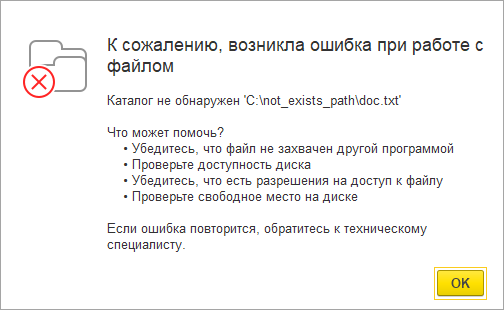
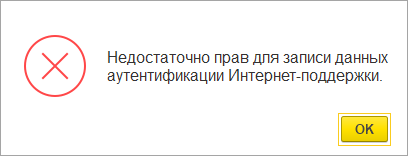
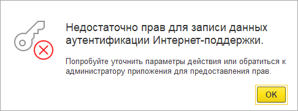
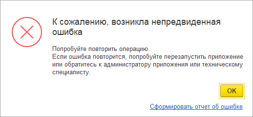

###### #std790

# Вызов исключений в коде

###### 1.

В общем случае исключения в коде вызывать не требуется.

При ошибках в выполнении кода исключение формирует платформа, после чего:

- пользователю выводится сообщение с рекомендацией;
- в журнал регистрации пишется подробная диагностика со стеком вызовов;
- при необходимости данные отправляются в сервис регистрации ошибок платформы.

!!! example "Пример 1"

    Исключение платформы с категорией `#!bsl ОшибкаДоступаКЛокальномуФайлу`.

    { width="504" }

    Запись журнала регистрации с событием `Ошибка выполнения` и комментарием:

    ```log
    Ошибка при вызове метода контекста (Открыть)
    {Обработка.ПримерИсключения.Форма.Форма.Форма(14)}:Текст.Открыть("C:\not_exists_path\doc.txt");
    [ОшибкаВоВремяВыполненияВстроенногоЯзыка]
    по причине:
    Каталог не обнаружен 'C:\not_exists_path\doc.txt'
    [ОшибкаДоступаКЛокальномуФайлу]
    ```

!!! example "Пример 2"

    Исключение платформы с категорией `#!bsl ПрочаяОшибка`.

    { width="518" }

    Запись журнала регистрации с событием `Ошибка выполнения` и комментарием:
    
    ```log
    Поле объекта не обнаружено (Организация)
    {Обработка.ПримерИсключения.Форма.Форма.Форма(22)}:Если ЗначениеЗаполнено(Свойства.Организация) Тогда
    [ОшибкаВоВремяВыполненияВстроенногоЯзыка, ОшибкаИспользованияВстроенногоЯзыка]
    ```

###### 2.

Тем не менее, иногда исключение нужно вызывать программно.

Для исключений бизнес-логики, которые выводятся пользователю, категорию ошибки можно не указывать (`#!bsl ИсключениеВызванноеИзВстроенногоЯзыка`).
Для остальных случаев рекомендуется задавать категорию (`#!bsl ОшибкаРаботыСПринтером`, `#!bsl ОшибкаСети`, `#!bsl НарушениеПравДоступа` и т.п.).

Тогда пользователь получает не только технический текст, но и типовую рекомендацию по решению.

Проверяйте внешний вид исключений без отладки и без режима технического специалиста: поведение окна исключения зависит от режима запуска.

###### 2.1.

Обычно для проверки прав доступа используйте `#!bsl ВыполнитьПроверкуПравДоступа`.

В редких случаях, когда проверяется наличие конкретной роли, исключение можно вызывать вручную.

!!! failure "Неправильно"

    ```bsl
    Если Не РольДоступна("ПодключениеИнтернетПоддержки") Тогда
        ТекстОшибки = НСтр("ru = 'Недостаточно прав для записи данных аутентификации Интернет-поддержки.'");
        ВызватьИсключение ТекстОшибки;
    КонецЕсли;
    ```

    Сообщение пользователю:

    { width="408" }

!!! success "Правильно"

    ```bsl
    Если Не РольДоступна("ПодключениеИнтернетПоддержки") Тогда
        ТекстОшибки = НСтр("ru = 'Недостаточно прав для записи данных аутентификации Интернет-поддержки.'");
        ДляАдминистратора = НСтр("ru = 'Нет роли:'") + " " + Метаданные.Роли.ПодключениеИнтернетПоддержки.Представление();
        ВызватьИсключение(ТекстОшибки, КатегорияОшибки.НарушениеПравДоступа,, ДляАдминистратора);
    КонецЕсли;
    ```

    Сообщение пользователю:

    { width="486" }

###### 2.2.

Для диагностики программных ошибок (некорректные параметры, неверно встроенная подсистема и т.п.) используйте категорию `#!bsl ОшибкаКонфигурации`.

Такие ошибки адресованы разработчику, а не пользователю.

!!! example "Пример"

    ```bsl
    Если ТипЗнч(Количество) <> Тип("Число") Тогда
        ТекстОшибки = НСтр("ru = 'Недопустимое значение параметра'") + " " + "Количество";
        ВызватьИсключение(ТекстОшибки, КатегорияОшибки.ОшибкаКонфигурации);
    КонецЕсли;
    ```

    Сообщение пользователю:

    { width="518" }

###### 2.3.

Если анализ типа исключения критичен для бизнес-логики, используйте один из подходов:

- не вызывать исключения, а возвращать строковые коды ошибок;
- анализировать категорию ошибки исключения, вызванного платформой;
- вызывать исключение со строковым кодом ошибки (параметр `#!bsl Код` у `#!bsl ВызватьИсключение`).

Числовые коды ошибок использовать не рекомендуется: их сложнее читать и сопровождать.

###### 2.3.1.

!!! example "Пример"

    ```bsl
    РезультатЗагрузки = ЗагрузитьФайлИзИнтернета(...);
    Если РезультатЗагрузки = "Успешно" Тогда
    ...
    ИначеЕсли ...
    ```

###### 2.3.2.

!!! example "Пример"

    ```bsl
    НомерПопытки = 1;
    Пока НомерПопытки < 4 Цикл
        Попытка
            HTTPОтвет = HTTPСоединение.ОтправитьДляОбработки(HTTPЗапрос);
        Исключение
            ИнформацияОбОшибке = ИнформацияОбОшибке();
            Если ИнформацияОбОшибке.ЯвляетсяОшибкойКатегории(КатегорияОшибки.ОшибкаСети) Тогда
                НомерПопытки = НомерПопытки + 1;
                Продолжить;
            КонецЕсли;
            ВызватьИсключение;
        КонецПопытки;
    КонецЦикла;
    ```

###### 2.3.3.

!!! example "Пример вызова исключения со строковым кодом"

    ```bsl
    Если КонфигурацияБазыДанныхИзмененаДинамически() Тогда
        ВызватьИсключение(НСтр("ru = 'Версия приложения обновлена, требуется перезапустить сеанс.'"),,
            "СтандартныеПодсистемы.БазоваяФункциональность.КонфигурацияИзмененаДинамически");
    КонецЕсли;
    ```

Для уникальности кода включайте префикс подсистемы, например:

- `СтандартныеПодсистемы.БазоваяФункциональность.КонфигурацияИзмененаДинамически`;
- `СтандартныеПодсистемы.БазоваяФункциональность.РасширенияИзмененыДинамически`.

!!! example "Пример обработки такого исключения"

    ```bsl
    Попытка
        ВыполнитьОбновление();
    Исключение
        КодОшибки = ИнформацияОбОшибке().Код;
        Если КодОшибки = "СтандартныеПодсистемы.БазоваяФункциональность.КонфигурацияИзмененаДинамически"
         Или КодОшибки = "СтандартныеПодсистемы.БазоваяФункциональность.РасширенияИзмененыДинамически" Тогда
            ПерезапуститьЗаданиеОбновления();
            Возврат;
        КонецЕсли;
        ВызватьИсключение;
    КонецПопытки;
    ```

Если используется БСП, удобно применять `#!bsl ОбщегоНазначенияКлиентСервер.ЭтоИсключениеСКодомОшибки()`.
Метод рекурсивно ищет коды в цепочке вложенных исключений (`#!bsl ИнформацияОбОшибке().Причина`).

!!! example "Пример с использованием БСП"

    ```bsl
    Попытка
        ВыполнитьОбновление();
    Исключение
        Если ОбщегоНазначенияКлиентСервер.ЭтоИсключениеСКодомОшибки(ИнформацияОбОшибке(),
                "СтандартныеПодсистемы.БазоваяФункциональность.КонфигурацияИзмененаДинамически
                |СтандартныеПодсистемы.БазоваяФункциональность.РасширенияИзмененыДинамически") Тогда
            ПерезапуститьЗаданиеОбновления();
            Возврат;
        КонецЕсли;
        ВызватьИсключение;
    КонецПопытки;
    ```

###### 3.

Не используйте исключения в обработчиках `#!bsl ОбработкаПроверкиЗаполнения`, `#!bsl ОбработкаПроведения`, `#!bsl ПередЗаписью`, `#!bsl ПриЗаписи`, `#!bsl ПередУдалением` и т.п. для обычных блокирующих предупреждений пользователю.

Вместо этого устанавливайте `#!bsl Отказ = Истина` и выводите сообщение.
Пользователь должен видеть все блокирующие причины сразу, а не по одной.

!!! success "Исключение"

    Если пользователь не может обработать предупреждение в рамках текущей операции или ошибка имеет исключительный характер и делает остальные проверки бессмысленными.

    ```bsl
    Процедура ПередЗаписью(Отказ)

        Если Не ЗарегистрироватьИзмененияНаУзлахПлановОбмена() Тогда
            ТекстОшибки = НСтр("ru = 'Не удалось зарегистрировать изменения на узлах планов обмена. Обратитесь к администратору.'");
            ВызватьИсключение ТекстОшибки;
        КонецЕсли;
        ...
    КонецПроцедуры
    ```

Подробнее: [#std400: Информирование пользователя, пп. 1.1 и 1.3](400.md).

###### Источник

https://its.1c.ru/db/v8std#content:790
