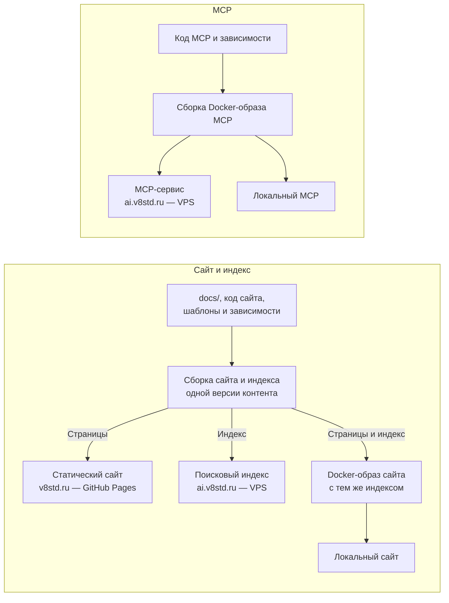
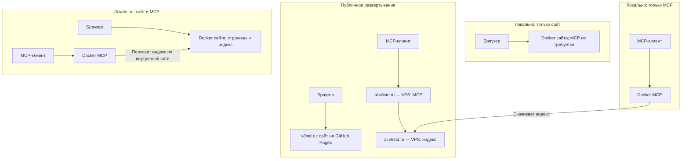

# Целевая задача поставки v8std

Зафиксировано 16 сентября 2026 года. Документ описывает согласованный целевой
результат, а не подтверждает готовность текущей реализации.
Решение об HTTP уточнено 17 сентября. Текущее состояние и оставшиеся работы —
в [плане поставки](repository-layout-plan.md).

## Результат

Выпустить сайт и MCP с чистой переустановкой существующего VPS и обеспечить
три варианта локального запуска. Решение пользователя от 17 сентября заменяет
прежнее требование отдельного нового VPS: существующий сервер переустанавливается
после подготовки резервной копии и проверенных артефактов.

В публичных текстах и схемах использовать обозначения `v8std.ru` (GitHub Pages)
и `ai.v8std.ru` (VPS), без названия провайдера VPS.

| Результат поставки | Размещение и назначение |
|---|---|
| Статический сайт | `v8std.ru` — GitHub Pages |
| Собранный поисковый индекс | `ai.v8std.ru` — VPS; доступен для скачивания локальным MCP |
| MCP-сервис | `ai.v8std.ru` — VPS |
| Docker-образ сайта с индексом | Самостоятельный локальный сайт или совместный запуск с MCP |
| Docker-образ MCP | Локальный запуск; тот же образ используется для MCP на VPS |

## Схема поставки

Индекс собирается один раз для версии контента. Один и тот же артефакт индекса
поставляется на VPS и включается в Docker-образ сайта. Страницы локального сайта
и его индекс относятся к одной версии контента.

## Схема развёртывания

## Правила локального запуска

MCP использует только Streamable HTTP, включая локальный запуск.
Поддержка stdio и поставка через Docker MCP Catalog/Gateway исключены.

- Сайт запускается и работает без MCP.
- MCP без локального сайта скачивает индекс с `ai.v8std.ru`.
- При совместном запуске MCP получает индекс из контейнера локального сайта.
  Контейнер сайта предоставляет индекс для скачивания по внутренней сети.
- Источник индекса задаётся настройкой MCP; отдельные образы MCP для разных
  источников индекса не нужны.
- Один образ сайта используется как отдельно, так и совместно с MCP.
- Если выбранный локальный источник индекса недоступен, MCP сообщает явную
  ошибку и не переключается незаметно на публичный индекс.

## Критерии готовности

- Сайт опубликован и доступен на `v8std.ru`.
- Серверная часть установлена на чистой ОС после переустановки существующего VPS. Индекс доступен для
  скачивания, MCP доступен клиентам через `ai.v8std.ru`.
- Самостоятельный локальный сайт запускается из поставляемого Docker-образа
  и открывается в браузере без запущенного MCP.
- Самостоятельный локальный MCP скачивает опубликованный индекс с
  `ai.v8std.ru` и обслуживает запросы MCP-клиента.
- При совместном локальном запуске сайт открывается в браузере, а MCP
  обслуживает запросы по индексу локального сайта. Источник индекса проверен.
- Недоступность локального источника индекса приводит к явной ошибке,
  без скрытого перехода на публичный источник.
- Подтверждено совпадение артефакта индекса на VPS и в образе сайта для одной
  поставки, а также соответствие индекса версии контента.
- До переустановки сохранена внешняя резервная копия и определён способ восстановления
  прежней установки. На время переустановки допустим согласованный простой MCP;
  после установки проверена работа через публичный адрес.

Готовность подтверждается фактическими проверками этих сценариев. Наличие
этого документа само по себе не означает выполнение задачи. Конкретные команды
сборки, адреса скачивания индекса и настройки запуска уточняются по реализации.
