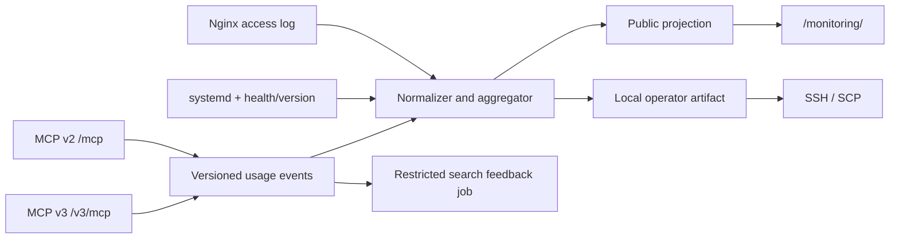

# Проект аналитики и редизайна мониторинга MCP

## Требования

### MONITORING_SHOWS_AGENT_FAMILIES

Отчёт показывает нормализованные семейства подключавшихся MCP-клиентов, не
публикуя произвольную исходную строку user-agent.

### MONITORING_SHOWS_API_VERSIONS

Статистика разделяет использование MCP v2 и MCP v3 и сохраняет явно
обозначенную категорию для событий, версия которых неизвестна.

### MONITORING_SHOWS_MCP_OPERATIONS

Отчёт показывает частоты initialize, tools, resources/list и resources/read, а
для tools — безопасную агрегацию по имени метода.

### PUBLIC_MONITORING_EXCLUDES_SENSITIVE_DATA

Публичная проекция не содержит IP, сырых user-agent, request ID, cursor, URI с
пользовательскими параметрами, текстов запросов или малых идентифицируемых срезов.

### OPERATOR_DETAILS_STAY_OUTSIDE_WEB_ROOT

Детальные события и операторские отчёты хранятся с ограниченными правами вне
каталога, публикуемого веб-сервером, и доступны оператору через SSH.

### MONITORING_REMAINS_PUBLIC

Безопасная агрегированная страница `/monitoring/` остаётся публичной и не
получает обязательную аутентификацию.

### LEGACY_USAGE_EVENTS_REMAIN_READABLE

Новый агрегатор продолжает читать существующие legacy access/usage events и
явно маркирует неизвестные измерения вместо отбрасывания истории.

- Дата: 2026-08-14
- Основание:
  [PUBLIC_MCP_MONITORING](../adr/2026-08-14-public-mcp-monitoring.md)
- Область: MCP v2, MCP v3 и сайт `https://ai.v8std.ru/monitoring/`

## Контекст

Текущий мониторинг реализован скриптом
[`scripts/v8std_mcp_monitoring.py`](https://github.com/zeegin/v8std/blob/main/scripts/v8std_mcp_monitoring.py).
Он периодически строит статические `index.html` и `stats.json` за последние 24
часа из трёх источников:

- Nginx access log;
- `/var/lib/v8std-mcp/tool-usage.jsonl`;
- состояния `v8std-mcp.service` в systemd.

Текущий отчёт полезен, но его модель соответствует только MCP v2:

- MCP-трафиком считается только путь `/mcp`;
- usage-событие обязано иметь поле `tool`;
- чтение страницы распознаётся только как `v8std_get_page`;
- uptime читается только для одного процесса;
- `mcp_requests` фактически означает количество `tools/call`, а не всех MCP
  запросов;
- агент определяется по User-Agent отдельного tool call;
- публично показываются последние поисковые запросы;
- публичный `stats.json` содержит те же детальные данные, что и HTML.

После появления resource-first MCP v3 эта модель станет неполной. Путь
`/v3/mcp` будет ошибочно отнесён к прочим HTTP-запросам, а `resources/list` и
`resources/read` не попадут в статистику использования. Удаление
`v8std_get_page` из v3 также разорвёт текущую эвристику
`search -> get_page`, используемую для генерации search feedback cases.

Отдельная проблема — безопасность. `noindex` сообщает поисковым роботам о
желательном поведении, но не ограничивает доступ. Поисковый запрос может
содержать имя закрытого проекта, фрагмент внутренней задачи или секрет. Такие
данные нельзя публиковать в HTML или JSON даже при read-only характере MCP.

## Цели

Новый мониторинг должен отвечать на следующие вопросы:

1. Какие семейства MCP-агентов обращаются к серверу.
2. Какую API-версию они используют: v2 или v3.
3. Какие MCP-методы, tools и resource operations вызываются.
4. Какие публичные страницы и диагностики читаются чаще всего.
5. Работают ли оба процесса и насколько свеж их индекс или resource snapshot.
6. Сколько запросов завершилось успешно, с ошибкой или rate limit.
7. Какие данные допустимо публиковать, а какие остаются только на сервере.

## Не-цели

- Не считать уникальных пользователей без аутентификации.
- Не идентифицировать пользователя по IP, User-Agent или браузерному
  fingerprint.
- Не строить real-time observability и алерты: это область
  `LOCAL_OPENMETRICS_EXPOSITION`.
- Не превращать статический сайт в отдельное серверное приложение или базу
  данных.
- Не создавать закрытый web-интерфейс: оператор получает расширенный отчёт и
  журналы через SSH.
- Не публиковать полный журнал MCP-событий.
- Не использовать `clientInfo` для аутентификации или авторизации.

## Термины и честные ограничения

### Событие подключения

В отчёте «подключение» означает успешно разобранный MCP-запрос `initialize`.
Это не уникальный пользователь и не обязательно долговечная транспортная
сессия. Stateless HTTP-клиент может инициализироваться повторно, а одна система
может обслуживать нескольких пользователей.

Dashboard показывает число `initialize` и последующие вызовы, но не выводит
метрику «уникальные подключения». Без устойчивого доверенного идентификатора
такая метрика была бы недостоверной.

### Агент

Агент — нормализованное семейство клиентской программы, например `claude`,
`codex` или `cursor`. Источники определения в порядке приоритета:

1. `initialize.params.clientInfo.name` для события `initialize`;
2. безопасная классификация User-Agent для отдельных HTTP-запросов;
3. `unknown`, если классификация невозможна.

`clientInfo` и User-Agent не заверены и могут быть подделаны. Они используются
только для аналитики. Точное исходное значение не публикуется и не влияет на
доступ или поведение MCP.

### Версия

Основная версия на dashboard — прикладная версия MCP v8std, определённая
серверным маршрутом или процессом:

- `/mcp` — `v2`;
- `/v3/mcp` — `v3`.

Заявленная версия клиентской программы не заменяет API version. Она не нужна
для цели этого dashboard и не журналируется: точная версия имеет высокую
кардинальность и может использоваться для fingerprinting.

## Рассмотренные варианты

### Оставить текущий публичный отчёт и только добавить v3

Отклонено. Это сохраняет публикацию поисковых текстов, смешивает usage analytics
с эксплуатационными деталями и не исправляет неоднозначность `mcp_requests`.

### Полностью закрыть `/monitoring/`

Отклонено. Безопасные агрегаты полезны публично: они показывают востребованность
сервиса, переход на v3 и популярные открытые материалы. Закрытие всего сайта не
нужно для защиты пользовательского содержимого.

### Публиковать безопасную проекцию, а операторский отчёт хранить локально

Принято. Один агрегатор строит два разных артефакта из общей нормализованной
модели событий:

- публичный агрегированный dashboard;
- расширенный операторский отчёт вне web root.

Операторский отчёт и сырой журнал никогда не попадают в web root. При
необходимости владелец получает их через SSH или SCP.

## Решение



Остаётся один логический сайт мониторинга. Для v3 не создаётся отдельный
dashboard. Обе API-версии сравниваются в одном отчёте.

Генератор остаётся batch-процессом и атомарно заменяет готовые статические
файлы. Ошибка генерации не влияет на MCP v2 или v3; Nginx продолжает отдавать
последнюю исправную версию отчёта.

## Контракт событий

### Общий envelope

Новая версия внутреннего JSONL-события имеет обязательные поля:

```json
{
  "schema_version": 2,
  "ts": "2026-08-14T00:00:00+00:00",
  "api": "v3",
  "kind": "mcp_operation",
  "method": "resources/read",
  "outcome": "success",
  "duration_ms": 8,
  "agent_family": "claude",
  "agent_source": "client_info"
}
```

Ограниченные значения:

| Поле | Допустимые значения |
|---|---|
| `api` | `v2`, `v3` |
| `kind` | `initialize`, `mcp_operation`, `content_usage` |
| `outcome` | `success`, `client_error`, `server_error` |
| `agent_source` | `client_info`, `user_agent`, `unknown` |

Неизвестный метод или агент нормализуется в `other` либо `unknown`, а не
создаёт новую публичную категорию.

Один JSON-RPC request создаёт не более одного usage event. `content_usage` —
специализированный вид MCP operation, а не дополнительное событие рядом с
`mcp_operation`; это предотвращает двойной подсчёт totals.

### Событие initialize

```json
{
  "schema_version": 2,
  "ts": "2026-08-14T00:00:00+00:00",
  "api": "v3",
  "kind": "initialize",
  "method": "initialize",
  "outcome": "success",
  "agent_family": "claude",
  "agent_source": "client_info"
}
```

Исходные `clientInfo.name`, `clientInfo.version` и User-Agent классифицируются
в памяти и не записываются в usage event. В событие переходит только
нормализованный `agent_family`. Доступ к MCP не зависит от этих полей.

### Вызов tool

```json
{
  "schema_version": 2,
  "ts": "2026-08-14T00:01:00+00:00",
  "api": "v3",
  "kind": "mcp_operation",
  "method": "tools/call",
  "tool": "v8std_search",
  "outcome": "success",
  "duration_ms": 16,
  "agent_family": "claude",
  "agent_source": "user_agent"
}
```

`tool` допускает только инструменты соответствующей API-версии. Аргументы tool
в это событие не записываются.

### Чтение ресурса

```json
{
  "schema_version": 2,
  "ts": "2026-08-14T00:02:00+00:00",
  "api": "v3",
  "kind": "content_usage",
  "method": "resources/read",
  "outcome": "success",
  "agent_family": "claude",
  "resource_type": "standard",
  "resource_uri": "v8std://ru/standards/437",
  "page_id": "std437",
  "title": "Оформление текстов запросов",
  "url": "https://v8std.ru/std/437/"
}
```

URI, page ID, title и URL допустимы во внутренней аналитике, потому что
описывают уже публичный материал v8std. Markdown страницы не записывается.

Успешный v2 `v8std_get_page` использует тот же вид события:

```json
{
  "schema_version": 2,
  "ts": "2026-08-14T00:02:00+00:00",
  "api": "v2",
  "kind": "content_usage",
  "method": "tools/call",
  "tool": "v8std_get_page",
  "outcome": "success",
  "agent_family": "claude",
  "page_id": "std437",
  "url": "https://v8std.ru/std/437/"
}
```

Поэтому один вызов увеличивает одновременно `tool_calls` и логический рейтинг
прочитанных страниц, но остаётся одной MCP operation.

### Получение списка ресурсов

```json
{
  "schema_version": 2,
  "ts": "2026-08-14T00:03:00+00:00",
  "api": "v3",
  "kind": "mcp_operation",
  "method": "resources/list",
  "outcome": "success",
  "page_size": 100,
  "has_cursor": true,
  "result_count": 100,
  "agent_family": "claude"
}
```

Значение cursor и состав выданной страницы не журналируются.

### Совместимость со старыми логами

Строка без `schema_version` и `api`, но с полем `tool`, трактуется как legacy
событие v2:

```json
{"ts":"...","tool":"v8std_get_page","page_id":"std437"}
```

Это позволяет строить сквозные окна 7 и 30 дней через момент развёртывания,
не переписывая исторические JSONL-файлы.

## Разделение usage и search feedback

Общий поток usage analytics не должен содержать текст поискового запроса.
Поэтому текущая запись `query` разделяется на два назначения:

1. `usage.jsonl` содержит только метод, outcome, длительность, агент и число
   результатов;
2. отдельный `search-feedback.jsonl` содержит нормализованный текст запроса и
   публичные ID результатов только для построения weak benchmark cases.

`search-feedback.jsonl`:

- имеет права `0640` и не находится внутри web root;
- хранится не более 30 дней;
- удаляет управляющие символы, code fences и очевидные присваивания секретов;
- ограничивает запрос 240 символами;
- никогда не читается генератором сайта;
- обрабатывается локально с ручной проверкой результата перед публикацией
  benchmark case.

Санитизация уменьшает риск, но не считается полной защитой. Основная защита —
отсутствие web-доступа и короткий срок хранения.

Для v3 переход `search -> resources/read` учитывается наравне с legacy
`search -> v8std_get_page`. Эвристика принимает чтение только если выбранный
page ID присутствовал среди результатов предшествующего поиска того же
нормализованного семейства агента в заданном временном окне. Результат всё равно
не считается доказательством намерения конкретного пользователя.

## Публичная и локальная операторская проекции

### Публичный dashboard

Публичный `https://ai.v8std.ru/monitoring/` содержит:

- время формирования и выбранное окно;
- общий объём полезных MCP operations;
- число `initialize` без заявления об уникальности;
- долю v2 и v3;
- агрегированное распределение по agent family;
- MCP methods;
- tools/call по имени инструмента;
- resource operations: list, templates/list и read;
- топ публичных страниц и диагностик;
- агрегированные success/error/rate-limit;
- общий статус v2 и v3 без внутренних путей и конфигурации.

Все значения из ограниченных справочников API version, method, tool и agent
family показываются без порога. Это позволяет видеть даже первое обращение
нового агента и безопасно, потому что исходные client name, version и User-Agent
не публикуются. Неизвестные исходные значения объединяются в `other`, а
невозможность классификации — в `unknown`.

Публичная проекция не содержит:

- тексты поисковых запросов и фрагменты кода;
- IP, полный User-Agent, session ID и request ID;
- точные client name и client version;
- cursor;
- необработанные ошибки и stack trace;
- внутренние имена systemd unit, filesystem paths и upstream addresses;
- список посторонних HTTP-сканирований;
- содержимое Markdown.

### Локальный операторский отчёт

Локальный отчёт дополнительно показывает:

- обе systemd-службы, uptime и restart count;
- freshness индекса, snapshot revision и degraded status;
- распределение agent family с отдельным breakdown источника классификации:
  `client_info`, `user_agent` и `unknown`;
- точные API version и MCP method counts;
- client/server error classes без пользовательских payload;
- перечень посторонних HTTP paths в нормализованном виде;
- состояние и время последнего успешного запуска генератора.

Даже локальный отчёт не показывает поисковые тексты, IP, полный User-Agent,
Markdown или stack trace. Для расследования оператор обращается по SSH к
ограниченным исходным логам, а не к публичному dashboard.

## URL и контроль доступа

```text
/monitoring/                    public HTML
/monitoring/v2/stats.json      public sanitized JSON schema v2
```

Текущий `/monitoring/stats.json` временно сохраняется как совместимая
санитизированная проекция старой схемы. Новый HTML его не использует. После
одного релизного цикла и проверки отсутствия потребителей путь можно удалить
отдельным решением.

Для публичных ответов обязательны:

```text
X-Robots-Tag: noindex, nofollow, noarchive
X-Content-Type-Options: nosniff
Referrer-Policy: no-referrer
Content-Security-Policy: default-src 'self'; img-src 'self' data:; style-src 'self'; script-src 'self'
```

Публичный dashboard может кешироваться не более 60 секунд. Пути с локальным
операторским отчётом в конфигурации Nginx отсутствуют.

## Хранение и права

Рекомендуемая структура:

```text
/var/lib/v8std-mcp/v2-usage.jsonl
/var/lib/v8std-mcp/v3-usage.jsonl
/var/lib/v8std-mcp/search-feedback.jsonl
/var/lib/v8std-mcp/monitoring/operator/index.html
/var/lib/v8std-mcp/monitoring/operator/stats.json
/var/www/ai.v8std.ru-monitoring/
```

- usage и feedback logs: `0640`, каталог: `0750`;
- локальный операторский отчёт: `0640`, каталог: `0750`;
- публичная проекция пишется сначала во временный файл и заменяется через
  rename;
- процесс генератора имеет read-only доступ к usage logs и write-доступ только
  к публичному каталогу и каталогу локального отчёта;
- Nginx не имеет доступа к `/var/lib/v8std-mcp`;
- usage events без пользовательского содержимого хранятся 90 дней;
- search feedback хранится 30 дней;
- Nginx access log регулируется отдельной политикой и не копируется в JSON
  dashboard.

## Модель данных отчёта

Новая JSON-схема имеет явную версию и несколько временных окон:

```json
{
  "schema_version": 2,
  "generated_at": "2026-08-14T00:05:00+00:00",
  "windows": {
    "24h": {},
    "7d": {},
    "30d": {}
  },
  "services": {
    "v2": {},
    "v3": {}
  }
}
```

Каждое окно содержит:

```text
totals
api_versions
agent_families
methods
tools
resource_operations
top_pages
top_diagnostics
outcomes
```

Определения счётчиков:

- `initialize_attempts` — события метода `initialize`;
- `mcp_operations` — разобранные JSON-RPC requests, кроме notifications;
- `useful_operations` — успешные `tools/call` и `resources/read`;
- `tool_calls` — все `tools/call`;
- `resource_reads` — все `resources/read`;
- `discovery_operations` — `tools/list`, `resources/list` и
  `resources/templates/list`;
- `rate_limited` — запросы, отклонённые ingress rate limit;
- `error_ratio` — `client_error + server_error` к `mcp_operations`, без
  rate-limited запросов.

Старое имя `mcp_requests` не переопределяется новым смыслом. Оно остаётся только
в legacy JSON как alias прежнего `tool_calls`.

## Информационная архитектура и редизайн

### Верхняя область

- название сервиса;
- время последней сборки;
- переключатель `24 часа / 7 дней / 30 дней`;
- компактные статусы v2 и v3;
- предупреждение, если отчёт устарел более чем на два интервала генерации.

### KPI

1. Полезные операции.
2. Initialize attempts.
3. Доля v3.
4. Ошибки.
5. Rate limit.

### Основные секции

1. `API versions` — v2 против v3.
2. `Agents` — нормализованные семейства и доля unknown.
3. `MCP methods` — initialize, list, call и read.
4. `Tools` — только вызовы инструментов.
5. `Resources` — list, templates/list, read и типы читаемых ресурсов.
6. `Content` — топ открытых страниц и диагностик, объединяющий v2 get_page и
   v3 resources/read.
7. `Reliability` — outcomes и freshness.

Цвет не является единственным способом передать состояние. Все диаграммы имеют
числовое значение, подпись и табличное представление. Dashboard работает от
320 px, поддерживает keyboard navigation, `prefers-reduced-motion` и системную
цветовую схему. Внешние CDN, fonts, trackers и JavaScript dependencies не
используются.

## Изменения компонентов

Текущий файл мониторинга выполняет parsing, aggregation, systemd inspection,
HTML rendering и запись файлов. В ходе доработки ответственность разделяется:

| Компонент | Ответственность |
|---|---|
| usage event module | schema v2, sanitization и запись событий |
| analytics module | legacy parsing, normalization и aggregation |
| projection module | public/operator field policy |
| dashboard renderer | доступный HTML и локальные assets |
| monitoring CLI | чтение источников, окна, system status и atomic publish |
| search feedback job | единственный потребитель restricted feedback log |

Конкретные имена файлов утверждаются implementation plan, но public/operator
projection должна быть отдельной проверяемой границей, а не условными блоками
в HTML template.

## Обработка ошибок

- Неверная JSONL-строка пропускается и увеличивает internal parse-error count.
- Неизвестная версия schema не интерпретируется как v2.
- Неизвестные agent или method нормализуются в ограниченную категорию.
- Недоступность одного systemd unit не прерывает построение другого.
- Ошибка public projection не должна копировать поля operator artifact в web
  root.
- При любой ошибке записи сохраняется предыдущая полностью сформированная
  версия файлов.
- Устаревший отчёт явно показывает возраст последней успешной сборки.

## План реализации

### Этап 0. Немедленное закрытие утечки

1. Удалить последние поисковые запросы из публичных HTML и `stats.json`.
2. Добавить security headers.
3. Проверить, что raw JSONL недоступен через Nginx.

Этап можно развернуть независимо от MCP v3.

### Этап 1. Versioned event schema

1. Ввести schema v2 и parser legacy rows.
2. Добавить `api`, `method`, `outcome`, duration и agent family.
3. Разделить usage и search feedback logs.
4. Добавить v3 resource events.

### Этап 2. Агрегатор v2 + v3

1. Поддержать `/mcp` и `/v3/mcp` в access log.
2. Считать 24h, 7d и 30d за один проход по входным данным.
3. Объединить v2 get_page и v3 resources/read по page ID.
4. Получать состояние обеих служб и snapshot metadata.

### Этап 3. Проекции и редизайн

1. Ввести public/operator projection tests.
2. Собрать новую JSON schema v2.
3. Реализовать responsive HTML без внешних зависимостей.
4. Добавить accessibility и XSS tests.

### Этап 4. Безопасный rollout

1. Shadow-генерация в новый каталог без изменения production route.
2. Сравнение legacy и новых 24h totals на одном наборе логов.
3. Проверка отсутствия Nginx route к operator artifact.
4. Переключение `/monitoring/` на public projection.
5. Проверка скачивания operator artifact через SSH/SCP.
6. Сохранение старого каталога для мгновенного rollback.

## Тестирование

Обязательные проверки:

1. Legacy event без `api` учитывается как v2.
2. События v2 и v3 не смешиваются.
3. `initialize` считается как попытка подключения, но не как unique user.
4. `clientInfo` и User-Agent нормализуются в одинаковый agent family.
5. Неизвестный agent остаётся видимым как `unknown`.
6. `resources/list`, `resources/templates/list` и `resources/read` разделены.
7. Top pages объединяет v2 get_page и v3 resource read.
8. Cursor, query, IP, User-Agent и Markdown отсутствуют в public JSON.
9. Query отсутствует и в operator JSON.
10. Произвольные agent names не создают новые категории и попадают в `other`.
11. Public projection не содержит operator-only полей рекурсивно.
12. HTML escaping блокирует stored XSS из title и agent metadata.
13. Одновременно формируются окна 24h, 7d и 30d.
14. Атомарная публикация сохраняет прежний отчёт при ошибке.
15. Operator HTML и JSON создаются с правами `0640` вне web root.
16. Для operator artifact отсутствует Nginx route.
17. Raw usage и feedback logs не доступны по HTTP.
18. Public dashboard работает без внешних сетевых запросов.
19. Мобильная ширина 320 px не создаёт горизонтальный scroll.
20. Полный набор unit-тестов репозитория проходит.
21. `./scripts/zensical_docs.sh build --strict` проходит.

## Критерии готовности

- В одном dashboard видны v2 и v3.
- Видны initialize attempts по нормализованным agent family.
- Видны MCP methods, tools и resource operations.
- Top pages сохраняет непрерывность между get_page и resources/read.
- На публичном route нет пользовательских запросов и эксплуатационных
  деталей.
- Operator artifact и raw logs физически отделены от web root и доступны
  владельцу через SSH/SCP.
- Старые JSONL-файлы читаются без миграции.
- Rollback сайта не требует rollback MCP v2 или v3.

## Последствия

Положительные:

- статистика отражает resource-first контракт v3;
- переход с v2 на v3 измеряется напрямую;
- публичный сайт остаётся полезным без публикации пользовательского ввода;
- операторская информация не имеет HTTP-поверхности и доступна через SSH;
- схема событий становится пригодной для будущей OpenMetrics-инструментации.

Отрицательные:

- потребуется поддерживать публичную проекцию, локальный operator artifact и
  совместимый legacy JSON;
- agent family остаётся приблизительной и недоверенной классификацией;
- batch dashboard не заменяет real-time alerts;
- сокращение retention search feedback уменьшает историческое окно слабых
  benchmark cases, но это оправданная цена за снижение риска.

## Источники

- [Claude: `clientInfo` используется только для telemetry и coarse feature
  detection](https://claude.com/docs/connectors/building/testing)
- [MCP specification](https://modelcontextprotocol.io/specification/)
