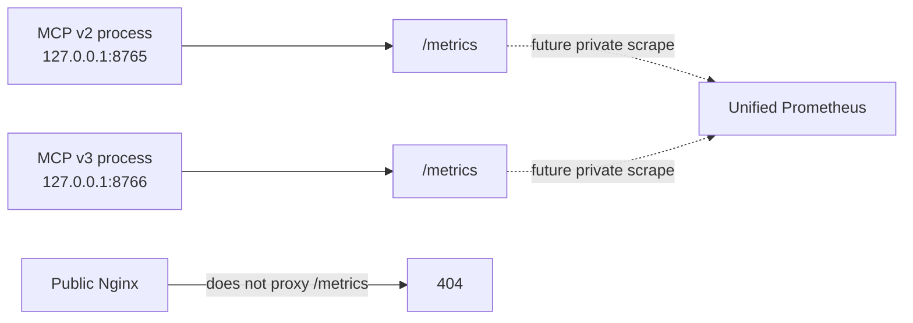

# Проект генерации OpenMetrics для MCP v2 и v3

## Требования

### OPENMETRICS_IS_GENERATED_LOCALLY

MCP v2 и v3 формируют валидную OpenMetrics exposition на том же узле, где
возникают counters и gauges, без зависимости от внешнего collector.

### PROMETHEUS_INTEGRATION_IS_DEFERRED

Подключение к единому Prometheus, scrape configuration, dashboards и alerts не
входят в текущую реализацию генерации и требуют отдельного решения.

### METRICS_EXCLUDE_HIGH_CARDINALITY_LABELS

Labels не содержат IP, user-agent, request ID, cursor, URI, query text и иные
неограниченные или чувствительные значения.

### METRICS_ENDPOINTS_USE_LOOPBACK

Exposition endpoint слушает только loopback и не публикуется внешним reverse
proxy или статическим сайтом.

### METRIC_NAMES_ARE_VERSIONED_CONTRACTS

Имена метрик, наборы labels и смысл значений являются наблюдаемым
версионированным контрактом, а не внутренней деталью реализации.

- Дата: 2026-08-14
- Основание:
  [LOCAL_OPENMETRICS_EXPOSITION](../adr/2026-08-14-local-openmetrics-exposition.md)
- Область: эксплуатационная телеметрия MCP v2 и MCP v3

## Контекст

`PUBLIC_MCP_MONITORING` сохраняет статический сайт мониторинга как продуктовую usage analytics:
какие агенты обращаются к MCP, какую API-версию и методы они используют, какие
публичные страницы читают. Этот отчёт строится периодически из журналов и не
предназначен для оперативных графиков или алертов.

Для эксплуатации нужны time series:

- частота запросов и ошибок;
- длительность MCP operations;
- состояние и свежесть индекса;
- успешность обновления resource snapshot;
- uptime и состояние процессов.

OpenMetrics подходит для числовых снимков состояния и накопительных counters.
Он не заменяет события и логи: в OpenMetrics нельзя переносить тексты поисковых
запросов, page ID, resource URI, cursor или другие высококардинальные значения.

В инфраструктуре планируется единый Prometheus, но его подключение, Grafana и
alert rules не входят в текущий этап. Сначала каждый MCP-процесс должен уметь
корректно генерировать OpenMetrics локально.

## Решение в одном предложении

MCP v2 и v3 получают независимые loopback-only endpoints `/metrics`, которые
генерируют OpenMetrics 1.0; подключение этих endpoints к единому Prometheus
откладывается на отдельный инфраструктурный этап.

## Границы решения

### Текущий этап: генерация

Входит:

- инструментирование процессов v2 и v3;
- OpenMetrics registry каждого процесса;
- endpoint `GET /metrics` на существующем loopback listener;
- content negotiation и корректный OpenMetrics 1.0 response;
- unit и integration tests;
- запрет публичного проксирования `/metrics` через Nginx;
- документация локальной проверки через SSH.

### Отложенный этап: сбор и использование

Не входит:

- изменение конфигурации единого Prometheus;
- сетевой маршрут от Prometheus к MCP host;
- service discovery;
- TLS, mTLS или VPN для удалённого scrape;
- Grafana dashboards;
- recording rules, alerts и SLO;
- retention и remote write;
- объединение с Nginx или host metrics.

Этот список является явной границей, а не отказом от интеграции. После появления
доступного scrape path ADR дополняется либо создаётся инфраструктурное решение с
адресами, authentication, alert thresholds и rollback.

## Рассмотренные варианты

### Использовать только статический сайт `PUBLIC_MCP_MONITORING`

Отклонено. Batch-отчёт не хранит time series, не даёт надёжно вычислять rate и
latency percentiles и не подходит для alerts.

### Сразу подключить production Prometheus

Отложено. Для этого необходимо отдельно проверить сеть, права, TLS, scrape
interval, labels, retention и владельца alerts. Смешивание инструментирования с
инфраструктурным rollout расширит область изменений и усложнит rollback.

### Генерировать `.prom` файлы для node_exporter textfile collector

Отклонено для request counters и duration. Периодическая запись файла плохо
соответствует процессным counters и histogram. Textfile collector остаётся
пригодным для batch jobs, но MCP является постоянно работающим HTTP-сервисом.

### Экспортировать `/metrics` из каждого процесса

Принято. Это стандартная pull-модель, сохраняющая независимость v2 и v3 и не
требующая промежуточного файла или push gateway.

## Архитектура



На первом этапе endpoints проверяются локально:

```bash
curl -H 'Accept: application/openmetrics-text; version=1.0.0' \
  http://127.0.0.1:8765/metrics

curl -H 'Accept: application/openmetrics-text; version=1.0.0' \
  http://127.0.0.1:8766/metrics
```

Публичные URL не создаются:

```text
https://ai.v8std.ru/metrics     -> 404
https://ai.v8std.ru/v3/metrics  -> 404
```

Endpoint встроен в существующее ASGI-приложение процесса. Отдельный metrics
HTTP server и дополнительный port на первом этапе не нужны. Processes уже
слушают только loopback, поэтому `/metrics` доступен локальному оператору, но не
публичному ingress.

## Формат exposition

Ответ по согласованию OpenMetrics 1.0:

```text
Content-Type: application/openmetrics-text; version=1.0.0; charset=utf-8
Cache-Control: no-store
```

Тело:

- UTF-8 без BOM;
- строки заканчиваются LF;
- exposition завершается `# EOF`;
- содержит `HELP`, `TYPE` и `UNIT`, когда unit применим;
- формируется из текущего registry на каждый GET;
- не зависит от предыдущего scrape.

Для инструментирования используется официальный Python client Prometheus с
отдельным `CollectorRegistry` для v8std MCP. Отдельный registry предотвращает
случайное добавление метрик импортированных библиотек и делает контракт
endpoint проверяемым. Process и Python runtime collectors подключаются к нему
явно.

## Контракт метрик

### Информация о процессе

```text
v8std_mcp_info{api_version="v2",resource_schema="none"} 1
v8std_mcp_info{api_version="v3",resource_schema="1"} 1
```

Тип: gauge со значением `1`. Один процесс публикует только одну из этих time
series.

Labels ограничены заранее известными значениями. Build SHA и resource revision
не добавляются в labels, потому что каждая новая версия создавала бы новую time
series. Они остаются в `/version`.

### MCP operations

```text
v8std_mcp_operations_total{api_version,method,outcome}
v8std_mcp_operation_duration_seconds{api_version,method}
v8std_mcp_operations_in_progress{api_version,method}
```

- `operations_total` — counter;
- `operation_duration_seconds` — histogram;
- `operations_in_progress` — gauge.

`method` принимает только:

```text
initialize
ping
tools/list
tools/call
resources/list
resources/templates/list
resources/read
other
```

`outcome` принимает только:

```text
success
client_error
server_error
```

Ingress rate limit не включается: отклонённый Nginx запрос не достигает
процесса. Позднее эта метрика должна поступать из ingress exporter, а не
имитироваться приложением.

Histogram buckets в секундах:

```text
0.005, 0.01, 0.025, 0.05, 0.1, 0.25, 0.5, 1, 2.5, 5, 10
```

Они покрывают быстрые list/read operations и более долгие search/explain без
создания отдельного histogram для каждого tool.

### Tool calls

```text
v8std_mcp_tool_calls_total{api_version,tool,outcome}
```

`tool` ограничен опубликованным контрактом соответствующей API-версии. В v3
отсутствует `v8std_get_page`; неизвестное имя нормализуется в `other`.

Аргументы инструмента и результаты не являются labels.

### Resource operations

```text
v8std_mcp_resource_reads_total{api_version,resource_type,outcome}
v8std_mcp_resource_list_requests_total{api_version,outcome}
v8std_mcp_resource_list_items_total{api_version}
```

`resource_type` принимает:

```text
standard
diagnostic
pattern
article
other
```

`resource_list_items_total` увеличивается на число ресурсов, фактически
возвращённых во всех страницах `resources/list`. Размер страницы не label.

### Каталог и обновления

```text
v8std_mcp_catalog_rows{api_version}
v8std_mcp_catalog_resources{api_version}
v8std_mcp_catalog_refresh_total{api_version,outcome}
v8std_mcp_catalog_last_success_timestamp_seconds{api_version}
v8std_mcp_catalog_degraded{api_version}
```

- rows и resources — gauges;
- refresh total — counter с outcome `success` или `failure`;
- last success — Unix time gauge;
- degraded — gauge `0` или `1`.

V2 экспортирует количество строк индекса. V3 дополнительно экспортирует число
resource catalog entries. Отсутствующая для версии величина не подменяется
нулём: metric family для неё не публикуется этим процессом.

Revision не является label. Свежесть вычисляется позднее в PromQL как разность
между временем Prometheus и `last_success_timestamp_seconds`, а не
экспортируется как постоянно меняющийся age gauge.

### Классификация агентов

```text
v8std_mcp_agent_operations_total{api_version,agent_family,operation_class}
```

`agent_family` использует тот же ограниченный classifier, что
`PUBLIC_MCP_MONITORING`:

```text
claude
codex
cursor
jetbrains
vscode
opencode
kilo
node
go
python_httpx
java
curl
browser
other
unknown
```

`operation_class`:

```text
initialize
discovery
tool
resource
other
```

Exact client name и client version не являются labels. Метрика отражает
заявленное или эвристически классифицированное семейство и не считается
доверенной идентичностью.

## Запрещённые labels

Ни одна metric family не содержит:

- query или нормализованный query;
- tool arguments;
- page ID, title или URL;
- resource URI или cursor;
- diagnostic code;
- resource revision, SHA или build ID;
- IP, User-Agent, MCP session ID или request ID;
- exact client name или client version;
- текст ошибки или exception class, не входящий в закрытый enum.

Причина — безопасность и кардинальность. Каждая уникальная комбинация labels
создаёт новую time series. Публичные страницы и диагностические коды допустимы в
event analytics `PUBLIC_MCP_MONITORING`, но не в OpenMetrics.

## Связь с `PUBLIC_MCP_MONITORING`

Оба решения используют одну нормализацию API version, method, tool, outcome и
agent family, но имеют разные хранилища и назначение:

| Свойство | `PUBLIC_MCP_MONITORING` | `LOCAL_OPENMETRICS_EXPOSITION` |
|---|---|---|
| Представление | JSONL events и статические отчёты | числовой snapshot |
| История | log files | будущий Prometheus |
| Page ID и URL | допустимы в ограниченных events | запрещены |
| Поисковый текст | только restricted feedback log | запрещён |
| Назначение | usage analytics | operations и alerts |
| Текущий consumer | generator сайта | локальный curl/test |

Событие не должно сначала записываться в JSONL, а затем перечитываться для
увеличения OpenMetrics counter. Logger и metrics recorder вызываются независимо
из одной точки завершения MCP operation. Ошибка одного observability sink не
останавливает другой и не меняет MCP response.

## Жизненный цикл counters

Counters и histograms хранятся в памяти процесса и сбрасываются при restart.
Это нормальное поведение Prometheus instrumentation. Будущий Prometheus
учитывает process restart при вычислении `rate()` и `increase()`.

OpenMetrics endpoint не читает и не агрегирует старые JSONL. Он показывает
текущий registry процесса и не пытается восстанавливать counters после restart.

## Безопасность

- Processes продолжают слушать `127.0.0.1`.
- Nginx не проксирует никакой внешний `/metrics`.
- Endpoint не содержит пользовательского ввода или секретов.
- Response использует `Cache-Control: no-store`.
- Exposition generation не запускает refresh индекса и не выполняет сетевые
  запросы.
- Metric HELP text является статической строкой.
- Ошибка генерации metrics возвращает `500` только локальному caller и не влияет
  на MCP endpoints.

При будущем удалённом scrape loopback-ограничение нельзя просто снять на
публичный интерфейс. Требуется отдельный private network path либо authenticated
TLS proxy, рассмотренный вместе с единым Prometheus.

## Производительность

- Инкремент counter и observation histogram выполняются in-process.
- Metrics recorder не пишет на диск.
- Labels нормализуются до регистрации time series.
- `/metrics` не захватывает lock resource snapshot на время сериализации.
- Полная генерация exposition должна занимать менее одной секунды.
- Ошибка instrumentation подавляется после диагностического log event и не
  меняет результат пользовательского MCP-вызова.

## Реализация генерации

### Этап 1. Registry и контракт

1. Добавить pinned dependency официального Python Prometheus client.
2. Создать отдельный registry и все metric families централизованно.
3. Запретить динамическое создание label values вне enum normalizers.
4. Добавить contract tests имён, типов, labels и buckets.

### Этап 2. Инструментирование MCP

1. Измерять method, duration, in-progress и outcome в общей обёртке.
2. Добавить tool counters.
3. Добавить resource counters обеим версиям; три агрегированных ресурса v2
   нормализуются как `other`, а v3 использует типы resource catalog.
4. Использовать общий agent classifier `PUBLIC_MCP_MONITORING`.
5. Проверить, что instrumentation exceptions не меняют MCP response.

### Этап 3. Каталог и refresh

1. Устанавливать rows/resources после успешной замены snapshot.
2. Увеличивать refresh counter на каждой попытке.
3. Обновлять last-success timestamp только после полной проверки нового индекса.
4. Сохранять предыдущие gauges при неуспешном refresh и устанавливать degraded.

### Этап 4. Exposition endpoint

1. Добавить `GET /metrics` обоим loopback applications.
2. Реализовать OpenMetrics content negotiation и content type.
3. Проверить `# EOF`, LF и отсутствие BOM.
4. Явно проверить production Nginx: публичные metrics URL возвращают `404`.
5. Документировать локальный curl через SSH.

На этом текущий объём `LOCAL_OPENMETRICS_EXPOSITION` заканчивается. Prometheus configuration не
изменяется.

## Тестирование

Обязательные проверки:

1. V2 и v3 используют разные registries и process counters.
2. API version label определяется сервером, а не входным payload.
3. Каждый method увеличивает только ожидаемый counter.
4. Tool call увеличивает operation и tool counters ровно один раз.
5. Resource read увеличивает operation и resource counters ровно один раз.
6. Failed operation записывает соответствующий ограниченный outcome.
7. Histogram наблюдает duration в секундах и использует утверждённые buckets.
8. In-progress gauge возвращается к нулю после success и exception.
9. Неизвестные method, tool, resource type и agent нормализуются.
10. Запрещённые values не появляются в labels или HELP.
11. Successful refresh меняет rows, resources, counter и last-success.
12. Failed refresh увеличивает failure, включает degraded и сохраняет старый
    snapshot.
13. `/metrics` возвращает OpenMetrics 1.0 content type.
14. Exposition завершается `# EOF` и проходит parser OpenMetrics.
15. Exposition не вызывает network fetch или refresh.
16. Instrumentation failure не меняет MCP result.
17. `https://ai.v8std.ru/metrics` возвращает `404`.
18. `https://ai.v8std.ru/v3/metrics` возвращает `404`.
19. Полный набор unit-тестов репозитория проходит.
20. `./scripts/zensical_docs.sh build --strict` проходит.

## Критерии готовности текущего этапа

- Оба локальных endpoints выдают валидный OpenMetrics 1.0.
- Метрики различают v2 и v3, methods, tools, resources, outcomes и
  нормализованные agent families.
- Метрики каталога отражают успешный и degraded refresh.
- Label cardinality ограничена контрактом.
- Пользовательский ввод отсутствует в exposition.
- Metrics endpoints недоступны через публичный Nginx.
- Ни Prometheus, ни Grafana, ни alerts пока не изменены.

## Условия начала интеграции с единым Prometheus

Следующий этап начинается только после определения:

1. адреса и владельца единого Prometheus;
2. private network path от Prometheus до MCP host;
3. TLS или иной authentication boundary;
4. scrape interval и timeout;
5. external labels и job naming;
6. retention;
7. Grafana folder и владельца dashboard;
8. SLO и alert thresholds;
9. канала доставки alerts;
10. rollback scrape configuration.

## Последствия

Положительные:

- код готов к будущему подключению Prometheus без изменения metric contract;
- v2 и v3 наблюдаются независимо;
- OpenMetrics дополняет, а не дублирует usage analytics;
- public attack surface не увеличивается;
- labels заранее защищены от высокой кардинальности.

Отрицательные:

- до подключения Prometheus time series нигде не сохраняются;
- counters сбрасываются при restart и видны только локальному scrape;
- локальный `/metrics` сам по себе не даёт dashboards или alerts;
- metric contract потребуется поддерживать как совместимый API после появления
  Prometheus queries и alert rules.

## Источники

- [OpenMetrics specification](https://github.com/prometheus/OpenMetrics/blob/main/specification/OpenMetrics.md)
- [Prometheus exposition formats](https://prometheus.io/docs/instrumenting/exposition_formats/)
- [Prometheus instrumentation practices](https://prometheus.io/docs/practices/instrumentation/)
- [Official Prometheus Python client](https://prometheus.github.io/client_python/)
